Seguimiento
===========

Cuando navega por la web pequeños rastros de su presencia van quedando por el camino. Muchos sitios web inofensivos usan estos datos para compilar estadísticas y ver cuánta gente está visitando el sitio y qué páginas son populares, pero algunos sitios usan estas técnicas para rastrear usuarios individuales, tratando de ir más allá para identificarlos personalmente. Sin embargo, no se detienen acá. Algunas empresas almacenan datos en su navegador para registrarlo a usted en otros sitios. esta información puede ser recopilada y pasada a otras organizaciones sin su conocimiento o permiso.

Todo esto suena ominoso ¿pero a quién le importa realmente si alguna gran empresa sabe de unos pocos sitios web que hemos visto? Los sitios web grandes recopilan y utilizan estos datos para "publicidad comportamental" donde los anuncios están diseñados para satisfacer exactamente sus intereses. Es por eso que después de mirar la entrada de Wikipedia para Mallorca, uno de repente puede comenzar a ver un montón de anuncios para la paquetes de vacaciones envasados y sombreros de fiesta. Esto puede parecer bastante inocente, pero después de hacer una búsqueda de "tratamientos para el herpes" o "comunidades fetiches" y ver listados de repente a los productos pertinentes, se puede empezar a sentir que la web se está volviendo demasiado familiar.

Esta información es también de interés para otros, como su compañía de seguros. Si ellos saben que usted ha estado buscando en los sitios de paracaidismo o en los foros de enfermedades congénitas, sus primas misteriosamente puede empezar a aumentar de precio. Los empleadores potenciales o los propietarios de alquileres pueden perder interés basado en sus intereses en la web. En casos extremos, las autoridades policiales o fiscales pueden empezar a observarlo sin que siquiera haya cometido un delito, simplemente sobre la base de sospechas.

¿Cómo lo siguen?
----------------

Cada vez que carga una página web, el software del servidor en el sitio web genera un registro de la página vista en un archivo de log. Esto no es siempre una mala idea. Cuando se loguea en un sitio web, es necesario establecer su identidad y mantener registros ordenados para grabar sus preferencias, o presentarle información personalizada. Esto se logra pasándole un pequeño archivo a su navegador y almacenando una referencia correspondiente en el servidor web. Este archivo se denomina *cookie*. Suena hermoso, pero el problema es que esta información se mantiene en el equipo incluso después de salir del sitio web y podrá llamar a casa para decirle al dueño de la cookie acerca de otros sitios web que está visitando. Algunos sitios importantes, como Facebook y Google han sido descubiertos usándolos para realizar un seguimiento de su navegación, incluso después de haber cerrado la sesión.
 
¿Cómo puedo evitar el seguimiento?
---------------------------

La manera más simple de evitar el seguimiento es borrar las cookies en su navegador.

En **Firefox**:

 1. Pulse **Firefox menu**. 
 
 2. Pulse **Options**.
 
 3. Pulse **Privacy**.
 
 4. Pulse **Clear your recent history**.
 
    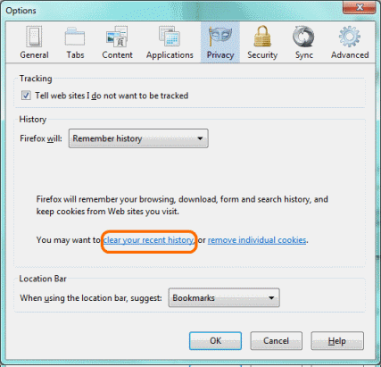
 
 5. Asegúrese de configurar **Time range to clear** como **Everything**.
 
 6. Tilde **Cookies**.
 
    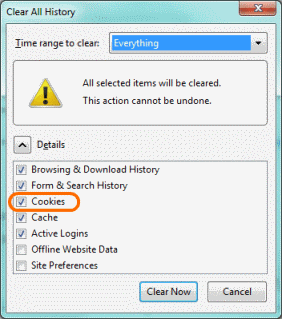
 
 7. Haga click en **Clear now**.
 
En **Chrome**:
 
 1. Pulse **Chrome menu**.
 
 2. Pulse **Tools**.
 
 3. Pulse **Clear browsing data**.
 
 4. Asegúrese de configurar **Obliterate the following items from** como **The beginning of time**.
 
 5. Tilde **Delete cookies and other site and plug-in data**.
 
 6. Pulse **Clear browsing data**.
 
 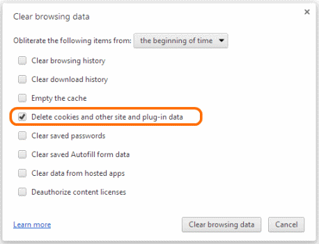

En **Internet Explorer**: 

 1. Pulse el botón **Tools** (en forma de engranaje).

 2. Pulse **Safety**.

 3. Pulse **Delete Browsing History**.

 4. Tilde **Cookies**.

 5. Pulse **Delete**.
 
 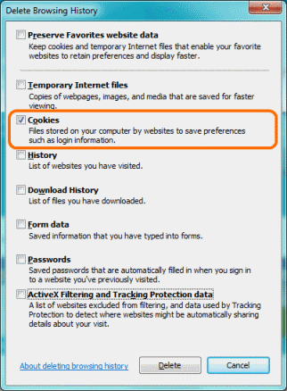

La limitación de esta aproximación es que usted recibirá nuevas cookies tan pronto como vuelva al sitio o cuando vaya a otras páginas con componentes de seguimiento. Otras desventajas son que usted perderá todas sus sesiones iniciadas para todas sus pestañas abiertas, forzándolo a tipear sus nombres de usuario y contraseña nuevamente. Una opción más conveniente, soportada por los navegadores actuales es navegación privada o modo incógnito. Esto abre una ventana de un navegador temporario que no grabará la historia de las páginas visitadas, contraseñas, archivos descargados o cookies. Después de cerrar la ventana de navegación privada, toda la información será borrada.

En **Firefox**:

 1. Pulse **Firefox menu**.

 2. Pulse **Start Private Browsing**.
 
 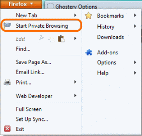

 3. Si se lo solicita, pulse **Start Private Browsing** nuevamente.
 
 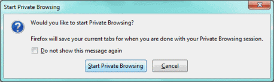

 4. El botón **Firefox menu** aparece en color púrpura, mostrando que se está navegando en forma privada.
 
 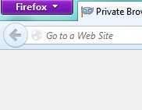

En **Chrome**:

 1. Pulse **Chrome menu**.

 2. Pulse **New incognito window**.
 
    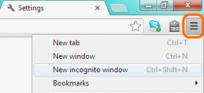
 
 3. El **ícono espía** en la parte superior izquierda de la ventana del navegador muestra que se está navegando en forma privada.
 
    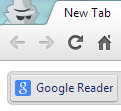
 
En **Internet Explorer**: 

 1. Pulse en el menú **Tools**, en forma de engranaje.

 2. Pulse **Safety**.

 3. Pulse **InPrivate Browsing**.
 
    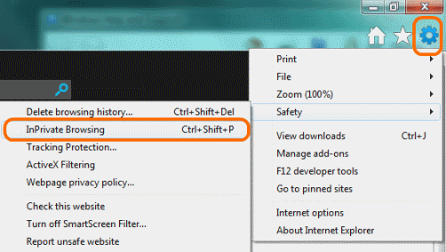 

 4. El logo **InPrivate** aparecerá en la parte superior izquierda de la ventana del navegador: se está navegando en forma privada.
 
    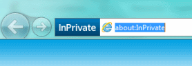

Esta solución también tiene sus limitaciones. Nosotros no podemos grabar marcadores, registrar contraseñas, o sacar ventajas de la conveniencia ofrecida por navegadores modernos. Afortunadamente, existen distintos plugins especialmente diseñados para direccionar los problemas del seguimiento. El más extenso, en términos de características y flexibilidad, es Ghostery. El plugin le permite bloquear servicios individuales o por categorías que registran usuarios.

 1. En Firefox, pulse el menú **Firefox** y elija **Add-ons**.
 
    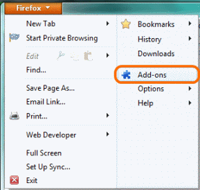
 
 2. En la casilla **Search**, tipee "ghostery", luego pulse el ícono **Search** o presione **Enter**.
 
    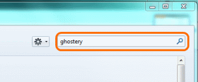

 3. Busque Ghostery en la lista de Add-ons, y pulse **Install**.
 
    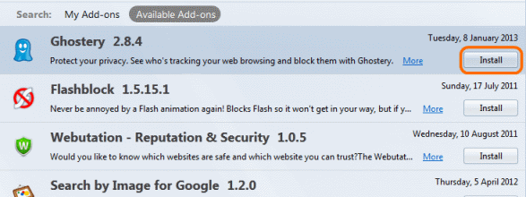

 4. Reinicie su navegador pulsando **Restart Now**.
 
    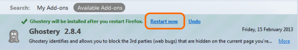

 5. Pulse **Ghostery toolbar** y seleccione **Options**. Recorre las opciones y prueba diversos ajustes para Ghostery, si así lo desea.
 
    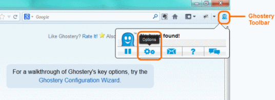

 6. Visite una página web y observe sus rastreadores.
 
    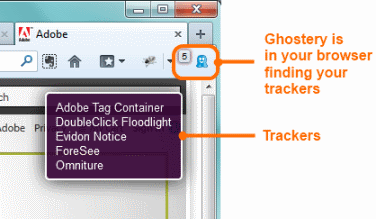

Otra opción es instalar un plugin bloqueador de publicidad como AdBlockPlus. Este plugin automáticamente bloqueará muchos de las cookies de seguimiento enviadas por empresas de publicidad pero no los utilizados por Google, Facebook y otras empresas de análisis web.

¿Cómo puedo ver quién me está siguiendo?
----------------------------------------

La forma más fácil de ver quién lo está rastreando es usar el plugin Ghostery. Hay un pequeño ícono en la esquina superior derecha o inferior derecha de la ventana del navegador que le dirá qué servicios lo están siguiendo a usted en un sitio web específico.
 
(Sugerencia: Añada el complemento Do Not Track de Abine.com  Sugerimos utilizar tanto Ghostery como DNT, porque a veces bloquean cookies distintas. Abine también tiene Privacy Suite, recientemente desarrollado que puede darle un proxy telefónico y de correo electrónico, similar a 10 Minute Mail o Guerrilla Mail para rellenar correos electrónicos para formularios.)

Una palabra de advertencia
--------------------------

Si bloquea a sus rastreadores tendrá un elevado nivel de privacidad cuando navegue por la web. Sin embargo, las agencias de gobierno, los jefes, los hackers y los administradores de red inescrupulosos aún podrán interceptar su tráfico y averiguar qué está viendo. Si quiere asegurar su conexión, necesitará leer el capítulo de cifrado. Su identidad puede ser visible para otras personas en internet. Si quiere proteger completamente su identidad mientras navega, tendrá que dar algunos pasos más hacia el anonimato en línea que se explican en otra sección de este libro.

