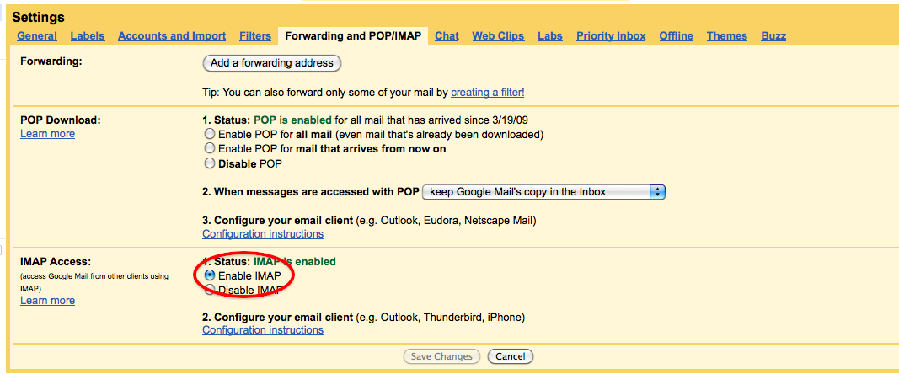
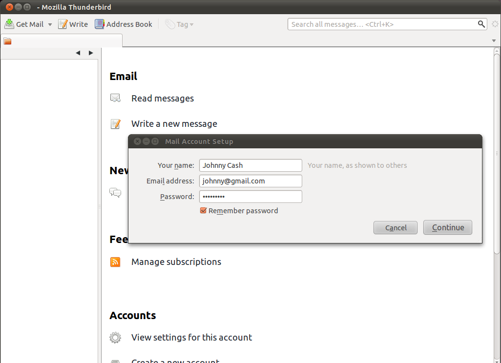
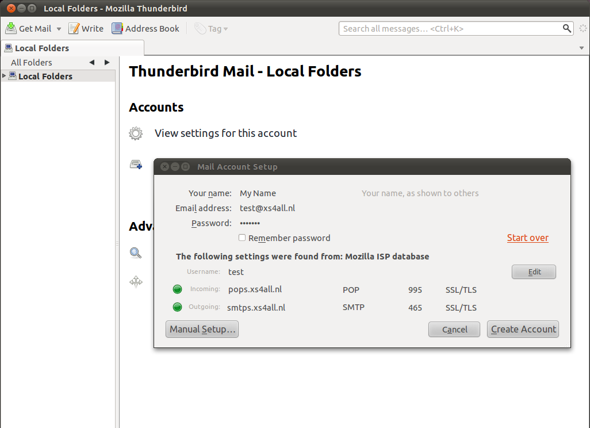
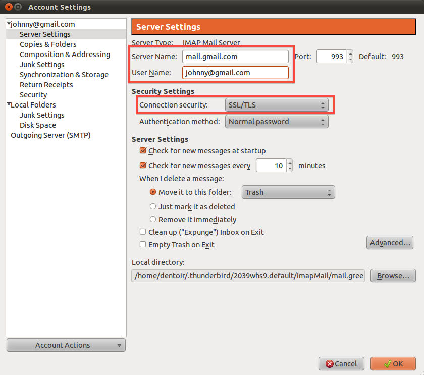
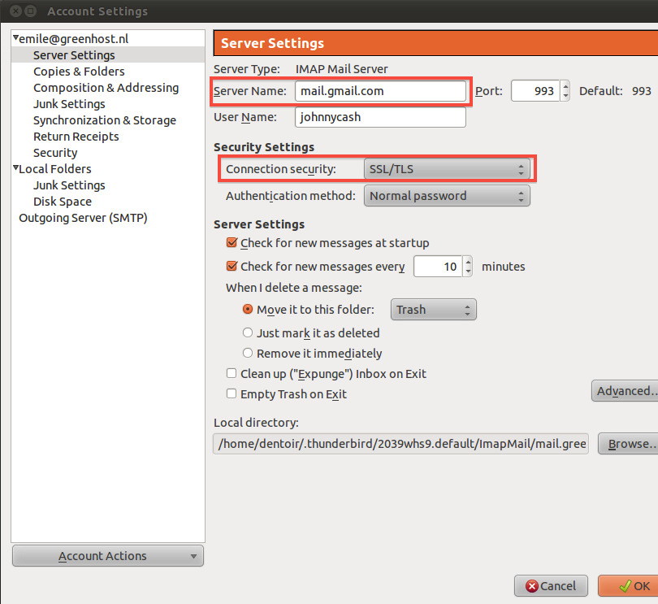
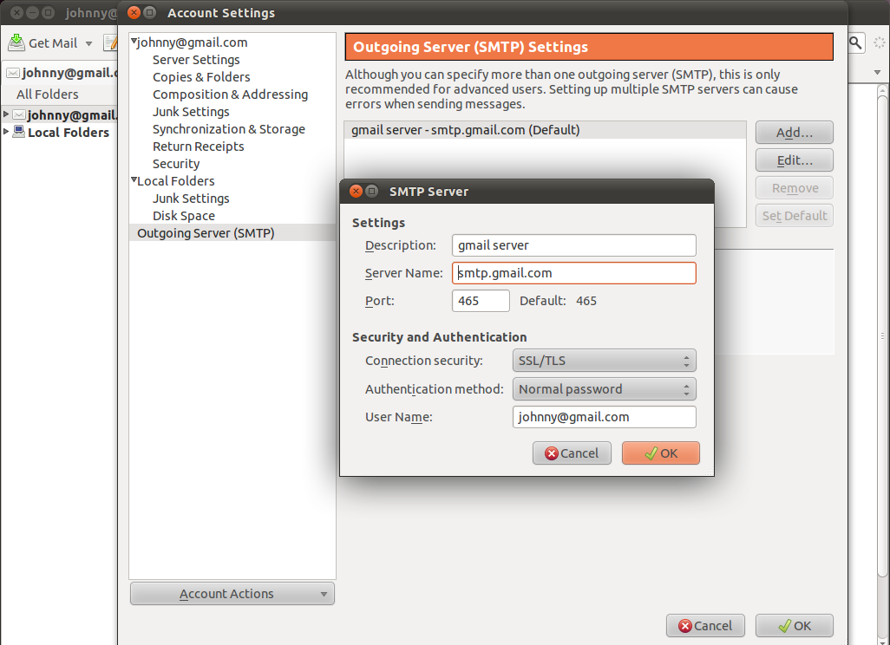

Configuración de cuentas seguras
================================

Existe una manera correcta (segura) de configurar su conexión con los servidores de correo electrónico de su proveedor y una manera incorrecta (insegura). El aspecto más importante de la seguridad en los correos electrónicos es el tipo de conexión que establecerá con el servidor de su proveedor.

Siempre que sea posible, debería conectarse usando los protocolos **SSL** (Secure Socket Layer) y **TLS** (Transport Layer Security). (**STARTTLS**, otra versión disponible cuando configura una cuenta, es una variación de SSL/TLS.) Estos protocolos impiden que su propio sistema (más allá de Thunderbird) y todos los puntos entre sus sistema y el servidor de correo puedan ser interceptados y robadas sus contraseñas.Además, también impiden que los la lectura del contenido de sus mensajes.

Estos protocolos, sin embargo, sólo aseguran la conexión entre el ordenador y el servidor de correo. No protegen el canal de información en todo el camino hasta el destinatario del mensaje. Una vez que los servidores de correo reenvían el mensaje para la entrega, el mensaje puede ser interceptado y leído por los puntos intermedios entre el servidor de correo y el destinatario.

Aquí es donde **PGP** (Pretty Good Privacy) entra, lo cual se describe en el capítulo siguiente.

El primer paso para asegurar al correo electrónico es tener una conexión segura entre su sistema y los servidores de correo. En este capítulo se describe cómo configurar su cuenta de correo electrónico de la manera correcta.

Requisitos de configuración
---------------------------

Al configurar una cuenta, Thunderbird intenta determinar los parámetros de conexión (de la cuenta de correo electrónico y los datos de la cuenta que usted proporciona) con su proveedor de correo electrónico. Aunque Thunderbird conoce los parámetros de conexión para muchos proveedores de correo electrónico, no los conoce a todos. Si los parámetros no son conocidos por Thunderbird, usted tendrá que proporcionar la siguiente información para configurar su cuenta:

 * **Su nombre de usuario**
 * **Su contraseña**
 * **Servidor entrante:** nombre (como `imap.example.com`), protocolo (POP o IMAP), el puerto (por defecto, 110), y el protocolo de seguridad
 * **Servidor saliente:** nombre (como `smtp.example.com`), el puerto (por defecto, 25), y el protocolo de seguridad

Debería haber recibido esta información de su proveedor de hosting. Alternativamente, usted puede encontrar esta información en las páginas de soporte en el sitio Web de su proveedor de hosting. En nuestro ejemplo vamos a utilizar la configuración del servidor de Gmail. Puede utilizar Thunderbird con su cuenta de Gmail. Para ello, es necesario cambiar una opción de configuración de su cuenta. Si no está usando una cuenta de Gmail, saltee la siguiente sección.

Preparación de una cuenta de Gmail para usar con Thunderbird
------------------------------------------------------------

Accede a tu cuenta de Gmail en tu navegador. Seleccione **Configuración** de opciones en la parte superior derecha, luego vaya a la pestaña **Forwarding and POP/IMAP**. Pulse **Enable IMAP** y luego **Save Changes**.

Configurar Thunderbird para usar SSL / TLS
------------------------------------------

Al iniciar Thunderbird por primera vez, se entra en un proceso de configuración paso a paso para configurar su primera cuenta. (Se puede invocar la interfaz de configuración de la cuenta en cualquier momento seleccionando **File | New | Mail Account**). En la primera pantalla, se le pedirá su nombre, su dirección de correo electrónico y su contraseña. El valor que introduzca por nombre no tiene por qué ser su nombre real. Se muestra al destinatario de sus mensajes. Introduzca la información y haga click en **Continue**.

En la siguiente pantalla, Thunderbird intentará determinar los nombres de los servidores basados en su dirección de correo electrónico. Esto puede llevar algún tiempo, y sólo funcionará si Thunderbird sabe la configuración de los servidores de tu proveedor. En cualquier caso, se le presentará una ventana donde se puede modificar la configuración. En el siguiente ejemplo, Thunderbird ha detectado la configuración de forma automática. Usted puede ver el protocolo en la parte derecha de los nombres de servidor. Esto debe ser tanto **SSL/TLS** o **STARTTLS**. *De lo contrario su conexión es insegura y usted debe tratar de configurarla manualmente.*

Cuando haya terminado, haga click en **Create account**. Si Thunderbird no pudo determinar la configuración del servidor, haga click en **Manual setup** para configurar los nombres de servidor usted mismo.

Configuración manual
--------------------
Utilice la interfaz para configurar manualmente las cuentas en Thunderbird. El cuadro de diálogo  de configuración de la cuenta se abrirá automáticamente si se selecciona **Manual setup** en el asistente de configuración. En este caso, sólo estamos interesados en los nombres de servidores de correo entrante y saliente, y el protocolo que se utiliza para conectarse con ellos. Como se puede ver en los ejemplos siguientes, ingresamos los nombres de los servidores de Gmail y los forzamos a utilizar **TLS/SSL**, un método seguro para conectarse a los servidores.

En 'Configuración del servidor', encontraremos sólo el servidor entrante (**IMAP**) y la configuración de esa cuenta específica.

Bajo **Server Name** introduzca el nombre del servidor IMAP, en este caso `mail.gmail.com`.

*Como usted puede ver, hemos seleccionado **'SSL/TLS'** en la configuración de seguridad de conexión. o fuerza el cifrado.* No te asustes por el método de autenticación **contraseña normal**. La contraseña se cifra automáticamente debido a nuestras conexiones seguras al servidor.

Por último, configure el servidor de correo saliente para la cuenta. Haga click en **Outgoing Server (SMTP)** en el panel izquierdo.

Una vez más, hemos seleccionado **SSL/TLS** en **Connection security**. El puerto por defecto será 465 y generalmente no debería ser cambiado.

Finalizando la configuración, diferentes métodos de cifrado
-----------------------------------------------------------

Pruebe la configuración de Thunderbird intentando enviar y recibir mensajes. Algunos proveedores de almacenamiento de correo electrónico no soportan el protocolo SSL/TLS, la opción favorita. Debería aparecer un mensaje de error diciendo que el protocolo de autenticación no está soportado por el servidor. Entonces, pruebe a utilizar STARTTLS. En las dos pantallas de más abajo, seleccione "STARTTLS" en "Connection security". Si este método también falla, póngase en contacto con su proveedor de almacenamiento de correo electrónico y pregúntele ellos ofrecen otra manera de conectarse de forma segura a sus servidores. Si no le permiten hacerlo entonces usted debe quejarse y considerar seriamente la posibilidad de cambiar a un proveedor diferente.

De regreso a las pantallas de configuración 
-------------------------------------------

En cualquier momento usted puede reconfigurar sus cuentas de correo yendo a la barra de menú de Thunderbird y pulsando **Edit | Account Settings** (GNU/Linux), **Tools | Account Settings** (Windows y Mac OS X).

