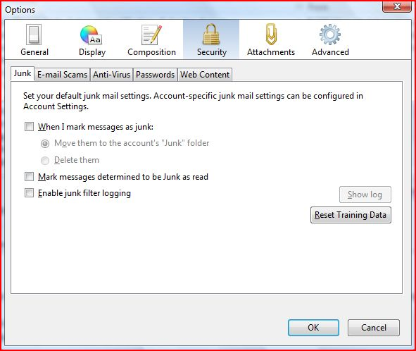
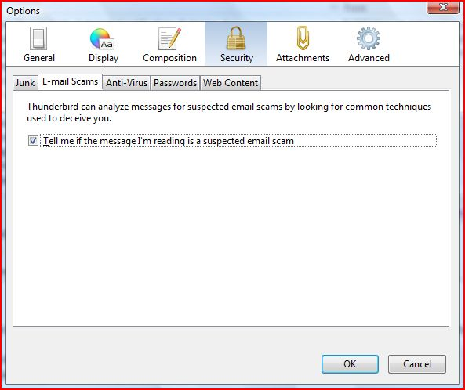
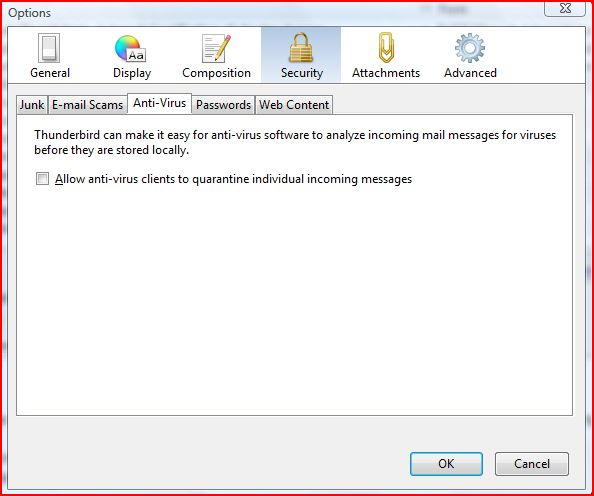
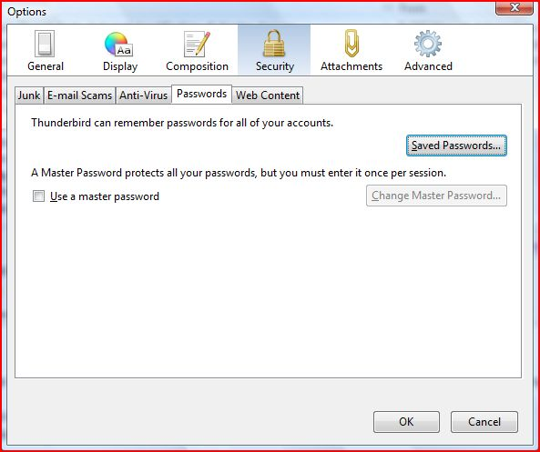
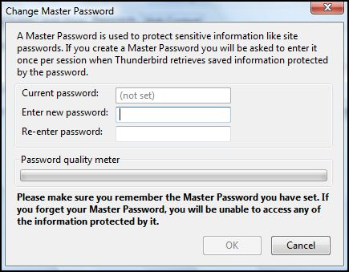
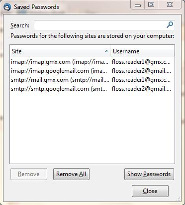
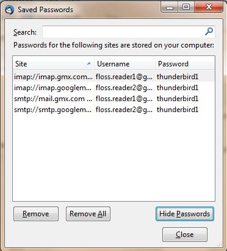
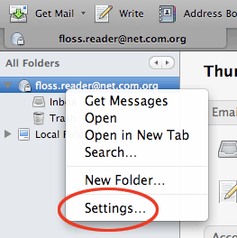
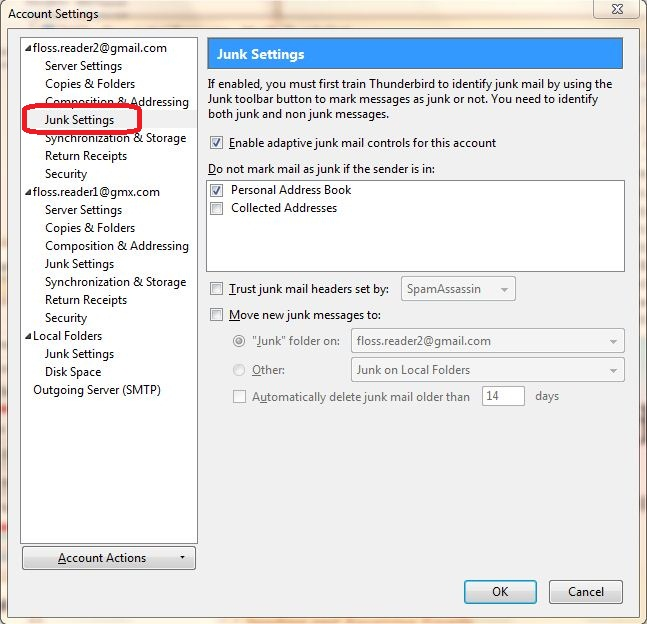

Parámetros adicionales de seguridad
===================================

Thunderbird provee medidas de seguridad adicional para protegerlo del correo basura, robo de identidad, virus (con la ayuda de su software antivirus, por supuesto), robo de propiedad intelectual, y sitios web maliciosos.

Veremos las siguientes características de seguridad de Thunderbird. Primero un poco de historia sobre por qué debe tener en cuenta algunas de estas medidas:

 * **Controles de correo basura adaptables**. Le permiten entrenar a Thunderbird para que pueda identificar correo electrónico no deseado (SPAM) y eliminarlo de su bandeja de entrada. También puede marcar los mensajes como correo basura manualmente si el sistema de su proveedor de correo electrónico falla el correo basura y lo deja pasar.
 * **Integración con el software anti-virus.** Si su software antivirus es compatible con Thunderbird, puede utilizarlo para poner en cuarentena a los mensajes que contienen virus u otros contenidos maliciosos. Si usted se pregunta qué software antivirus trabaja con Thunderbird, puede encontrar una lista aquí: http://kb.mozillazine.org/Antivirus_software.
 * **Contraseña maestra.** Para su conveniencia, usted puede hacer que Thunderbird recuerde cada una de las contraseñas individuales de sus cuentas de correo electrónico. Puede especificar una contraseña maestra que se introduzca cada vez que inicie Thunderbird. Esto le permitirá a Thunderbird abrir todas tus cuentas de correo electrónico con sus contraseñas guardadas.
 * **Restricciones a las cookies.** Algunos blogs y sitios web intentan enviar cookies (una pieza de código que almacena información de los sitios web en su computadora) con sus feeds RSS. Estas cookies son utilizan con frecuencia por los proveedores de contenido para ofrecer publicidad dirigida. Thunderbird rechaza las cookies de forma predeterminada, pero se puede configurar para aceptar algunas o todas las cookies.

En la caja de diálogo Options/Preferences de la sección Security Preferences puede establecer las preferencias para estas funciones.

 * En Windows y Mac OS X, vaya al menú 'Herramientas' y haga clic en 'Opciones'.
 * En Ubuntu u otras versiones de Linux, vaya al menú 'Editar' y haga clic en 'Preferencias'.

Configuración de correo basura
------------------------------

 1. En la caja de diálogo de Preferences/Options, pulse 'Security' y luego seleccione la pestaña 'Junk'.

 

 2. Haga lo siguiente:
    * Dígale a Thunderbird que maneje los mensajes marcados como basura, seleccionando la casilla de verificación etiquetada como 'When I mark message as junk'.
    * Para que Thunderbird mueva estos mensajes a la carpeta de correo basura, seleccione el botón de opción 'Move them to account's 'Junk' folder'.
    * Para que Thunderbird borre el correo basura recibido, seleccione el botón de inicio 'Delete them'.

 3. Thunderbird marcará los correos basura como leídos si usted selecciona la casilla de verificación etiquetada 'Mark messages determined to be Junk as read'.
 4. Si desea mantener un registro de correo basura recibido, seleccione la casilla de verificación 'Enable junk filter logging'.
 5. Haga click en el botón 'OK' para cerrar la casilla de verificación 'Options/Preferences'.

Alerta y detección de estafas
-----------------------------

 1. En el cuadro de diálogos Preferences/Options, haga click en 'Security' y luego en la pestaña 'E-mail Scams'.

 

 2. Para que Thunderbird le advierta sobre posibles estafas por correo electrónico, seleccione la casilla de verificación 'Tell me if the message I'm read is a suspected email scam'. Para desactivar esta característica, desmárquela.

 3. Pulse 'OK' para cerrar el cuadro de diálogo 'Options/Preferences'.

Integración con el antivirus
----------------------------

 1. En el cuadro de diálogos Preferences/Options, haga click en 'Security' y luego en la pestaña 'Antivirus'.

 

 2. Para activar la integración de antivirus, seleccione la casilla de verificación 'Allow anti-virus clients to quarantine individual incoming messages'. Para desactivar esta característica, desmárquela.
 3. Haga clic en el botón "Aceptar" para cerrar el cuadro de diálogo 'Options/Preferences'.

Establezca una contraseña maestra
---------------------------------

 1. En el cuadro de diálogos Preferences/Options, haga click en 'Security' y luego en la pestaña 'Passwords'.

 

 2. Seleccione la casilla de verificación 'Use a master password'.
 3. Ingrese su contraseña en los campos 'Enter new password' y 'Re-enter password'.

 

 4. Haga click en el botón "OK" para cerrar el cuadro de diálogos Change Master Password.
 5. Si desea ver las contraseñas que ha grabado en Thunderbird, haga click en el botón 'Saved Passwords'. Esto abrirá el cuadro de diálogos 'Saved Passwords'.

 

 6. Para ver las contraseñas, haga click en el botón 'Show Passwords'.

 

 7. Haga click en el botón 'Close' para cerrar el cuadro de diálogos 'Saved Passwords'.
 8. Haga click en el botón 'OK' para cerrar el cuadro de diálogos 'Options/Preferences'.

Controles adaptables para correo basura
---------------------------------------

Necesita primero abrir la ventana de configuración de cuentas (Account Settings). Tenga en cuenta que los ajustes configurados sólo se aplican a la cuenta que haya seleccionado en el panel de carpetas. Debe configurar las carpetas locales por separado.

 1. En el panel Carpetas haga clic derecho en un nombre de cuenta y seleccione "Configuración".

 

 2. En Windows o Mac, vaya al menú 'Tools' y seleccione 'Accounts settings'. En Linux, vaya 'Edit menu' y seleccione 'Account Settings'.

 3. Para configurar los controles adaptables de correo basura para una cuenta específica, elija una cuenta y 'Configuración' Junk clic.

 

 4. Para activar los controles, seleccione la casilla de verificación "Activar controles adaptables de correo basura para esta cuenta. Para desactivarlos, desmárquela.

 5. Si desea que los controles de ignorar el correo de los remitentes en la libreta de direcciones, seleccione las casillas de verificación junto a cualquiera de las libretas de direcciones de la lista.
 6. Para usar un filtro de correo como SpamAssassin o SpamPal, active la casilla de verificación denominada 'Trust junk mail headers sent by:' y elija un filtro en el menú.
 7. Seleccione la casilla de verificación denominada 'Move new junk messages to' si desea mover el correo no deseado a una carpeta especificada. A continuación, seleccione la carpeta de destino para su proveedor de correo electrónico o una carpeta local en el equipo.
 8. Seleccione la opción 'Automatically delete junk mail other 14 days' en la casilla de verificación para que Thunderbird regularmente elimine los mensajes de correo basura. Para cambiar el período de tiempo para este proceso, introduzca un número diferente (en días) en el cuadro de texto.
 9. Haga clic en 'OK' para guardar los cambios.

