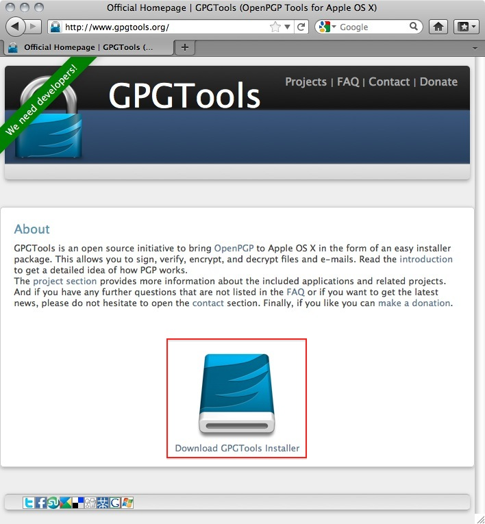
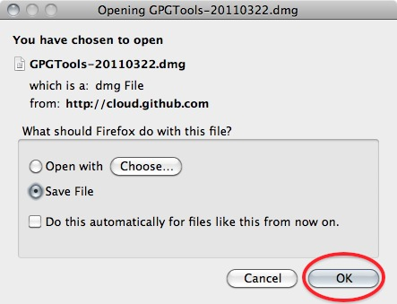
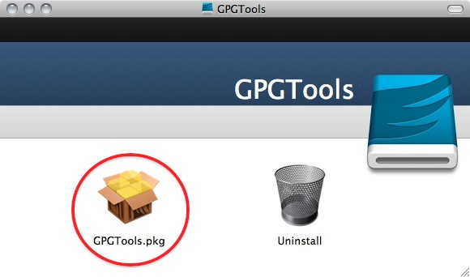
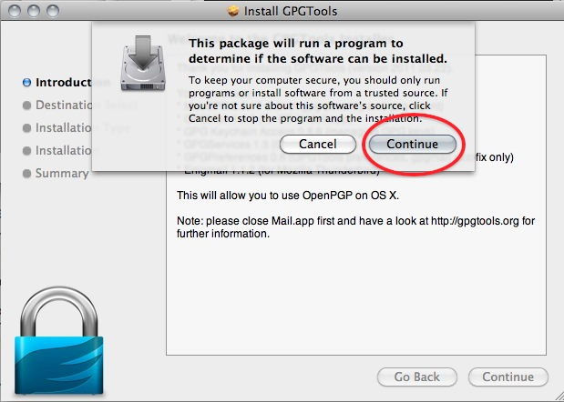
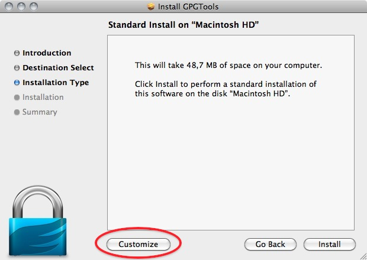
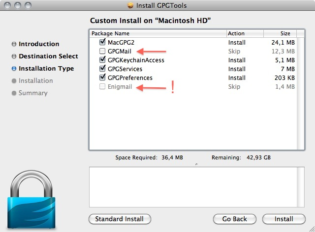
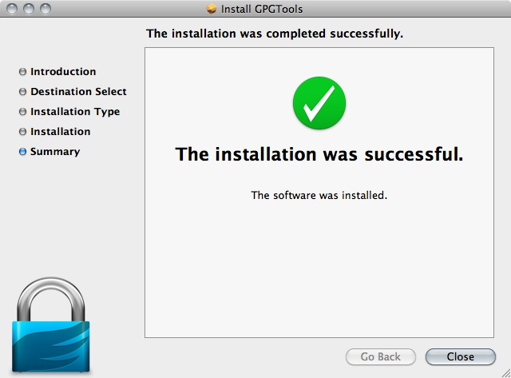
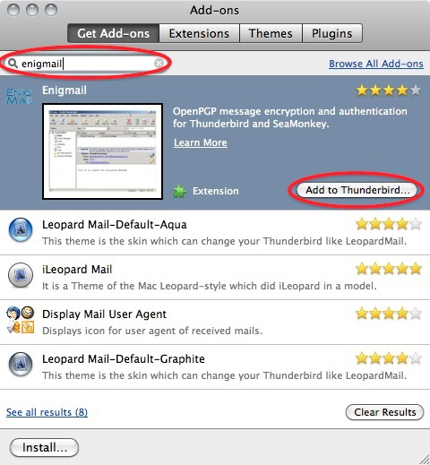
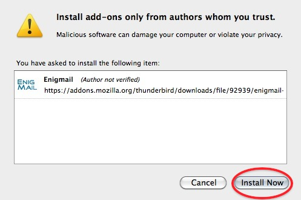

Instalación de PGP en OSX
=========================

GNU Privacy Guard (GnuPG) es un programa de software que le permite enviar mensajes de correo electrónico cifrados con PGP o firmados. Es necesario instalarlo previamente para poder realizar cualquier tipo de cifrado. Este capítulo cubre los pasos requeridos para instalar GnuPG en Mac OSX.

Comenzando
----------

En este capítulo supondremos que usted tiene instalado la última versión de:

 * OSX (10.6.7)
 * Thunderbird (3.1.10)

 **Nota acerca de OSX Mail:** Es posible usar PGP con el programa de correo electrónico incorporado de OSX. Sin embargo, no recomendamos esta opción se basa en un hack del programa que no es abierto ni está soportado por su creador, por lo que se rompe con cada actualización del programa de correo. Así que que realmente no tenemos otra opción que recomendarle cambiar a Mozilla Thunderbird como su programa de correo predeterminado si desea utilizar PGP. 

Descarga e instalación del software
-----------------------------------

 1. Para OSX existe disponible un paquete que instalará todo lo necesario en un solo paso. Para obtenerlo, vaya a [gpgtools](http://www.gpgtools.org/) y haga click en el gran disco azul con la inscripción "Download GPGTools Installer" debajo. Será redirigido a [otra página](http://www.gpgtools.org/installer/index.html) donde podrá descargar el software.

*(aclaración. estamos usando la última versión de Firefox para este manual, las pantallas pueden lucir algo diferentes si usted usa otro navegador)*

 2. Descargue el software seleccionando 'Save File' y haciendo click en 'OK' en el diálogo.

 

 3. Navegue a la carpeta donde guarda habitualmente sus descargas (generalmente el escritorio o la carpeta de descargas) y haga doble click en el archivo '.DMG' para abrir el disco virtual que contiene el instalador.

 

 4. Abra el instalador con un doble click en el ícono.

 

 5. El programa analizará su computadora para determinar si ésta puede ejecutarlo.

 (Observe que si su Mac fue construida antes del 2006 no tendrá el procesador de Intel requerido para ejecutar este software y la instalación fallará. Por desgracia, está más allá del alcance de este manual tener también en cuenta a estos equipos de más de cinco años de edad)

 

 Usted será guiado por el programa a través de los pasos siguientes para aceptar el acuerdo de licencia. Presione todo los OK y deténgase al llegar a la pantalla de 'Tipo de instalación':

 

 6. Haga click en 'Customize', se abrirá una pantalla donde habrá distintas opciones de programas y software para instalar. Haciendo click en cada uno de ellos tendrá una breve información acerca de qué es, qué hace y por qué puede necesitarlo.

 

Como se dijo en la introducción; advertimos en contrario al uso de Apple Mail en combinación con PGP. Por lo tanto, no va a necesitar 'GPGMail', ya que éste habilita PGP en el correo de Apple, y usted puede desactivarlo.

'**Enigmail11**' por otra parte es muy importante, ya que es el componente que permitirá a Thunderbird utilizar PGP. En la captura de pantalla aquí es gris vemos como el programa de instalación no pudo identificar mi instalación de Thunderbird. Dicho así parece ser un error. También puede instalar Enigmail desde dentro de Thunderbird como se explica en otro capítulo.

Si la opción no aparece en gris en la instalación, debe funcionar.

Una vez comprobados todos los componentes que desea instalar, haga clic en "Install" para continuar. El instalador le preguntará por su contraseña y después de escribirla la instalación se ejecutará y completará; ¡Hurra!

Instalación de Enigmail
-----------------------

 1. Abra **Thunderbird**, luego `Select Tools > Add-ons` para activar la ventana de los *complementos*; aparecerá con el panel *Get Add-ons* habilitado por defecto.

 2. Después de abierta la ventana de complementos, busque 'Enigmail' e instale la extensión haciendo click en 'Add to Thunderbird ...'

 

 3. Haga click en 'Install Now' para descargar e instalar la extensión.

 

**¡Tenga en cuenta que deberá reiniciar Thunderbird para usar la funcionalidad de esta extensión!**

Ahora que ha descargado e instalado exitosamente Enigmail y PGP pase al capítulo que trata acerca de cómo configurar el software para su uso.

