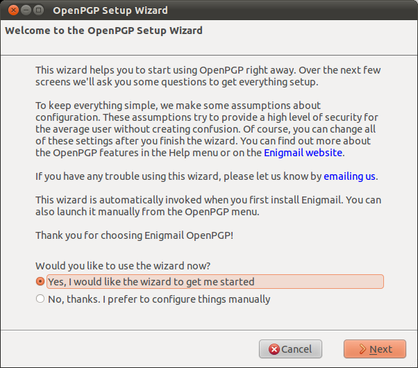
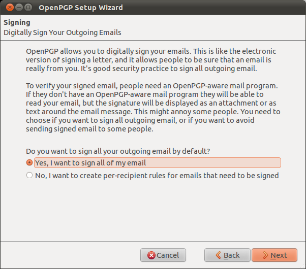
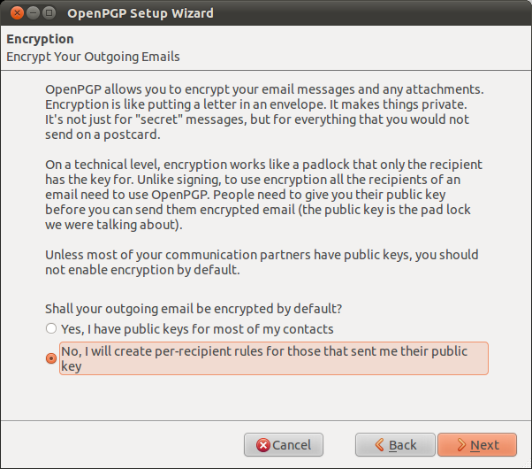
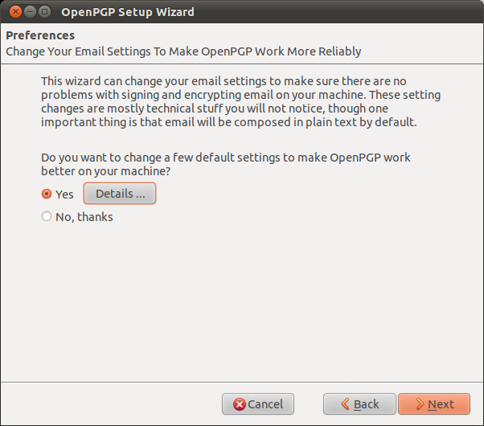
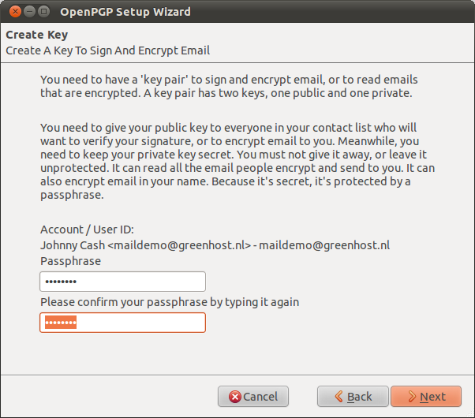
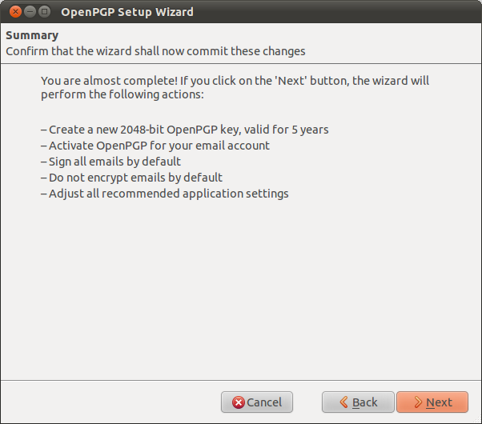
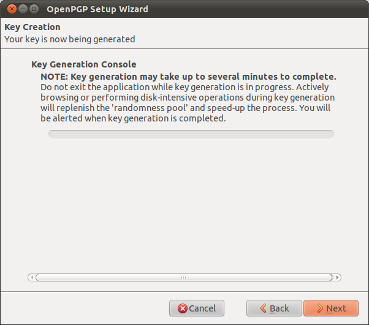
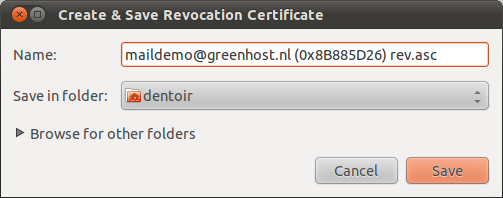
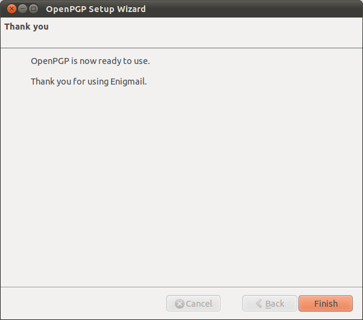

Creación de sus claves PGP
==========================

Enigmail presenta un agradable asistente que le ayudará a crear su par de claves pública/privada (vea el capítulo Introducción a PGP para una explicación). Puede iniciar el asistente en cualquier momento dentro de Thunderbird seleccionando `OpenPGP > Setup Wizard` desde el menú superior.

 1. Así luce el asistente. Por favor, lea el texto en todas las ventanas con cuidado. Proporciona información útil y lo ayudará a configurar PGP de acuerdo con sus preferencias personales. En la primera pantalla, haga click en Next para iniciar la configuración.

 

 2. El asistente le preguntará si desea firmar todos los mensajes de correo salientes. La firma de todos los mensajes es una buena opción. Si usted no la elige, todavía puede decidir hacerlo de forma manual para firmar un mensaje cuando lo está redactando. Haga clic en el botón 'Next' una vez que haya tomado una decisión.

 

 3. En la siguiente pantalla, el asistente le preguntará si desea cifrar *todos* los mensajes de correo salientes. A diferencia de la firma de correo electrónico, el cifrado requiere que el destinatario disponga de software de PGP instalado. Probablemente debería responder 'no' a esta pregunta, por lo que se va a enviar normal (sin cifrar) de correo por defecto. Una vez que haya tomado su decisión, haga clic en el botón 'Next'.

 

 4. En la siguiente pantalla el asistente le preguntará si quiere cambiar algo en su configuración del formato del correo para trabajar mejor con PGP. Es una buena opción responder 'Sí' aquí. Esto significa que, por defecto, el correo estará integrado en texto sin formato en lugar de HTML. Haga clic en el botón 'Next' después de que usted haya tomado su decisión.

 

 5. En la siguiente pantalla, seleccione una de las cuentas de correo. En el cuadro de texto 'Contraseña' debe introducir una. Se trata de un nuevo archivo *contraseña* que se utiliza para proteger su clave privada. Es **muy importante** recordar esta contraseña, ya que no puede leer sus mensajes de correo electrónico cifrados propios en caso de olvido. Debe ser una contraseña **fuerte**, lo ideal es 20 caracteres o más. Por favor, vea el capítulo sobre las contraseñas para obtener ayuda sobre la creación de contraseñas únicas, largas y fácil de recordar. Una vez seleccionada una su cuenta creada una contraseña, haga click en el botón "Siguiente".

 

 6. En la siguiente pantalla del asistente resume las acciones que tomará para habilitar el cifrado PGP para su cuenta. Si está satisfecho, haga clic en el botón "Siguiente".

 

 7. Sus claves serán creados por el asistente, que tomará algún tiempo. Cuando se haya completado, haga clic en el botón "Siguiente".

 

 8. Ahora tiene su propio par de claves PGP. El asistente le preguntará si también desea crear un "certificado de revocación. Este es un archivo que se puede utilizar para informar a todo el mundo si la clave privada está en peligro, por ejemplo, si su portátil es robado. Piense en ello como un "kill switch" para su identidad PGP. Usted también puede desear revocar la clave, simplemente porque usted ha generado una nueva, y el viejo es obsoleto.

 

 9. Si ha decidido generar un certificado de revocación, el asistente le pedirá la ubicación del archivo debe ser guardado. El diálogo tendrá un aspecto diferente dependiendo del sistema operativo que utilice. Es una buena idea cambiar el nombre del archivo a algo sensato como *my_revocation_certificate*. Haga clic en "Guardar" cuando usted haya decidido sobre un lugar.

 

 10. Si ha decidido generar un certificado de revocación, el asistente le informa de que se ha almacenado correctamente. Si lo desea, imprimirlo o grabarlo en un CD y guárdelo en un lugar seguro.

 

 11. El asistente le informará de que ha completado.

 

Felicitaciones, ahora tiene un cliente de correo electrónico de PGP totalmente configurado. En el próximo capítulo vamos a explicar cómo manejar sus llaves, mensajes de muestra y hacer la encriptación. Thunderbird puede ayudarle a hacer un montón de estas cosas automáticamente. 
