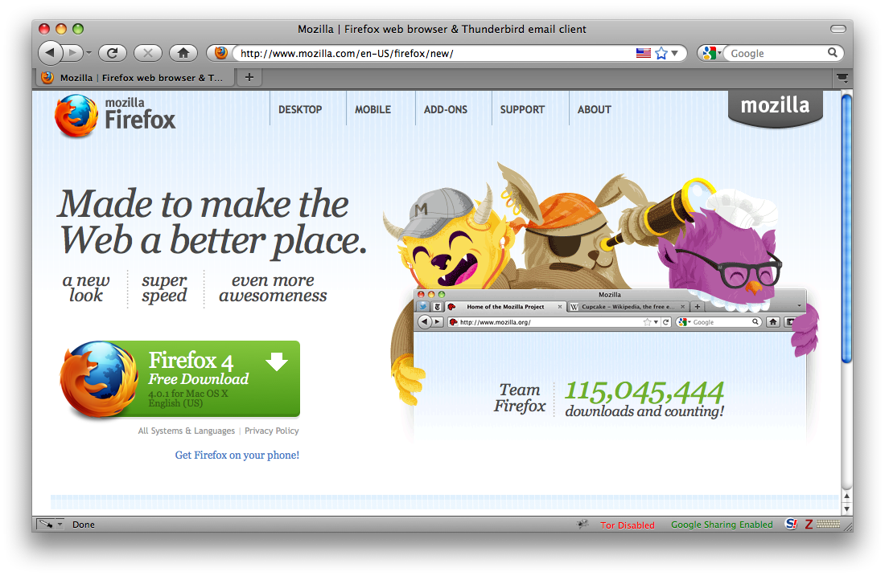
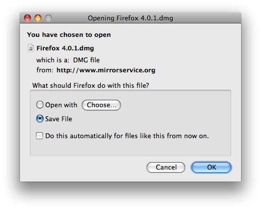
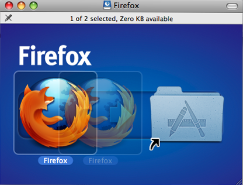
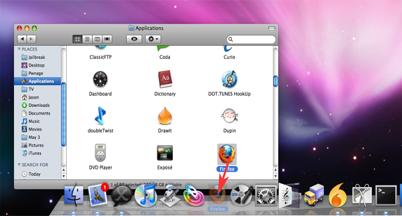
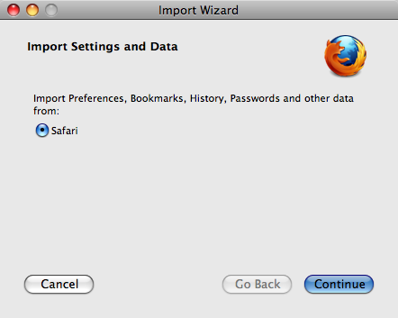
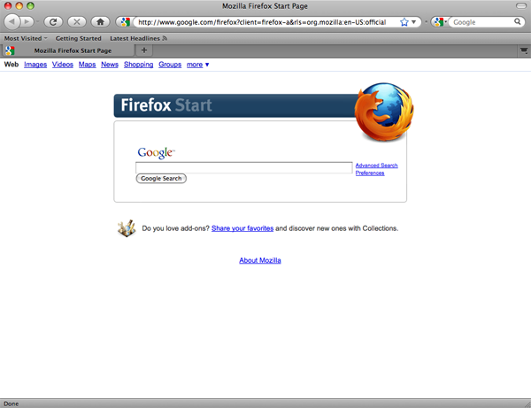

Instalación en Mac OS X
=======================

 1. Para descargar Firefox, visite su [página web](https://www.mozilla.org/firefox) y haga click en el botón verde etiquetado como "Firefox Free Download". La descarga debería comenzar automáticamente, si no es así, haga click en el enlace para descargarlo manualmente.

  

 2. Cuando se lo pidan, haga click en **OK**.

  

 Cuando se complete la descarga aparecerá una ventana similar a la siguiente:

 

 3. Haga click y arrastre el ícono de **Firefox** sobre la parte superior del ícono de **Applications**.

 4. Cuando la instalación haya terminado, cierre las dos ventanas pequeñas de Firefox.
 5. Elimine la imagen de disco de Firefox. Si esto no funciona de forma normal, seleccione el ícono de imagen de disco y luego, en el menú Finder, seleccione `File > Eject Firefox`.
 6. Ahora, abra el directorio **Applications** y arrastre el ícono de **Firefox** al dock:

 

 7. Haga click en el ícono de **Firefox** en el Dock para ejecutarlo. Aparecerá la casilla de diálogos del asistente de importación:

 

 8. Para importar sus marcadores, contraseñas y otros datos de Safari, haga click en **Continue**. Si no desea importar nada, solo seleccione **Cancel**.

Felicitaciones, ¡ya está preparado para usar Firefox!

