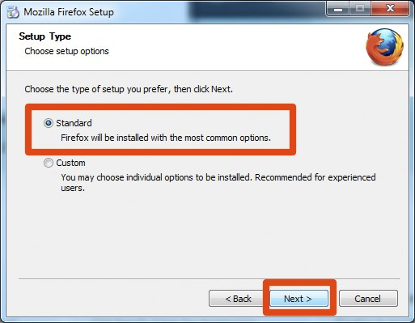
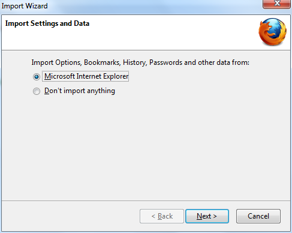

Instalación de Firefox en Windows
=================================

 1. Para descargar Firefox, visite su [página web](https://www.mozilla.com/firefox/).

 

 2. Haga click en el botón de descarga y el archivo de instalación se descargará en su computadora.

 3. Una vez completada la descarga, haga doble click en el archivo de instalación para iniciar el asistente.

    * Si está ejecutando Windows Vista, debería tener acceso al control de cuentas de usuario. En este caso, permita que se ejecute la configuración pulsando **Continue**.
    * Si está ejecutando Windows 7, se le preguntará si le permite a Firefox realizar cambios en su computadora. Haga click en **Yes**.

    Aparecerá una pantalla de bienvenida.

 4. Pulse **Next** para continuar. Se le preguntará si desea la instalación estándar, o si quieres personalizarla. Elija la instalación estándar y haga click en **Next**.

 

 5. Se le preguntará si desea que Firefox sea su navegador por defecto. Se recomienda que sí lo sea.

 

 6. Haga click en **Install**.

 7. Para importar sus marcadores y otros datos de otros navegadores (por ejemplo Internet Explorer),haga click en **Continue**. Si no desea importar nada, solo seleccione **Cancel**.

 

 8. Una vez instalado Firefox, haga click en **Finish** para cerrar el asistente de configuración.

Si tilda la casilla de verificación **Launch Firefox now**, Firefox se ejecutará después que usted pulse **Finish**. Otra forma de ejecutarlo es a través del menú de inicio.

### Usuarios de Windows Vista

Si en ningún momento a través del proceso de instalación le piden ingresar con la ventana de control de cuenta de usuario, presione Continue, Allow, o Accept.

Problemas
---------

Si surgen problemas con el uso de Firefox, consulte la sección de [ayuda](https://support.mozilla.com/kb/Firefox+will+not+start)

