Instalación de KeePass
======================

Explicaremos la instalación de KeePass en Ubuntu, en Windows y en Mac OSX.

Mac OS X viene con un excelente archivo administrador integrado de contraseña llamada Keychain que es bastante seguro Los inconvenientes son que no es de código abierto y no funciona en otros sistemas operativos. Si lo necesitas para llevar tus contraseñas de un sistema operativo a otro, es mejor quedarse con Keepass después de todo. Cómo utilizar Keychain se explicará en el capítulo siguiente.

Instalación de KeePassX en Ubuntu
---------------------------------

Para instalarlo en Ubuntu vamos a utilizar el Ubuntu Software Center. Escriba KeePass en el campo de búsqueda en la parte superior derecha y la aplicación KeePassX deberá aparecer automáticamente en el listado.

Resalte el elemento (que puede estar ya resaltado por defecto) y pulse en "Instalar". Se le pedirá autorización para el proceso de instalación:

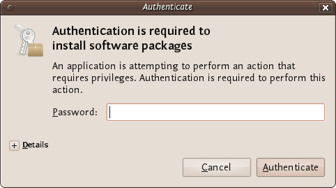

Introduzca la contraseña y pulse «verificar», el proceso de instalación comenzará entonces.

Ubuntu no ofrece una respuesta muy buena para mostrar que el software está instalado. Si el indicador de progreso verde en la izquierda ha desaparecido y la barra de progreso de la derecha se ha ido entonces se puede suponer que el software está instalado.

Instalación de KeePass en Windows
---------------------------------

Primero visite la [página web de descarga de KeePass](http://keepass.info/download.html) y seleccione el instalador apropiado. En este capítulo se utiliza el [Instalador actual](http://downloads.sourceforge.net/keepass/KeePass-2.15-Setup.exe).

Descárguelo a su computadora y haga doble click en el instalador. Primero se le pedirá que seleccione un idioma, vamos a elegir el idioma Inglés:

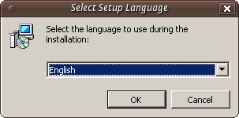

Presione 'OK' y se mostrará la siguiente pantalla:

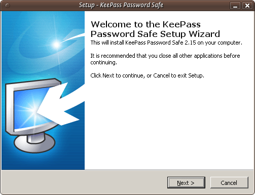

Sólo pulse en 'Next>' y vaya a la siguiente pantalla:

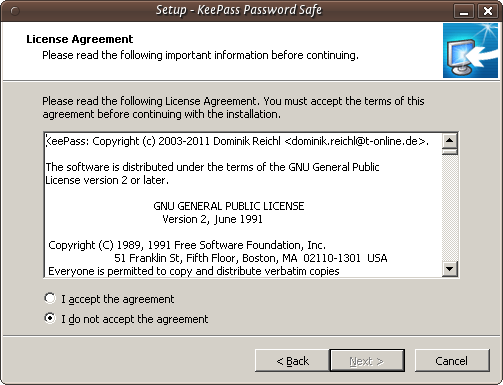

En la pantalla que se muestra arriba hay que seleccionar "Acepto el acuerdo" de lo contrario no podrá instalar el software. Elija esta opción y luego pulse 'Next>'. En la siguiente pantalla se le pedirá determinar la ubicación de la instalación. Puede dejar los valores por defecto a menos que tenga una buena razón para cambiarlos.

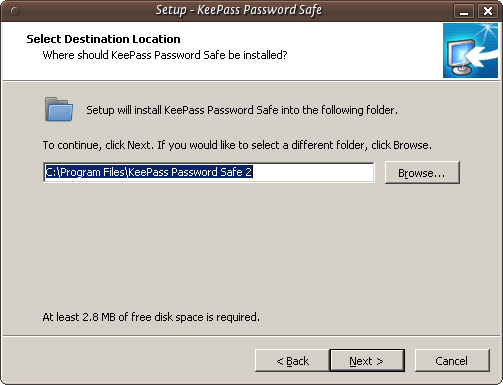

Haga clic en 'Next>' y continúe.

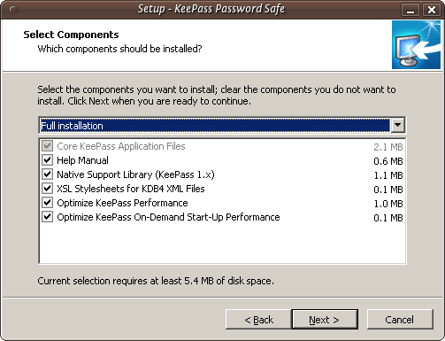

La imagen de arriba muestra los componentes de KeePass que usted puede elegir. Deje los valores por defecto como están y pulse 'Next>'. Llegará a una nueva pantalla:

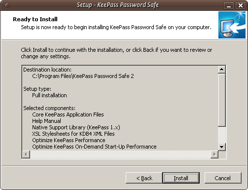

Esto no hace otra cosa que mostrarle un resumen de sus opciones. Presione "Instalar" y el proceso de instalación comenzará.

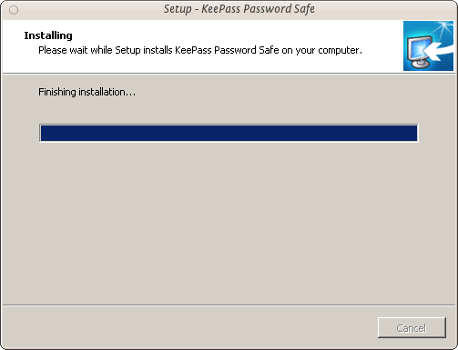 

Instalación de KeePass en Mac OS X
----------------------------------

Aunque KeyChain de Mac OS X hace un trabajo excelente al almacenar sus contraseñas, es posible que desee ejecutar su propia base datos y administrador de contraseñas. KeePass permite esta flexibilidad adicional. Primero visite la página web de descarga KeePass (http://keepass.info/download.html) y seleccione el instalador apropiado. Aunque los instaladores oficiales se enumeran en la parte superior de la página, hay instaladores no oficiales/contribuidos más abajo. Desplácese hacia abajo para encontrar [KeePass 2.x para Mac OS X](http://keepass2.openix.be/):

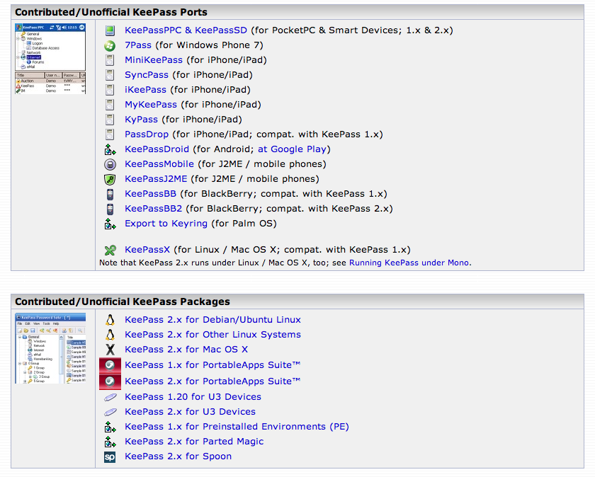

Como se trata de un enlace externo, su navegador será redirigido a [http://keepass2.openix.be/](http://keepass2.openix.be/):

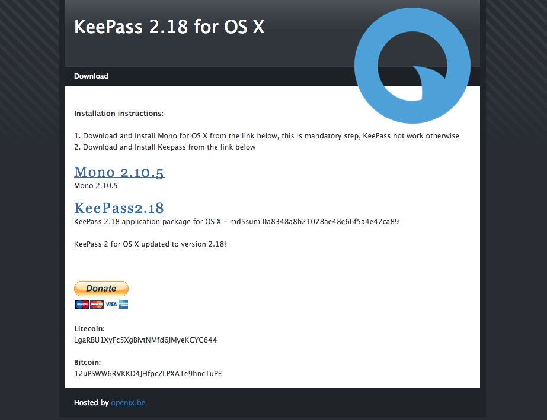

Nótese aquí que debe instalar el framework Mono primero, para que KeePass puede ejecutarlo en Mac OS X. Haga un click sobre cada uno de los enlaces [Mono 2.10.5](http://download.mono-project.com/archive/2.10.5/macos-10-x86/0/MonoFramework-MRE-2.10.5_0.macos10.xamarin.x86.dmg) y [KeePass2.18](http://keepass2.openix.be/KeePass2.18.dmg) para descargar los archivos DMG a su computadora. Haga doble click en cada uno de los DMGS en tus carpeta de descargas para descomprimir los volúmenes en el escritorio.

El programa de instalación del paquete Mono se llama 'MonoFramework-MRE-2.10.5_0.macos10.xamarin.x86.pkg', por lo que debe hacer doble click en este documento en el volumen MonoFramework en el escritorio:

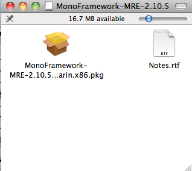

El instalador se abra y ejecuta:

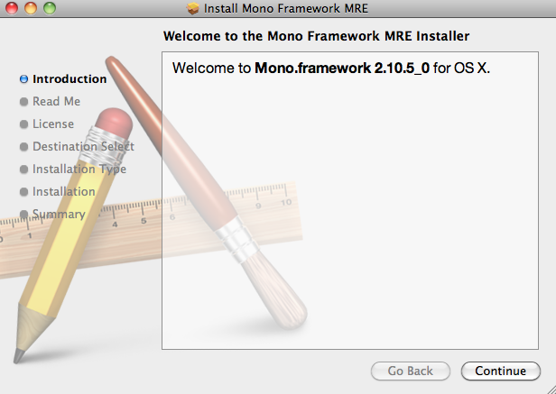

Siga cada uno de los pasos, haga clic en "Continuar", el siguiente paso es ver la sección 'Read me'. Esta es información importante, ya que posee todos los archivos que el paquete instalará, incluyendo información sobre cómo desinstalar Mono:

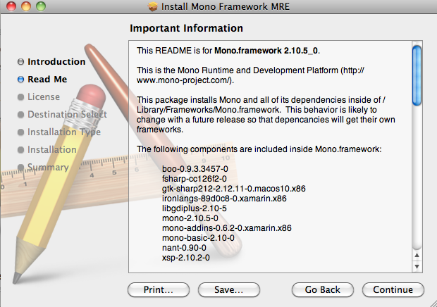

Haga click en 'Continue' en la pantalla siguiente, la licencia. Aparecerá el cuadro de diálogo de acuerdo/desacuerdo. Si está de acuerdo con las condiciones de la licencia, la instalación continuará:

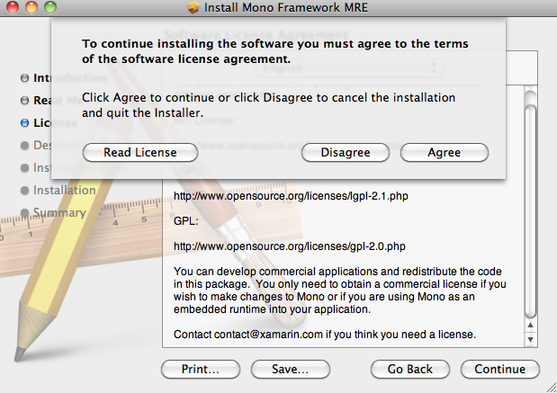

Los siguientes dos pasos de la instalación le pedirán que elija un destino y comprobar que haya espacio suficiente en el disco. Cuando la instalación se haya completado, verá la siguiente pantalla:

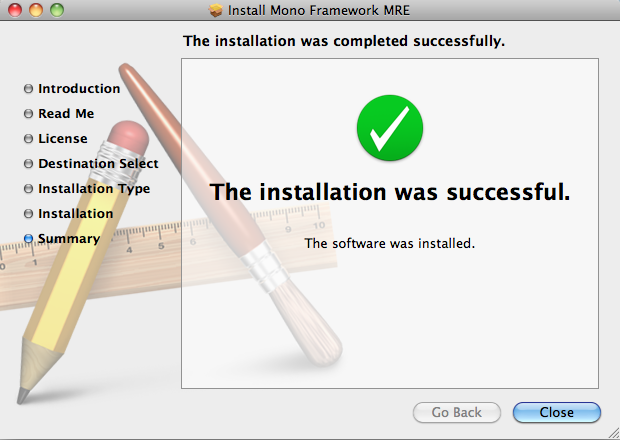

Ahora puede salir del instalador. A continuación, eche un vistazo a la imagen del disco KeePass, haga doble click para abrirlo y arrastre la aplicación KeePass a su carpeta de Aplicaciones:

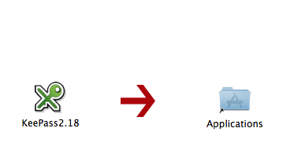
 
Ahora KeePass está listo para usar en Mac OS X.

