VPN en MacOSX
=============

Configurar un servicio VPN en MacOSX es muy sencillo una vez que tiene habilitada su cuenta. Supondremos que ya tiene en su poder las credenciales suministradas por su proveedor de VPN, para establecer una conexión L2TP/IPSec. Esta información debería contener lo siguiente:

 * Nombre de usuario, por ejemplo `bill2`
 * Contraseña, por ejemplo `verysecretpassword`
 * servidor VPN, por ejemplo `tunnel.greenhost.nl`
 * Una clave pre-compartida o un certificado de máquina

Configuración
-------------

 1. Antes de comenzar, por favor asegúrese de leer el párrafo "prueba antes y después de configurar una cuenta", para comprobar si su conexión trabaja correctamente.

 2. Un servicio VPN se configura en network settings, que son accesibles por medio de "System Preferences.." en el menú de Apple.

 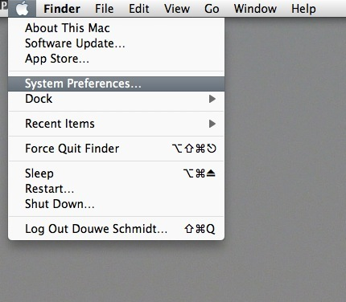

 3. Abra Network preferences.

 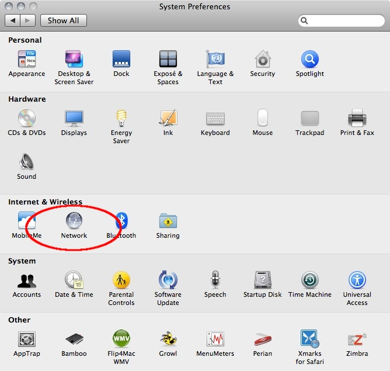

 4. OSX usa este sistema para bloquear la pantalla. Para agregar una VPN es necesario desbloquearla, haciendo doble click en el candado de la parte inferior izquierda de su pantalla.

 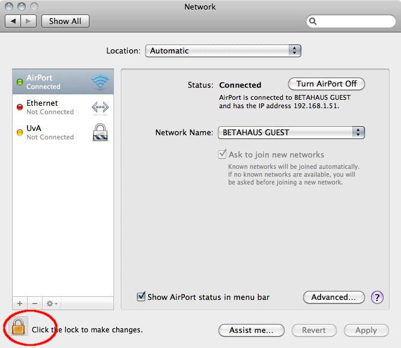

 5. Ingrese sus credenciales.

 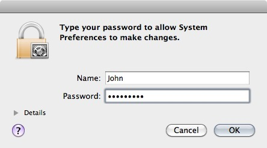

 6. Ahora puede agregar una nueva red, haciendo click en el signo "+".

 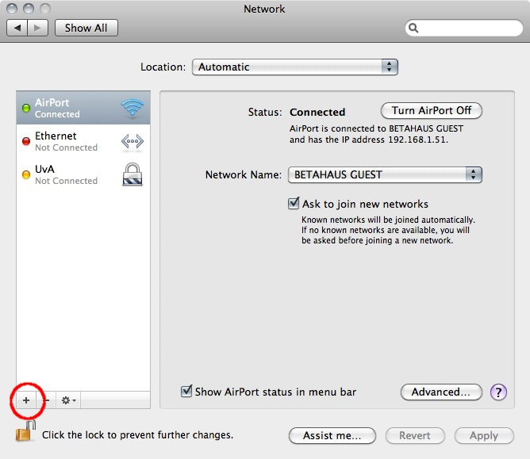

 7. En la ventana emergente deberá especificar el tipo de conexión. En este caso elija una interfaz VPN con L2TP sobre IPSec. Es el sistema más común. No olvide darle a la conexión un nombre bonito.

 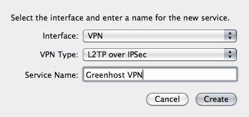

 8. Sigamos con los datos de conexión. Complete el nombre del servidor del proveedor y su nombre de usuario (denominado 'Account Name'). Hecho esto, pulse el botón "Authentication Settings...".

 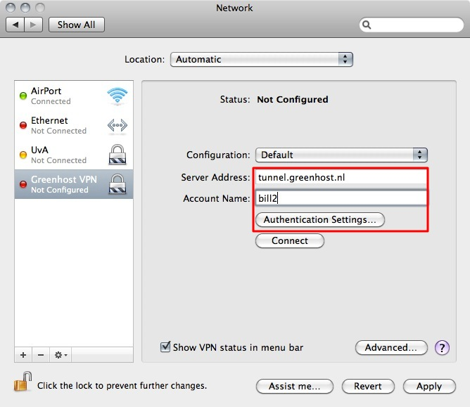

 9. En la nueva ventana emergente puede especificar la información de la conexión. Esta es la manera en que el usuario y la máquina se autentifican. El usuario generalmente se autentifica con una contraseña, aunque se podrían usar otros métodos. La autentificación es realizada a menudo por un secreto compartido (Pre-Shared-Key/PSK), pero también muy a menudo mediante el uso de un certificado. En este caso se utiliza el método del secreto compartido. Hecho esto, haga click en OK.

 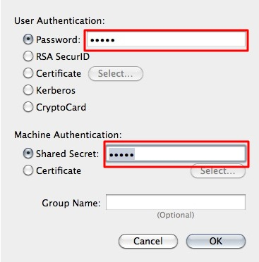

 10. Volvamos a la pantalla de red. El próximo paso es muy importante, por eso haga click en "Advanced..."

 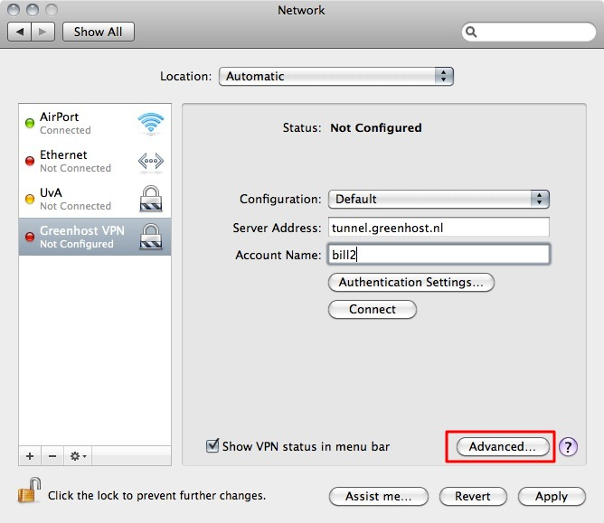

 11. En la nueva ventana emergente verá la opción para enrutar todo el tráfico a través de una conexión VPN. Habilítela para cifrar todo su tráfico.

 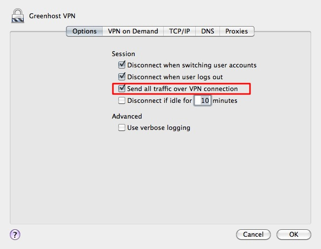

 12. Bueno, hemos terminado. ¡Ahora conéctese!

 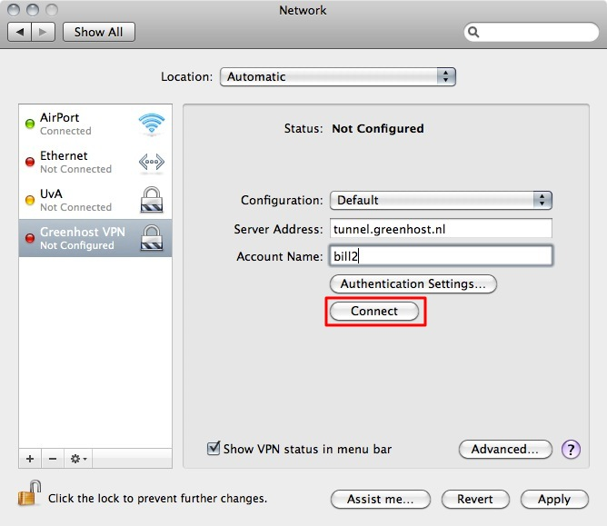

 13. Aparecerá una ventana emergente. Para confirmar los cambios, sólo pulse "Apply"

 

 14. Después de unos pocos segundos, en el lado izquierdo la conexión debe tornarse verde. Si esto sucede, entonces ¡ya está conectado!

 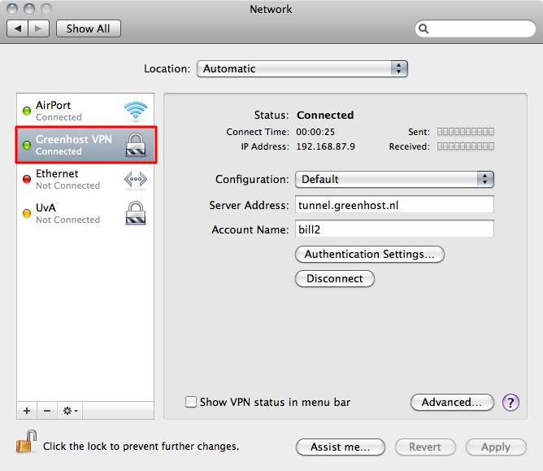

 15. Ok, ahora pruebe su conexión
