Instalando TrueCrypt
====================

TrueCrypt puede ser instalado en Windows, GNU/Linux, o Mac OSX. Los archivos de instalación están disponibles en su [página web](http://www.truecrypt.org/downloads)

La sección siguiente explica detalladamente como instalar TrueCrypt en su computadora para diversos sistemas operativos, comenzando con Ubuntu.

Instalación en Ubuntu
---------------------

TrueCrypt no está disponible en los repositorios estándares de Ubuntu. Esto significa que no puede usar el centro de software Ubuntu o *apt-get* (el método de la línea de comandos para instalar software en Ubuntu). Además, debería visitar primeramente la página de descargas de [TrueCrypt](http://www.truecrypt.org/downloads).

Usted verá primero un menú desplegable bajo el encabezado Linux.

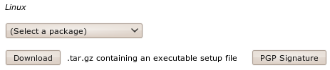

Del menú desplegable '(Select a package)' puede elegir una entre cuatro opciones:

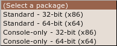

Esta es una versión para instalar desde la consola - la que debe elegir si tiene habilidades técnicas y no quiere usar interfaces gráficas de usuario o si desea correr TrueCrypt en una máquina que sólo posea una terminal (línea de comandos o 'shell') de acceso (como un servidor remoto por ejemplo).

Suponiendo que usted ejecutará TrueCrypt en su computadora personal la mejor opción es la 'standard', la más sencilla, que le proporcionará una agradable interfaz de usuario. Debe elegir  entre las dos opciones disponibles la más adecuada para la *arquitectura* de su máquina. ¿No sabe qué significa? Bueno, esto se relaciona básicamente con el tipo de hardware del procesador que posee su computadora, las opciones son 32-bits o 64-bits. Desafortunadamente Ubuntu no facilita información si no dispone de algunos conocimientos. Necesita abrir una desde el menú Aplicaciones->Accesorios y tipear

    uname -a

La salida será algo como `Linux bigsy 2.6.32-30-generic #59-Ubuntu SMP Tue Mar 1 21:30:46 UTC 2011 x86_64 GNU/Linux`. En esta instancia usted puede ver que la arquitectura es de 64-bit (`x86_64`). En este ejemplo debería elegir la opción 'Standard - 64-bit (x64)'. Si lee `i686` en algún en la salida del comando uname entonces debería elegir la opción restante para descargar.

Una vez elegida presione el botón 'download' y grabe el archivo en su computadora.

El proceso de instalación aún no ha terminado. El archivo que ha descargado está comprimido (para acelerar la descarga) y debe descomprimirlo antes de instalarlo. Afortunadamente Ubuntu lo hace muy fácilmente - simplemente vaya al archivo en su computadora y haga click con el botón derecho sobre él y elija 'Extraer aquí'.

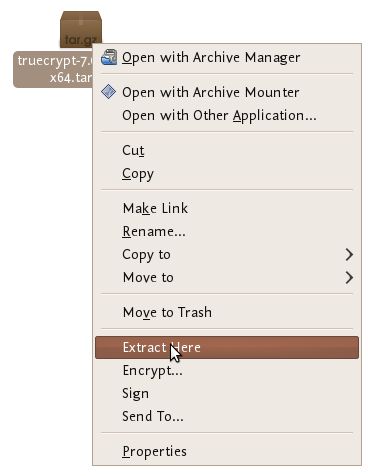

Verá que aparece un nuevo archivo cerca del original comprimido:

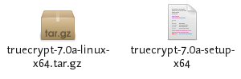

¡Casi hemos terminado! Ahora haga click derecho sobre el nuevo archivo y elija 'open':

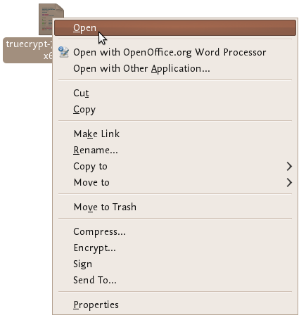

Si todo va bien verá una ventana abierta como esta:

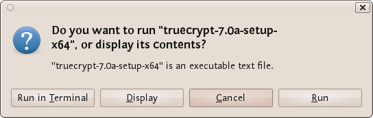

Elija 'Run' y verá lo siguiente:

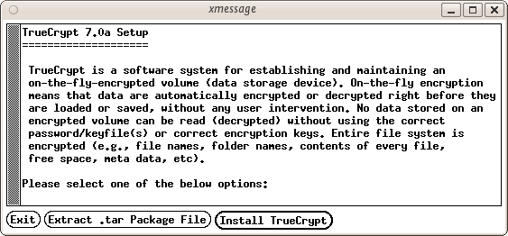

Ahora estamos llegando a alguna parte ... oprima el botón 'Instalar TrueCrypt. Se le mostrará un acuerdo de usuario. En la parte inferior elija "I accept and agree to be bound by the license terms" (suena serio). A continuación, se muestra otra pantalla de información que le dice que usted puede instalar TrueCrypt. Pulse 'OK' y luego se le pedirá la contraseña para instalar software en su ordenador. Introdúzcala y entonces por fin verá una pantalla como ésta:

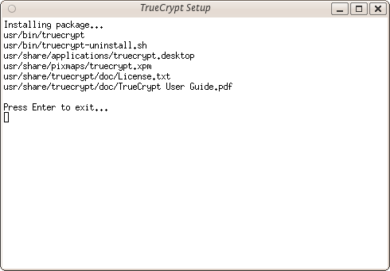

Créalo o no ya está hecho...TrueCrypt está instalado y usted puede acceder desde el menú Aplicaciones->accesorios...cierre la ventana de configuración. Ahora vaya al capítulo Uso de TrueCrypt.

Instalación en OSX
------------------

 1. Para instalar TrueCrypt en OSX primeramente visite la [página de descarga](http://www.truecrypt.org/downloads) y presione el botón de descarga en la sección OSX.

 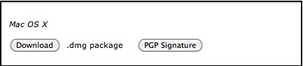

 2. Finalizada la descarga busque el archivo .dmg y ábralo para acceder al paquete de instalación
 
 

 3. Abra el paquete de instalación, y presione en algún lugar del diálogo.

 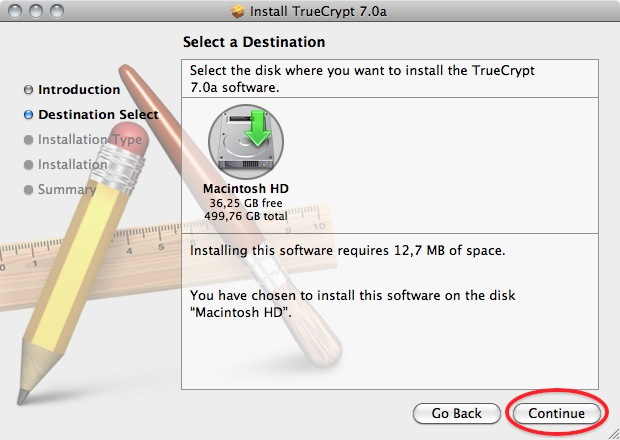

 4. Elija la instalación estándar. (usted puede elegir una instalación personalizada y no seleccionar FUSE, pero no tiene sentido hacerlo. Lo necesita)

 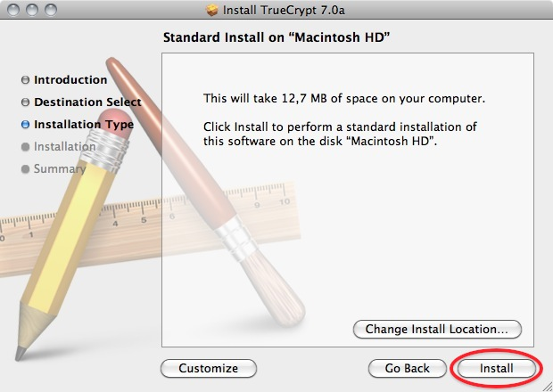

 5. Terminada la instalación podrá hallar el programa en su carpeta de aplicaciones

 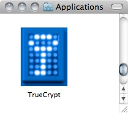

Instalación en Windows
----------------------

Para instalar TrueCrypt en Windows primeramente visite la [página de descarga](http://www.truecrypt.org/downloads) y presione el botón de descarga de la sección de Windows.

Descárguelo a su computadora y haga doble click en el archivo. Verá un acuerdo de usuario.

Haga click en 'I accept and agree to be bound by the license terms' y presione 'Accept'.

Salga de la pantalla anterior con los valores por defecto y presione 'Next >', aparecerá la ventana de opciones de configuración:

Puede dejar los valores predeterminados. Si desea instalar TrueCrypt sólo para usted, entonces no se recomienda seleccionar la opción "Instalar para todos los usuarios". Sin embargo, si va a instalar esto en su propia máquina y nadie más usa la computadora, entonces esto no es necesario. Puede que también desee considerar la instalación de TrueCrypt en una carpeta distinta de la predeterminada. En este caso, haga clic en "Examinar" y elija otra ubicación. Cuando haya terminado, haga clic en "Instalar" y el proceso continuará:

Cuando se complete la instalación aparecerá una confirmación de se ha realizado correctamente. Cierre esta ventana y haga clic en "Finalizar". Ahora continúe con el capítulo sobre el uso de TrueCrypt.

