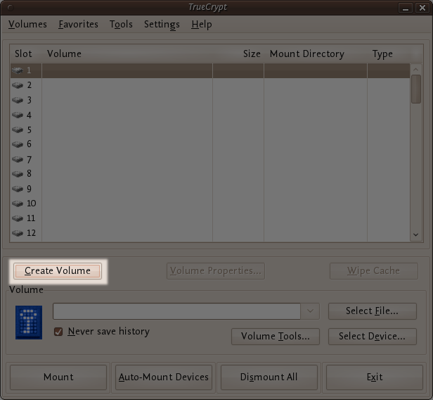
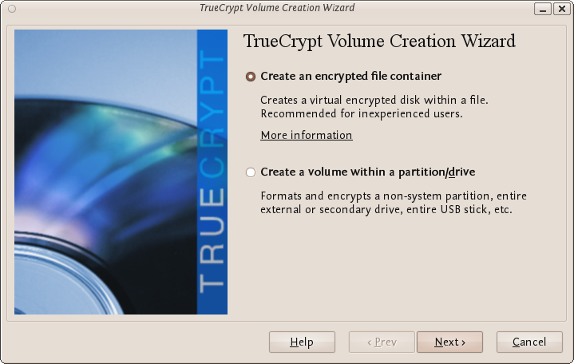
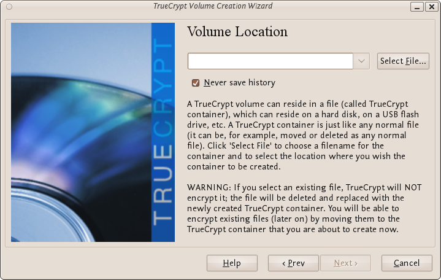
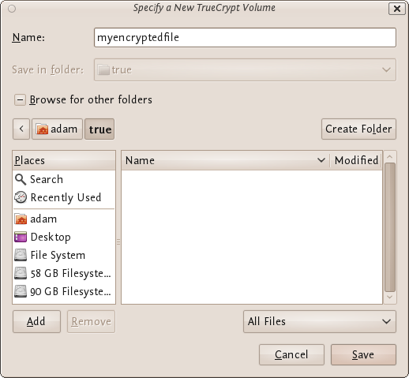
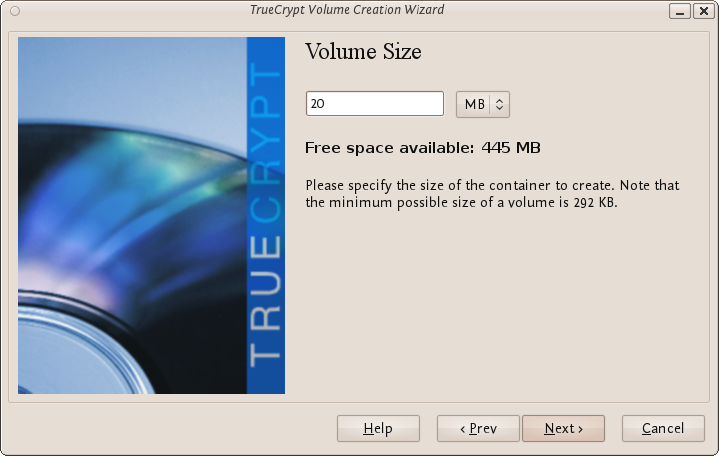
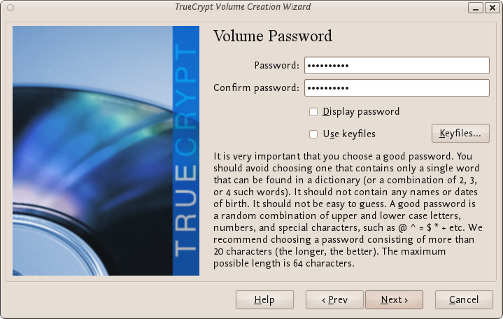
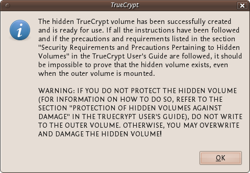

Configuración de un volumen oculto
==================================

Un volumen TrueCrypt oculto existe en el espacio libre de un volumen TrueCrypt típico. Suponiendo que accedamos al 'volumen externo', es (casi) imposible determinar si hay un volumen oculto dentro de él. Esto es así porque TrueCrypt *siempre* llena el espacio vacío de un volumen cifrado con datos aleatorios. Por eso un volumen oculto se ve igual que un volumen vacío.

Para crear y utilizar un volumen oculto se necesitan dos contraseñas - una para cada uno de los volúmenes, el exterior y el interior (oculto). Cuando monte (abra) el volumen puede utilizar cualquiera de ellos y esto determinará cuál de los dos estará abierto. Si desea abrir sólo el volumen oculto utilice una contraseña, y si usted desea tener acceso sólo al volumen cifrado no oculta deberá utilizar la otra contraseña.

Para crear un volumen abra TrueCrypt oculto y pulse el botón 'Crear volumen': 

Las opciones para la mitad de este proceso son casi todas iguales a las usadas para configurar un volumen TrueCrypt estándar, no obstante indicaremos el proceso completo paso por paso. En la pantalla mostrada debajo deberá optar por la configuración por defecto 'Create an encrypted file container':

Presione 'Next >' y continúe a la próxima pantalla. 

Elija la segunda opción 'Hidden TrueCrypt Volume'. Haga click en 'Next >' entonces le pedirán que seleccione un lugar y un nombre para el volumen TrueCrypt *externo*.

Haga click en 'Select File...' y navegue hasta el lugar donde ubicará el nuevo volumen. Nosotros usaremos el nombre 'myencryptedfile' en este ejemplo. Es el mismo nombre usado en el último ejemplo por eso tenga cuidado si ha seguido nuestras instrucciones anteriores porque ahora debe crear un volumen nuevo con un nombre diferente.

Navegue al directorio donde desea colocar el volumen externo e ingrese el nombre en el campo 'Name' como en el ejemplo anterior. Grabe los cambios. El navegador de archivos se cerrará y usted volverá al asistente. Presione 'Next >'. Aquí se encontrará con algunas decisiones técnicas. No se preocupe. Acepte todas por defecto. La próxima pantalla le pedirá que determine el tamaño de su volumen externo. Note que cuando haga esto el tamaño máximo del volumen interior 'oculto' lo determina TrueCrypt. Este tamaño máximo será  de hecho menor que el tamaño que usted está configurando en su pantalla. Si no está seguro de cuál es la relación entre el tamaño del volumen exterior y el tamaño del volumen interior (oculto) a partir de ahora deberá simular el proceso - siempre podrá desechar el volumen cifrado y empezar de nuevo (sin provocar ningún daño).

Elegimos entonces el tamaño del volumen exterior, que será de 20MB:

No se puede configurar el tamaño del volumen exterior más grande que el espacio libre disponible en su disco. TrueCrypt le informa el tamaño máximo posible en negrita. Luego haga clic en 'Siguiente >' y pasará a una pantalla que le solicitará que establezca una contraseña para el volumen exterior (no el oculto, esto viene después).

Ingrese una contraseña fuerte (consulte el capítulo acerca de crear buenas contraseñas) y presione 'Next >'. Ahora TrueCrypt lo ayudará a crear datos aleatorios para completar el volumen con ellos. Mueva zigzagueando su ratón por toda la pantalla, navegue por internet, haga cualquier cosa que se le ocurra. Cuando crea que TrueCrypt ya está satisfecho, pulse 'Format'. Usted verá una barra de progreso rápida y luego aparecerá la siguiente pantalla:

Usted puede abrir el volumen exterior si quiere, pero en este capítulo lo vamos a saltear y seguir adelante para crear el volumen oculto. Pulse 'Siguiente >' y TrueCrypt le informará el tamaño máximo posible del volumen oculto.

Cuando vea la pantalla mostrada más abajo, presione 'Next >'. Ahora podrá elegir el tipo de cifrado para el volumen oculto. Mantenga el valor por defecto y presione 'Next >'.

Ahora le pedirá que le indique el tamaño del volumen oculto.

Nosotros hemos configurado (como puede ver más abajo) el tamaño máximo en 10MB. Cuando usted configure el suyo presione 'Next >' y podrá crear una contraseña para el volumen oculto.

Cuando cree la contraseña par el volumen oculto asegúrese que sea sustancialmente diferente de la contraseña del volumen exterior. Si alguien puede acceder a su disco y encuentra la contraseña del volumen oculto podría intentar ligeras variaciones de esta contraseña para ver si puede obtener también la contraseña del volumen oculto. Asegúrese que las dos contraseñas no son similares.

Ingrese su contraseña por duplicado y presione 'Next >'. 

Mantenga los valores por defecto y presione 'Next >' entonces verá la misma pantalla que se le presentaba cuando generaba datos aleatorios para TrueCrypt. Cuando le dé la gana, presione 'Format' y verá lo siguiente :

El manual de TrueCrypt al cual se refiere no es este, es el que se encuentra en http://www.truecrypt.org/docs/

Presione 'OK' y cierre TrueCrypt. Ahora puede montar el volumen como se describió en el capítulo anterior.
