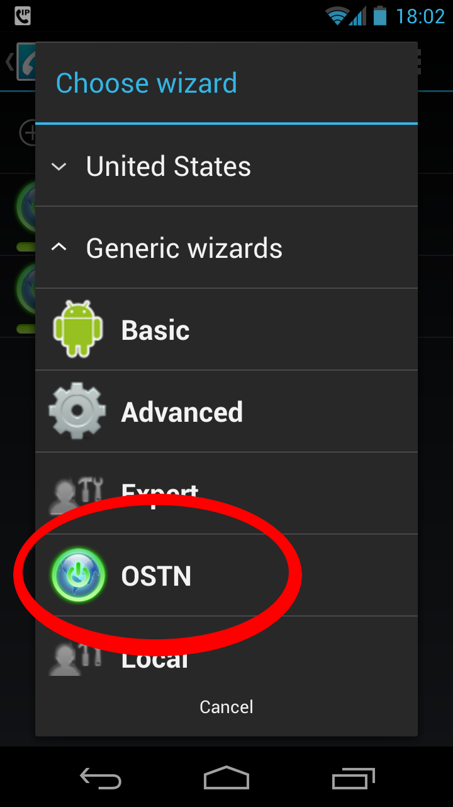
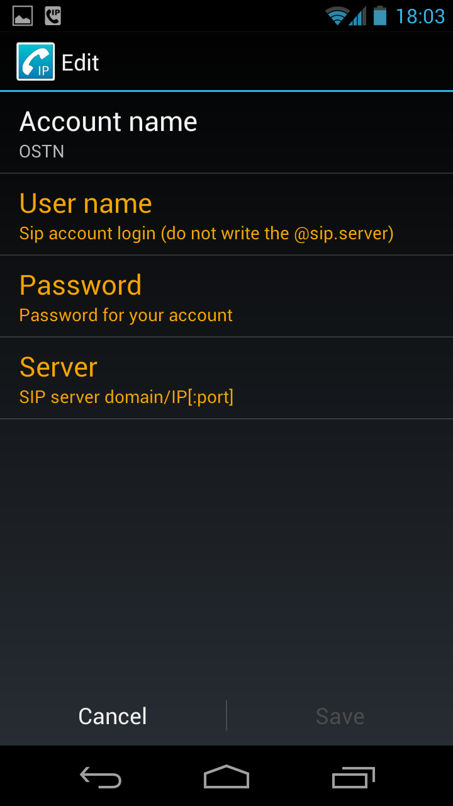
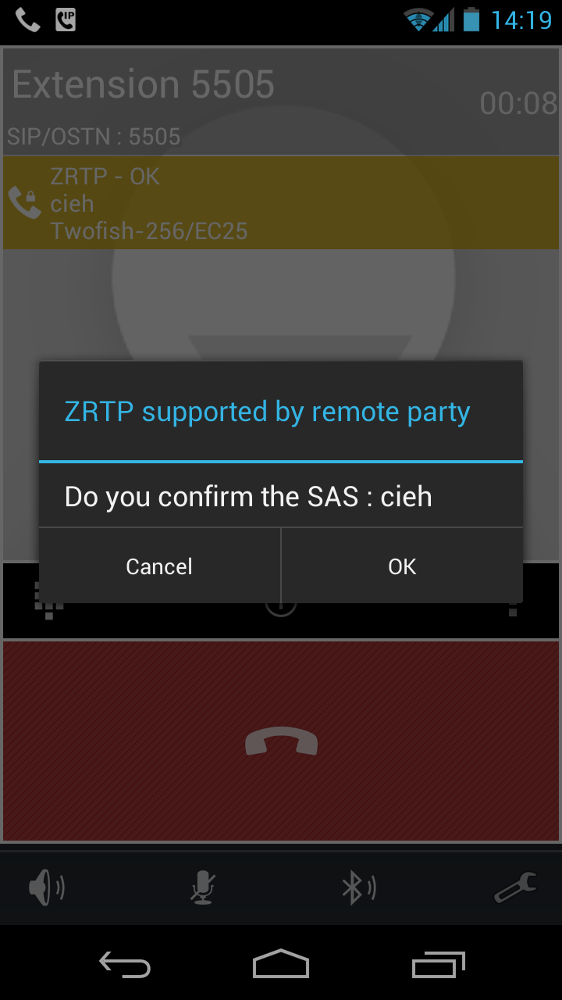

Instalación de CSipSimple
=========================

CSipSimple es un programa para dispositivos Android que permite hacer llamadas cifradas. Naturalmente, el software no es suficiente por sí solo y necesitamos una red de comunicación que nos permita hacer llamadas.

Introducción a la red OSTN
--------------------------

Si conoce acerca de OSTN y tiene una cuenta, puede saltear esta sección.

La red de telefonía abierta (segura, de código abierto, estándar) [OSTN](https://guardianproject.info/wiki/OSTN) es un intento de definir una configuración estándar de voz sobre IP (VoIP) usando el protocolo de inicio de sesión SIP que permite llamadas cifradas de extremo a extremo. De manera similar al correo electrónico, SIP le permite a las personas elegir su proveedor de servicios sin perder su capacidad de llamar a los demás, incluso si no está utilizando el mismo proveedor. Sin embargo, no todos los proveedores de SIP ofrecen OSTN y los proveedores tienen que apoyar OSTN para que las llamadas sean seguras. Una vez que una relación entre dos personas se ha establecido, los datos de audio se intercambian directamente entre las dos partes. Los datos se cifran de acuerdo con el protocolo de transporte seguro en tiempo real (SRTP).

La mayoría de las aplicaciones de cifrado de VoIP utilizan actualmente el protocolo de descripción de sesión denominado Descripciones de Seguridad para flujos de medios (SDES) con la seguridad de la capa de transporte (TLS) salto por salto para intercambiar claves maestras secretas para SRTP. Este método no es de extremo a extremo seguro como las claves de SRTP ya que son visibles en texto claro a cualquier proxy SIP o proveedor involucrado en la llamada.

ZRTP es un protocolo de acuerdo de clave cifrada para negociar las claves de cifrado entre dos partes. Los puntos extremos ZRTP utilizan el flujo de medios de comunicación en lugar del flujo de señalización para establecer las claves de cifrado SRTP. Puesto que la corriente de medios de comunicación es una conexión directa entre las partes que llaman, no hay manera para que los proveedores de SIP o proxies para interceptar las claves SRTP. ZRTP proporciona una tranquilidad razonable para los usuarios finales que tienen una línea segura. Al leer y comparar un par de palabras, los usuarios pueden estar seguros de que el intercambio de claves se ha completado.

CSipSimple
----------

CSipSimple es un cliente libre y open source para Android que trabaja bien con OSTN. Puede encontrarlo [aquí](https://market.android.com/details?id=com.csipsimple)

Para usar CSipSimple con ostel.me, elija OSTN en el asistente genérico cuando cree una cuenta e ingrese un nombre de usuario, contraseña y servidor según lo previsto después de inscribirse en [Ostel](https://ostel.me/users/sign_up)

Una vez que llame a otra persona con CSipSimple aparecerá una barra amarilla con ZRTP y el par de verificación de palabra. Ahora se ha establecido una conexión de voz segura que no puede ser interceptada. Sin embargo, usted debe ser consciente de que el teléfono o el teléfono de la otra parte pueden estar configurados para grabar la conversación.

Pasos básicos:

 1. Instalar CSipSimple desde Google Play store u otra fuente verificada
 2. Ponerlo en marcha y elegir si desea realizar llamadas SIP a través de conexión de datos o sólo Wi-Fi
 3. Configurar su cuenta

Para usar CSipSimple con ostel.me, elija OSTN en la sección Generic Wizards cuando cree una cuenta. Puede alternar entre los proveedores de los "Estados Unidos" haciendo clic en "Estados Unidos". Ahora seleccione *OSTN*:

Ahora puede ingresar su usuario (número), contraseña y servidor (ostel.me) según lo previsto después de inscribirse en [Ostel](https://ostel.me/users/sign_up).

Ahora usted puede hacer una llamada. La primera vez que se conecte a una persona con ZRTP usted tiene que comprobar que el intercambio de claves se ha realizado correctamente. En el siguiente ejemplo la palabra de confirmación es "cieh", usted puede hablar con la otra parte, y asegurarse de que ambos ven la misma palabra. Una vez terminado, pulse Aceptar.

Usted ha establecido una conexión de voz segura que no puede ser interceptada. Tenga en cuenta que usted o el teléfono de la otra parte podría estar grabando la conversación.

