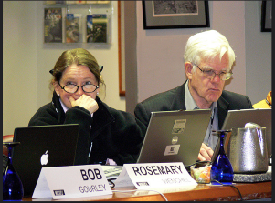
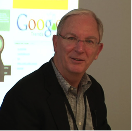
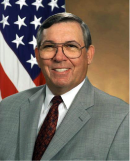
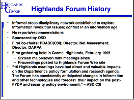

# Como la CIA hizo a Google

## Dentro de la red secreta detrás de la vigilancia global, una guerra sin fin, y Skynet - parte I

*INSURGE INTELLIGENCE, un nuevo proyecto de periodismo de investigación financiado por el público pone al descubierto la historia exclusiva acerca de cómo la comunidad de inteligencia de los Estados Unidos financió, promovió e incubó a _Google_ como parte de una campaña para dominar el mundo a través del control de la información.  Financiada desde su nacimiento por la NSA y la CIA, _Google_ fue simplemente la primera entre una plétora de empresas incipientes del sector privado cooptadas por la inteligencia de los EE.UU.  para mantener su "superioridad en la información".*

El Dr. Nafeez Ahmed es un periodista de investigación, escritor y referente en seguridad internacional. Es ex - columnista de _The Guardian_, escribe la
columna ‘System Shift’ en _Motherboard_ y además es columnista de _Middle East Eye_. Es ganador del "Premio al Proyecto Censurado" de "Periodismo de Investigación Destacado" a raíz de su trabajo en _The Guardian_.

*Los orígenes de esta ingeniosa estrategia se remontan a un grupo secreto patrocinado por el Pentágono que durante las dos últimas décadas ha funcionado como un puente entre el gobierno de los EE.UU. y las élites de los sectores de negocios,  industriales, financieros, corporativos y medios de comunicación. El grupo ha permitido que algunos de los más poderosos y especiales intereses corporativos estadounidenses pudieran eludir sistemáticamente la fiscalización democrática de cuentas y el estado de derecho, para influir en las políticas gubernamentales y en la opinión pública de Estados Unidos y de todo el mundo. Los resultados han sido catastróficos: la vigilancia global de la NSA, un estado permanente de guerra global, y una nueva iniciativa para transformar a los militares de los EE.UU. en _Skynet_.*

**Esta exclusiva está siendo liberada por su interés público y fue posible mediante _crowdfunding_. Quisiera dar las gracias a la maravillosa comunidad de patrocinantes por su apoyo, los cuales me han brindado la oportunidad de trabajar en profundidad en esta investigación. Por favor, apoye al periodismo independiente y de investigación del patrimonio mundial.**

Siguiendo los pasos de los ataques a Charlie Hebdo en París, los gobiernos occidentales se han movido rápidamente para legitimizar la expansión del poder de la vigilancia global y los controles sobre Internet. Todo en nombre de la lucha contra el terrorismo.

Los políticos estadounidenses y europeos han llamado a proteger el espionaje del tipo _NSA_ y a potenciar la capacidad de intrusión sobre la privacidad en Internet mediante la prescripción de la criptografía. Una idea es establecer una sociedad con las compañías de telecomunicaciones para poder eliminar unilateralmente el contenido considerado como "combustible para el odio y la violencia" en situaciones consideradas como "apropiadas".  Se han establecido acaloradas discusiones en los niveles gubernamentales y parlamentarios para explorar medidas enérgicas en contra de la confidencialidad abogado-cliente.

Cómo algo de esto hubiera sido efectivo para prevenir el ataque a Charlie Hebdo sigue siendo un misterio, sobretodo teniendo en cuenta que ya sabemos que los terroristas estaban bajo el radar de la inteligencia francesa desde hace una década.

Hay algo nuevo en esta historia. El atroz 11-S fue el primero de muchos ataques terroristas seguidos por la dramática extensión del poder draconiano del estado a expensas de las libertades civiles y por el respaldo de la proyección de fuerzas militares en regiones identificadas como territorios terroristas.  Sin embargo, hay pocos indicios de que esta fórmula tratada y probada haya hecho algo para reducir el peligro. En todo caso, parece estar encerrada en un ciclo de profundización de la violencia sin fin evidente a la vista.

Mientras nuestros gobiernos presionan para incrementar sus poderes, _INSURGE INTELLIGENCE_ ahora puede revelar la magnitud inmensa del involucramiento de la comunidad de inteligencia de Estados Unidos en el desarrollo de las plataformas web que conocemos hoy en día, con el objetivo preciso de utilizar la tecnología como un mecanismo para luchar en la "guerra de la información" global — una guerra para legitimar el poder de unos pocos sobre el resto de nosotres.  El eje de esta historia es la corporación que de muchas maneras define el siglo XXI con su discreta omnipresencia: _Google_.

_Google_ se muestra a sí mismo como una empresa de tecnología amistosa, buena onda, amigable con le usuarie, que creció en importancia a través de una combinación de talento, suerte y genuina innovación. Esto es verdad. Pero sólo es un fragmento de la historia. En realidad, _Google_ es una cortina de humo detrás de la cual acecha el complejo industrial y militar de los EE.UU. 

La historia interna del ascenso de Google, revelada aquí por primera vez, abre la caja de Pandora iluminando inesperadamente la existencia de una red parásita que impulsa la evolución de los aparatos de seguridad nacional de los EE.UU., y que se beneficia obscenamente de su operación.

### La red oculta

Durante las dos últimas décadas, las estrategias de inteligencia y de relaciones exteriores de EE.UU. han resultado en una "guerra de terror" global que consiste en invasiones militares prolongadas en el mundo musulmán y en una exhaustiva vigilancia de las poblaciones civiles. Estas estrategias han sido originadas, cuando no dictadas, por una red interna secreta que excede al Pentágono.

Establecida bajo la administración Clinton, consolidada con Bush y firmemente afianzada con Obama, esta red bipartidaria de la mayoría de los ideólogos neoconservadores, ha sellado su dominio dentro del Departamento de Defensa de los EE.UU (_DoD_) en los albores del 2015, a través de la operación de una oscura entidad corporativa externa al Pentágono, pero mantenida por él.

En 1999 la CIA creó su propia empresa de inversiones de capital de riesgo, _In-Q-Tel_, para financiar a las prometedoras empresas jóvenes que pudieran crear tecnologías útiles para las agencias de inteligencia. Pero la inspiración para _In-Q-Tel_ viene de antes, cuando el Pentágono constituyó su propio grupo en el sector privado.

Conocida como _Foro Highlands_, esta red privada ha operado como un puente entre el Pentágono y las poderosas élites estadounidenses no militares desde mediados de la década del '90.  A pesar de los cambios en las administraciones civiles, las redes alrededor del _Foro Highlands_ se han vuelto cada vez más exitosas en el dominio de la política de defensa de los EE.UU.

A los gigantes contratistas de defensa como _Booz Allen Hamilton_ y _Science Applications International Corporation_ se los denomina algunas veces "comunidad de inteligencia en las sombras" debido al intercambio de sus empleados con el gobierno y a su capacidad de influir simultáneamente y beneficiarse de la política de defensa. Pero aunque estos contratistas compiten entre sí por el poder y el dinero, colaboran en los momentos importantes. El _Foro Highlands_ durante 20 años ha proporcionado un espacio extraoficial para que algunos de los más prominentes miembros de la _comunidad de inteligencia en las sombras_ pudieran reunirse con altos funcionarios del gobierno de Estados Unidos, junto a líderes de otras industrias relevantes.

La primera vez que supe de la existencia de esta red fue en noviembre del 2014 cuando reporté para Motherboard, de _VICE_, que el secretario de defensa de EE.UU., Chuck Hagel recién había anunciado que la "Iniciativa de Innovación en Defensa" se trataba realmente de construir Skynet - o algo como eso-, esencialmente para dominar una era emergente de conflictos armados robóticos automatizados.

Esta historia está basada en un "libro blanco" del Pentágono, poco conocido y publicado dos meses antes por la Universidad Nacional de Defensa (NDU) en Washington DC, una institución líder de gestión militar estadounidense que entre otras cosas, lleva a cabo investigaciones para desarrollar políticas de defensa de EE.UU. en los más altos niveles. El libro blanco clarifica el pensamiento detrás de la nueva iniciativa y los desarrollos tecnológicos y científicos revolucionarios que esperaban capitalizar. 

### El _Foro Highlands_

El coautor del libro blanco de la _NDU_ es Linton Wells, un veterano oficial de defensa estadounidense de 51 años de edad que sirvió durante la administración Bush como oficial en jefe de información del Pentágono, supervisando a la _Agencia Nacional de Seguridad_ de los EE.UU (_NSA_) y a otras agencias de espionaje. Aún posee autorización activa en asuntos de seguridad _top-secret_ y según un reporte de la revista _Government Executive_, en el 2006 presidió el _Foro Highlands_ fundado por el Pentágono en 1994.

 
 
La revista _New Scientific_ (de acceso web mediante pago) ha comparado al _Foro Highlands_ con reuniones de élite tales como _Davos_, _Ditchley_ y _Aspen_, describiéndola como "mucho menos conocida, pero... sin duda tan influyente como las reuniones de negocios". Las reuniones periódicas del Foro juntan a "personas innovadoras para considerar las interacciones entre la política y la tecnología. Sus mayores éxitos han sido en el desarrollo de la guerra de alta tecnología basada en la red".

Dado el papel de Wells en ese foro, tal vez no fue sorprendente que su libro blanco para la transformación de la defensa fuera capaz de tener un profundo impacto sobre la actual política del Pentágono. Pero si ese fuera el caso, ¿por qué nadie lo notó?

A pesar de estar patrocinado por el Pentágono, no se podía encontrar ninguna página oficial en el sitio web del DoD sobre el Foro. Fuentes de inteligencia y militares de EE.UU. activas y retiradas nunca habían oído hablar de él, y tampoco los periodistas de seguridad nacional. Me sentí frustrado.

### La empresa de riesgo de capital intelectual del Pentágono

En el prólogo de su libro de 2007, "Una multitud de uno: el futuro de la identidad individual", John Clippinger, un científico del _MIT_ del _Grupo de Dinámicas Humanas del Laboratorio de Medios_, describió su participación en una reunión del _Foro Highlands_, una "reunión sólo para invitados financiada por el Departamento de Defensa y presidida por el asistente para la integración de redes e información". Este era un cargo de alto rango del _DoD_ que supervisaba operaciones y políticas para las agencias más poderosas de espionaje del Pentágono, incluyendo la _NSA_ y la _Agencia de Inteligencia de Defensa_ (DIA), entre otras. A partir de 2003, la posición fue una transición hacia lo que ahora es el subsecretario de defensa para inteligencia. El Foro Highlands, escribió Clippinger, fue fundado por un capitán retirado de la Marina de EE.UU. llamdo Dick O'Neill. Los delegados incluyen oficiales militares de alto rango de EE.UU. pertenecientes a numerosas agencias y divisiones - "capitanes, contraalmirantes, generales, coroneles, mayores y comandantes" así como "miembros líderes del DoD."

Lo que al principio parecía ser el principal sitio web del Foro, describe a Highlands como "una red informal interdisciplinaria patrocinada por el Gobierno Federal", enfocada en la "información, la ciencia y la tecnología". La explicación es escasa más allá del simple logo del _Departamento de Defensa_.

Pero Highlands tiene también otro sitio web que se describe a sí mismo como una "empresa de riesgo de capital intelectual" con "extensa experiencia asistiendo corporaciones, organizaciones y líderes del gobierno". La empresa provee un "amplio rango de servicios, incluyendo: planeamiento estratégico, creación de escenarios y juegos para la expansión de mercados globales", así como "trabajo con clientes para construir estrategias para la ejecución". El Grupo _Highlands Inc._ -dice el sitio web- organiza un completo rango de foros sobre el tema.

Por ejemplo, además del _Foro Highlands_, desde el 11-S el Grupo organiza el _Foro Island_, un evento internacional mantenido en asociación con el Ministro de Defensa de Singapur, el cual O'Neill supervisa como "líder consultor". El sitio web del Ministerio de Defensa de Singapur describe al _Foro Island_ como "modelado después del _Foro Highlands_ organizado por el Departamento de Defensa de los EE.UU.". Los documentos revelados por el informante Edward Snowden confirman que Singapur jugó un papel clave al ṕermitir que los EE.UU. y Australia interceptaran cables submarinos para espiar a potencias asiáticas como Indonesia y Malasia.

El sitio web del _Grupo Highlands_ también revela que _Highlands_ es un socio de uno de los mayores contratistas de defensa de los EE.UU. _Highlands_ está "apoyado por una red de compañías e investigadores independientes", que incluyen a "nuestros socios del _Foro Highlands_ por los últimos diez años en _SAIC_; y la amplia red de participantes en el _Foro Highlands_".

_SAIC_ es la sigla de la empresa de defensa de los EE.UU, _Science Applications International Corporation_ (Corporación Internacional de Aplicaciones de la Ciencia), que cambió su nombre a _Leidos_ en el 2013 y que opera a como una subsidiaria _SAIC_. _SAIC/Leidos_ está entre los diez contratistas de defensa más grandes y trabaja estrechamente con la comunidad de inteligencia de los EE.UU., especialmente la _NSA_. Según el periodista de investigación Tim Shorrock, el primero en revelar la privatización de la inteligencia en EE.UU. con su trascendental libro _Spies for Hire_, _SAIC_ tiene una "relación simbiótica con la _NSA_: la agencia es el mayor cliente individual de la compañía y _SAIC_ es el mayor contratista de la _NSA_".

El nombre completo del capitán "Dick" O'Neill, el presidente fundador de Foro Highlands, es Richard Patrick O'Neill, quien después de su trabajo en la Marina se unió al _DoD_. Desempeñó su último cargo como asistente para la estrategia y la política en la _Oficina del Secretario Adjunto de Defensa para el Comando, Control, Comunicaciones e Inteligencia_, antes de la fundación de _Highlands_. 

### El Club de Yoda

Pero Clippinger también se refiere a otro individuo misterioso venerado por los concurrentes al Foro:

>*"Se sentó en la parte de atrás de la sala, sin ninguna expresión detrás de sus gruesos anteojos de montura negra. Nunca le escuché pronunciar una palabra... Andrew (Andy) Marshall es un ícono dentro del DoD. Algunos lo llaman Yoda, por su mítico estado de inescrutabilidad... Él se ha desempeñado en varias administraciones y ha tenido una amplia consideración por sobre la política partidista. Fue un partidario del Foro Highlands y un asistente regular desde su comienzo".*
	
Desde 1973 Marshall encabezaba una de las más poderosas agencias del Pentágono, la _Oficina de Evaluación de Red_ (_ONA_), el _think tank_ interno del secretario de defensa de los EE.UU. que conduce una investigación altamente clasificada sobre el planeamiento futuro de la política de defensa, a través de la comunidad militar y de inteligencia. La _ONA_ ha desempeñado un rol clave en las principales iniciativas estratégicas del Pentágono, incluyendo la _Estrategia Marítima_, la _Iniciativa para la Defensa Estratégica_, la _Iniciativa de Estrategias Competitivas_ y la _Revolución en Asuntos Militares_.

En una extraña semblanza en 2002 en _Wired_, el reportero Douglas McGray describió a Andrew Marshall, actualmente de 93 años de edad, como "el más esquivo del DoD" pero "uno de los más influyentes" funcionarios. McGray añadió que "el vicepresidente Dick Cheney, el secretario de defensa Donald Rumsfeld, y el subsecretario Paul Wolfowitz" -  ampliamente considerados los halcones del movimiento neoconservador en la política norteamericana - fueron algunas de las "estrellas protegidas" de Marshall.

Hablando en un sencillo seminario en la Universidad de Harvard después del 11-S, el presidente fundador del _Foro Highlands_ Richard O'Neill dijo que Marshall fue mucho más que un "asistente regular" al Foro. "Andy Marshall es nuestro co-presidente, por lo que indirectamente todo lo que hacemos se remonta al sistema de Andy", le dijo a la audiencia. "Directamente, las personas que asisten a las reuniones del Foro pueden pasar sus informes a Andy sobre una variedad de tópicos y sintetizar cosas". También dijo que el Foro tiene un tercer co-presidente: el director de la _Agencia de Proyectos e Investigación en Defensa Avanzada_ (_DARPA_), que al mismo tiempo era un elegido de Rumsfeld, Anthony J. Theter. Antes de unirse a _DARPA_, Tether era vicepresidente del _Sector de Tecnología Avanzada_ de _SAIC_.

La influencia del _Foro Highlands_ sobre la política de defensa de EE.UU. ha operado de este modo a través de tres canales principales: el patrocinio de la _Oficina del Secretario de Defensa_ (alrededor de la mitad de la década pasada fue transferida específicamente a la oficina del _Subsecretario de Defensa para Inteligencia_, que está a cargo de las principales agencias de vigilancia), conectada directamente con la _ONA_ de Andrew Marshall y con _DARPA_ por su vínculo con la anterior.

De acuerdo a Clippinger en "Una multitud de uno", "lo que sucede en reuniones informales tales como el Foro Highlands, tiene un enorme impacto con el tiempo, a través de curiosas e inesperadas vías de influencia, no sólo dentro del DoD, sino también en todo el mundo". Además escribió que las ideas del Foro han "pasado de ser herejías a ser convencionales". Ideas que eran anatemas en 1999 han sido adoptadas como políticas sólo tres años más tarde".

Aunque el Foro no produce "recomendaciones consensuadas", su impacto es más profundo que el de un tradicional comité asesor del gobierno. "Las ideas que surgen de las reuniones están disponibles para su uso por parte de les que toman decisiones, así como para la gente de los _thinks tanks_". de acuerdo a O'Neill:

> *Vamos a incluir personas de _Booz_, _SAIC_, _RAND_, u otras de nuestras reuniones... Damos la bienvenida a ese tipo de cooperación, porque verdaderamente, ellos son importantes. Están allí a largo plazo y son capaces de influir en las políticas gubernamentales con trabajo muy académico... Nosotros producimos ideas e interacción y redes para que estas personas las puedan tomar y usar cuando lo necesiten.*

Mis pedidos reiterados a O'Neill para saber de su trabajo en _Foro Highlands_ fueron ignorados. El Departamento de Defensa tampoco respondió a mis múltiples pedidos de información ni hizo comentarios acerca del Foro.

### La guerra de la información

El _Foro Highlands_ ha servido como un "puente para el tráfico de influencias" en dos sentidos: en un sentido, para la influencia de la red oculta de contratistas privados en la formulación de operaciones de información a través de la inteligencia militar de los EE.UU. y en el otro, para la influencia del Pentágono sobre el sector privado. No hay evidencia más clara de esto que el papel verdaderamente instrumental del Foro en la incubación de la idea de la vigilancia global como mecanismo para dominar la información a escala mundial.

En 1989, Richard O'Neill, entonces un criptógrafo de la Marina estadounidense, escribió un paper para el _Colegio de Guerra Naval_ de EE.UU., "Hacia una metodología para el manejo de las percepciones". En su libro, "Future Wars", el Coronel John Alexander, entonces un oficial superior del _Comando de Seguridad e Inteligencia de la Marina_ de los EE.UU. (_INSCOM_), mencionó que el paper de O'Neill delineó por primera vez una estrategia para el "manejo de las percepciones" como parte de la guerra de información (_IW_). Las estrategias propuestas por O'Neill identificaron tres categorías de objetivos para la _IW_: adversarios, para que se sientan vulnerables; socios potenciales, "para que perciban la causa (de la guerra) como justa"; y, finalmente, la población civil y los líderes políticos para que "perciban el costo como un mérito al esfuerzo". Un informe secreto basado en el trabajo de O'Neill "llegó a la cúpula" del _DoD_. "Reconocieron que O'Neill tenía razón y le dijeron que lo archivara".

Excepto que el _DoD_ no lo archivó. Alrededor de 1994 el _Grupo Highlands_ fue fundado por O'Neill como un proyecto oficial del Pentágono por el nombramiento del entonces secretario de defensa de Bill Clinton, William Perry - quien se unió a la junta directiva de _SAIC_ después de retirarse del gobierno en 2003.

En las propias palabras de O'Neill, el grupo funcionaría como un "laboratorio de ideas" del Pentágono. Según _Government Executive_, expertos en tecnología de la información (_IT_) y militares asistieron a la primera reunión del Foro "para considerar el impacto de la _IT_ y la globalización en los EE.UU. y en la guerra. ¿Cómo podrían cambiar el mundo Internet y otras tecnologías emergentes?". La reunión ayudó a sembrar la idea de la "guerra centrada en las redes" en la mente de los "pensadores militares más influyentes de la nación".

### Excluyendo al público

Los registros oficiales del Pentágono confirman que el objetivo primario fue apoyar a la políticas del _DoD_ en la especialidad de O'Neill: la guerra de la información. Según el _Reporte Anual del Pentágono_ de 1997 para el Presidente y el Congreso bajo una sección titulada "Operaciones de información" (IO), la _Oficina de la Secretaría de Defensa_ (_OSD_) ha autorizado la "creación del Grupo Highlands en el contexto del DoD, la industria y los expertos académicos en IO" para coordinar las IO a través de las agencias federales de inteligencia militar.

Los años siguientes el reporte anual del _DoD_ reiteraba el enfoque del Foro en las operaciones de información: "Para examinar los temas de IO, el DoD patrocina el Foro Highlands, el cual trabaja junto al gobierno, la industria y los profesionales académicos de diferentes campos."

Vale resaltar que en 1998, el "Grupo" _Highlands_ se convirtió en "Foro". Según O'Neill, esto se hizo para evitar que las reuniones del _Foro Highlands_ quedaran sujetas a "restricciones burocráticas". A lo que él estaba haciendo alusión era la _Ley Federal de Comité Consultivo_ (_FACA_), que regula la forma en que el gobierno estadounidense puede solicitar formalmente el asesoramiento de intereses especiales.

Conocida como la ley de "gobierno abierto", _FACA_ requiere que los oficiales de gobierno de EE.UU. no puedan manejarse a puertas cerradas ni mantener consultas secretas con personas externas al gobierno para desarrollar políticas. Todas estas consultas deberían tener lugar por medio de los comités de asesoramiento federales que permiten el control público. _FACA_ requiere que las reuniones sean públicas, anunciadas por intermedio del _Registro Federal_, que los grupos de asesores estén registrados en la _Administración de Servicios Generales_, además de otros requerimientos pensados para garantizar el reporte de cuentas al interés público. 

Pero _Government Executive_ reportó que "O'Neill y otros creían" que tales cuestiones reglamentarias "podrían entorpecer las discusiones sin tapujos y el libre flujo de ideas que buscaban tener". Los abogados del Pentágono advirtieron que la palabra "Grupo" podría acarrear ciertas obligaciones y sugirieron dejar todo en manos privadas: "Entonces O'Neill cambió el nombre a Foro Highlands y lo trasladó al sector privado para manejarlo como consultor del Pentágono". El _Foro Highlands_ del Pentágono entonces funciona bajo el manto de la "empresa de riesgo de capital intelectual" de O'Neill, _Highlands Group Inc._.

En 1995, un año después que William Perry designara a O'Neill a la cabeza del _Foro Highlands_, _SAIC_ - la organización "socia" del _Foro_ - inauguró un nuevo _Centro para la Política y Estrategia de la Información_ bajo la dirección de "Jeffrey Cooper, un miembro del _Grupo Highlands_ que asesoraba a oficiales superiores del _Departamento de Defensa_ en cuestiones referidas a la guerra de la información". El Centro tuvo precisamente el mismo objetivo que el _Foro_, funcionar como "un centro de consulta para reunir a las mejores y más brillantes mentes en guerra de la información con el patrocinio de una serie de seminarios, ponencias y simposios que exploren sus implicancias en profundidad". El objetivo era "permitir que los dirigentes y autoridades gubernamentales, industriales y académicas pudieran abordar las cuestiones claves alrededor de la guerra de la información para asegurar que Estados Unidos conserve su ventaja sobre todos sus enemigos potenciales".

A pesar de las regulaciones de la _FACA_, los comités asesores federales están muy fuertemente influenciados, cuando no manejados, por el poder corporativo. Así que al eludir la _FACA_, el Pentágono omitió incluso sus restricciones menores, al excluir permanentemente toda posibilidad de participación del público.

La afirmación de O'Neill de que no existen informes o recomendaciones es falsa. Por reconocimiento propio, las consultas secretas del Pentágono con la industria que han tenido lugar a través del _Foro Highlands_ desde 1994, han sido acompañadas por las presentaciones regulares de papers políticos y académicos, grabaciones y notas de reuniones y otras formas de documentación que están bajo llave y son sólo accesibles para los delegados del _Foro_. Esto viola el espíritu -si no la letra, de la FACA — en una forma donde claramente se pretende eludir la responsabilidad democrática y el estado de derecho.

El _Foro Highlands_ no necesita producir recomendaciones consensuadas. Su propósito es proveerle al Pentágono un mecanismo de redes sociales ocultas para consensuar relaciones duraderas con el poder corporativo e identificar nuevos talentos que puedan usarse para ajustar las estrategias de la guerra de la información en un absoluto secreto.

El número total de participantes en el _Foro Highlands_ del _DoD_ supera los mil, aunque las sesiones consisten en gran parte de reuniones al estilo de pequeños talleres cerrados de 25 a 30 personas como máximo y que reúnen a expertos y funcionarios dependiendo del tema. Los delegados han incluído a personal de alto rango de _SAIC_ y _Booz Allen Hamilton_, _RAND Corp._, _Cisco_, _Human Genome Sciences_, _eBay_, _PayPal_, _IBM_, _Google_, _Microsoft_, _AT&T_, la _BBC_, _Disney_, _General Electric_, _Enron_, entre muchos más; miembros del Congreso y el Senado demócratas y republicanos; altos ejecutivos de la industria de la energía de EE.UU. como _Daniel Yergin_ de _IHS_ _Cambridge Energy Research Associates_; y personal clave involucrado en ambos lados de las campañas presidenciales.

Otros participantes son profesionales de alto nivel de los medios de comunicación: David Ignatius, editor asociado del _Washington Post_ y al tiempo editor ejecutivo del _International Herald Tribune_; Thomas Friedman, columnista del _New York Times_ desde hace mucho tiempo; Arnaud de Borchgrave, editor del _Washington Times_ y en _United Press International_; Steven Levy, un ex editor de _Newsweek_, escritor _senior_ de _Wired_ y ahora editor en jefe de tecnología en _Medios_; Lawrence Wright, redactor en "The New Yorker"; Noah Shachtmann, editor ejecutivo en el "Daily Beast"; Rebecca McKinnon, cofundadora de "Global Voices Online"; Nik Gowing de la _BBC_; y John Markoff del _New York Times_.

Debido al patrocinio actual del subsecretario de defensa para inteligencia del _OSD_, el _Foro_ tiene acceso interno a los jefes de las principales agencias de reconocimiento y vigilancia de los EE.UU., así como a los directores y sus asistentes en las agencias de investigación del _DoD_, desde _DARPA_ hasta _ONA_. Esto también significa que el _Foro_ está profundamente conectado con los equipos de tareas de investigación política del Pentágono. 

### Google: sembrado por el Pentágono

En 1994 - el mismo año en que el _Foro Highlands_ fue fundado bajo la tutela de la oficina del secretario de defensa, la _ONA_ y _DARPA_ - dos jóvenes estudiantes de doctorado de la Universidad de Stanford, Sergey Brin y Larry Page, obtuvieron un logro con su primera aplicación de ranking de páginas web e indexado automatizado. Esta aplicación permanece como un componente central de lo que con el tiempo se convirtió en el servicio de búsqueda de _Google_. Brin y Page han realizado su trabajo con el financiamiento de la _Iniciativa de Bibliotecas Digitales_ (_DLI_), un programa de múltiples agencias de la _Fundación Nacional de Ciencias_ (_NSF_), la _NASA_ y _DARPA_.

Pero esto es sólo una parte de la historia.

Durante el desarrollo del motor de búsqueda, Sergey Brin reportaba regular y directamente a dos personas que no pertenecían en absoluto a la facultad de Stanford: la Dra. Bhavani Thuraisingham y el Dr. Rick Steinheiser. Ambos eran representantes de programas de investigación sobre seguridad de la información y _data mining_ con alto impacto en la comunidad de inteligencia de los EE.UU.

Thuraisingham es actualmente el profesor distinguido Louis A. Beecherl y el director ejecutivo del _Instituto de Investigaciones sobre Ciberseguridad_ de la _Universidad de Texas_, Dallas, y una experta cotizada en _data mining_, administración de datos y en temas de seguridad de la información. Pero en los '90, ella trabajaba para _MITRE Corp._, un contratista líder de defensa de EE.UU. donde administraba la iniciativa de sistemas de datos digitales masivos, un proyecto patrocinado por la _NSA_, la CIA y el _Director de la Central de Inteligencia_, para promover investigaciones innovadoras en tecnología de la información.

"Hemos financiado a la Universidad de Stanford a través del experto en informática Jeffrey Ullman, quien tenía varios estudiantes graduados promisorios trabajando en muchas áreas excitantes," me dijo la prof. Thuraisingham. "Uno de ellos era Sergey Brin, el fundador de Google. El programa MDDS de la comunidad de inteligencia en esencia le proporcionó un capital inicial de inversión a Brin que fue complementado por muchas otras fuentes, incluyendo el sector privado".

Esta forma de financiamiento ciertamente no es inusual, y que Sergey Brin fuera autorizado para recibirla siendo un estudiante graduado parece haber sido casual.  El Pentágono había terminado sus investigaciones sobre la ciencia de la computación en ese tiempo. Pero esto ilustra cuán profundamente estaba arraigada la cultura de _Silicon Valley_ en los valores de la comunidad de inteligencia de los EE.UU.

En un extraordinario documento hospedado en el sitio web de la _Universidad de Texas_, Thuraisingham relata que desde 1993 a 1999, "la Comunidad de Inteligencia (IC) comenzó un programa denominado Sistemas de Datos Digitales Masivos (MDDS) que administré para la Comunidad de Inteligencia cuando estaba en MITRE Corporation". El programa financió 15 esfuerzos de investigación de varias universidades incluyendo Stanford. Su meta era desarrollar "tecnologías de administración de datos para manejar desde varios terabytes a petabytes", incluso para "procesamiento de consultas, manejo de transacciones, manejo de metadatos, administración de almacenamiento e integración de datos".

En ese momento, Thuraisingham era científica en jefe para el manejo de información y datos de _MITRE_, donde lideraba los esfuerzos del equipo de investigación y desarrollo para la _NSA_, la CIA. el _Laboratorio de Investigación_ de la _Fuerza Aérea_, así como también el _Comando de Sistemas de Guerra Espacial y Naval de la Marina_ de los EE.UU.(_SPAWAR_) y el _Comando Electrónico y de Comunicaciones_ (_CECOM_). Thuraisingham impartía cursos para funcionarios de gobierno de los EE.UU. y contratistas de defensa sobre _datamining_ en contraterrorismo. 

En su artículo de la Universidad de Texas, adjuntó la copia de una reseña sobre el programa _MDDS_ de la comunidad de inteligencia de los EE.UU. que había sido presentada en el _Simposio Anual de la Comunidad de Inteligencia_ en 1995. La reseña revela que los patrocinantes principales del programa _MDDS_ fueron tres agencias: la _NSA_, la _Oficina de Investigación y Desarrollo_ de la CIA y el _Grupo de Gestión de la Comunidad_ (_CMS_) de inteligencia que opera bajo órdenes del _Director de la Central de Inteligencia_. Los administradores del programa que aportaron 3 o 4 millones de dólares de financiamiento por año durante 3 o 4 años, fueron identificados como Hal Curran (_NSA_), Robert Kluttz (_CMS_), la Dra. Claudia Pierce (_NSA_), el Dr. Rick Steinheiser (_ORD_, la oficina de investigación y desarrollo de la CIA) y la misma Dra. Thuraisingham.

Thuraisingham vuelve a reiterar en su artículo que este programa conjunto entre la CIA y la _NSA_ financió parcialmente a Sergey Brin para desarrollar el núcleo central de _Google_, a través de una subvención a Stanford manejada por el supervisor de Brin, el profesor Jeffrey D.Ullman:

> *"De hecho, el fundador de Google, el Sr. Sergey Brin fue parcialmente financiado por este programa mientras era un estudiante de doctorado en Stanford. Junto con su tutor Prof. Jeffrey Ullman y mi colega en MITRE, Dr. Chris Clifton (jefe científico en TI de MITRE), desarrolló el sistema Query Flocks que arrojaba soluciones para la extracción de enormes cantidades de datos almacenados en las bases de datos. Recuerdo visitar Stanford con el Dr. Rick Stenheiser de la comunidad de inteligencia y el Sr. Brin solía irrumpir en patines, dar su presentación y retirarse velozmente. De hecho la última vez que nos reunimos en septiembre de 1998, el Sr. Brin nos demostró su motor de búsqueda que poco después se convertiría en _Google_".*

Brin y Page constituyeron oficialmente a _Google_ como una empresa en septiembre de 1998, el mismo mes que reportaron por última vez a Thuraisingham y Steinheiser. _Query flocks_ también forma parte del sistema de búsqueda patentado de _Google_, _PageRank_, que Brin desarrolló en Stanford bajo el programa de la CIA, la _NSA_ y _MDDS_, así como también con financiamiento de _NSF_, _IBM_ e _Hitachi_. Ese año, el Dr. Chris Clifton de _MITRE_, que trabajó bajo las órdenes de Thuraisingham para desarrollar el sistema _Query flocks_, escribió un paper en coautoría con el supervisor de Brin, el Prof.Ullman y el de la CIA, Rick Steinheiser. Titulado "Descubriendo información en textos", el paper fue presentado en una conferencia académica.

"El financiamiento de MDDS que patrocinó a Brin fue significativo en cuanto a los fondos iniciales, pero probablemente fue superado por otras fuentes de financiación", dijo Thuraisingham. "La duración del financiamiento a Brin fue de alrededor de dos años aproximadamente. En ese período, junto a mis colegas del MDDS visitábamos Stanford para ver a Brin y monitorear su progreso cada tres meses aproximadamente. No éramos exactamente sus supervisores, pero queríamos comprobar su progreso, señalar los potenciales problemas y sugerir ideas. En aquellas sesiones informativas, Brin nos presentó su investigación sobre Query Flocks, y también nos demostró las versiones preliminares del motor de búsqueda de Google".

Hasta aquí, Brin reportó a Thuraisinghaim y a Steinheiser regularmente acerca de su trabajo desarrollando _Google_. El programa _MDDS_ es mencionado actualmente en varios papers con la coautoría de Brin y Page mientras asistían a Stanford. En su paper publicado en 1998 en el _Boletín del Comité Técnico Social de Computación sobre Ingeniería de Datos_ de la _IEEE_, describen la automatización de los métodos de extracción de información a partir de la web por medio de la "extracción por patrones de relación iterativos duales", el desarrollo de un "ranking global de páginas web denominado PageRank", y el uso de PageRank para "desarrollar un nuevo motor de búsqueda llamado Google". En una nota al pie de página en la apertura, Sergey Brin confirma que él estaba "parcialmente patrocinado por el Programa de Sistemas Digitales Masivos de Datos del Equipo Administración de la Comunidad", a través de una subvención de la _NSF_ - confirmando que el programa de la CIA, la _NSA_ y el _MDDS_ aportó su financiamiento a través de la _NSF_.

Esta subvención, cuyo informe del proyecto menciona a Brin entre los estudiantes beneficiarios (sin mencionar al _MDDS_), era diferente a la subvención a Larry Page que incluyó financiamiento de _DARPA_ y la _NASA_. El reporte del proyecto autorizado por el supervisor de Brin, el Prof.Ullman, continúa diciendo bajo la sección "Indicaciones de éxito" que "hay algunas nuevas historias de nuevas empresas basadas en la investigación apoyada por la NSF". Bajo "Impacto del proyecto", el reporte señala: "Finalmente, el proyecto google también se ha vuelto comercial con Google.com". 

La explicación de Thuraisingham por lo tanto demuestra que el programa de la CIA, la _NSA_ y _MDDS_ no sólo financió a Brin a través de su trabajo con Larry Page desarrollando _Google_, sino también que los representantes de alto nivel de la inteligencia de los EE.UU. incluyeron a un oficial de la CIA que supervisó la evolución de _Google_ en su fase de pre-lanzamiento y durante todo el camino hasta que la empresa estuvo lista para ser oficialmente fundada. _Google_ entonces, fue activada con una "significativa" cantidad de capital inicial y supervisada desde el Pentágono: a saber, la CIA, la _NSA_ y _DARPA_.

El _DoD_ no hizo comentarios al respecto.

Cuando le pregunté al Prof. Ullman para confirmar si Brin fue parcialmente financiado o no por el programa _MDDS_ de la comunidad de inteligencia y si Ullman era consciente de que Brin era supervisado regularmente por Rick Steinheiser de la CIA mientra desarrollaba el motor de búsqueda _Google_, Ullman respondió de forma evasiva: "¿Puedo saber a quién representa usted y por qué está interesado en estas cuestiones? ¿Quiénes son sus ´fuentes´ ?" También negó que Brin haya desempeñado un rol importante en el desarrollo del sistema de _Query Flocks_, aunque queda claro a partir de los papers de Brin que se inspiró en este trabajo para desarrollar junto a Page el sistema _PageRank_.

Cuando le pregunté a Ullman si él estaba negando el rol de la comunidad de inteligencia de los EE.UU. apoyando a Brin durante el desarrollo de _Google_, respondió: "No me voy a dignar a responder esta tontería con una negación. Si no me explica cuál es su teoría y qué es lo que está tratando de hacer, no voy a ayudarlo en lo más mínimo".

La reseña del _MDDS_ publicada online por la Universidad de Texas confirma que la razón de ser del proyecto de la CIA y la _NSA_ era "proveer un capital inicial para desarrollar tecnologías de administración de datos de alto riesgo y altos dividendos", incluyendo técnicas para "consultas, navegación y filtrado, procesamiento de transacciones, métodos de acceso e indexación, gestión de metadatos y modelado de datos, e integración de bases de datos heterogéneas, así como el desarrollo de arquitecturas apropiadas". La visión de máxima del programa era "procurar el acceso constante y la fusión de cantidades enormes de datos, información y conocimientos en un medio ambiente heterogéneo en tiempo real" para ser usado por el Pentágono, la comunidad de inteligencia y potencialmente el gobierno.

Estas revelaciones corroboran la declaración de Robert Steele, ex oficial de alto rango de la CIA y subdirector civil fundador de la _Actividad de Inteligencia del Cuerpo de Marines_, a quien entrevisté para el periódico _The Guardian_ el año pasado en referencia a la inteligencia _open source_. Citando fuentas de la CIA, Steele dijo que en 2006 Steinheiser, un viejo colega suyo, fue el enlace de la CIA en _Google_ que proporcionó los primeros fondos para la firma de _IT_ pionera.  Al mismo tiempo, el fundador de _Wired_ John Batelle logró obtener esta negación oficial de un portavoz de _Google_ en respuesta a las afirmaciones de Steele:

> *"Las declaraciones relacionadas a Google son completamente falsas".*

En esta ocasión, a pesar de múltiples pedidos y conversaciones, un vocero de Google rechazó hacer declaraciones.

ACTUALIZACIÓN: a las 5:41PM GMT, el Director de comunicación corporativa de Google se puso en contacto conmigo y me pidió que incluyera la siguiente declaración:

> *"Sergey Brin no formaba parte del Programa Query Flocks en Stanford, y ninguno de sus proyectos fueron financiados por los organismos de inteligencia de EE.UU".*

Mi respuesta a esta declaración es la siguiente: el propio Brin en su paper reconoce el financiamiento de la iniciativa _MDDS_ (_Sistemas de Datos Digitales Masivos_) del _CMS_ (_Equipo de Administración de la Comunidad_) que fue suministrada a través de lla _NSF_. _MDDS_ fue un programa de la comunidad de inteligencia generado por la CIA y la _NSA_.  También me consta, como se observa en una parte, que la Prof. Thurainsingham de la _Universidad de Texas_ administraba el programa _MDDS_ en representación de la comunidad de inteligencia de EE.UU., y que ella y Rick Steinheiser de la CIA se reunieron con Brin cada tres meses aproximadamente durante dos años para supervisar el progreso del desarrollo de _Google_ y _PageRank_. Si Brin trabajó en _Query flocks_ no se sabe con exactitud.

En este contexto, usted se podría preguntar lo siguiente:

1) ¿_Google_ niega que el trabajo de Brin fue parcialmente financiado por el _MDDS_ por medio de una subvención de la _NSF_?
	
2) ¿_Google_ niega que Brin reportaba regularmente a Thurainsingham y Steinheiser desde alrededor de 1996 hasta septiembre de 1998, el año en que les fue presentado a ellos el motor de búsqueda Google?

### Conocimiento total de la información

El 3 de noviembre de 1993 se publicó la apertura del plazo de recepción de papers para el _MDDS_ por medio de una lista de correos electrónicos del oficial de alto rango de la inteligencia de EE.UU., David Charvonia, director de la oficina de coordinación de investigación y desarrollo del _CMS_ de la comunidad de inteligencia. La reacción de Tatu Ylonen (famoso inventor del ampliamente usado protocolo de protección de datos de shell segura (_SSH_)) fue decirles  a sus colegas en la lista de correos electrónicos: "¿Cripto relevancia? Te hace pensar si debes proteger tus datos". El mensaje también confirma que el contratista de defensa y socio del _Foro Highlands_, _SAIC_, manejó el proceso de presentaciones a _MDDS_ con reseñas que fueron enviadas a Jackie Booth de la _Oficina de Investigación y Desarrollo_ de la CIA por intermedio de una dirección de correo electrónico de _SAIC_.

En 1997 Thuraisingham revela, poco antes que _Google_ fuera lanzada como empresa y mientras ella aún supervisaba el desarrollo de este motor de búsqueda en Stanford, que enfocó sus pensamientos en las aplicaciones de seguridad nacional del programa _MDDS_. En los agradecimientos de su libro "Web Data Mining y aplicaciones en inteligencia de negocios y contraterrorismo" del año 2003, Thuraisingham escribió que ella y el DR.Rick Steinheiser de la CIA, comenzaron a "discutir con la Agencia de Proyectos de Investigación Avanzada en Defensa acerca de las aplicaciones del _data mining_ en contraterrorismo", una idea que se originó directamente desde el programa _MDDS_ que financió parcialmente a _Google_. "Estas discusiones con el tiempo se convirtieron en el actual programa de DARPA y EELD (Detección de Enlaces y Extracción de Evidencias)".

Entonces el mismo oficial superior de la CIA y contratista de la CIA y la _NSA_ involucrado en el suministro del capital inicial para _Google_, estaba considerando simultáneamente el rol del _data mining_ para propósitos contraterroristas y estaba desarrollando ideas para herramientas expuestas por _DARPA_.

Hoy, como lo demuestra su reciente página de opinión en _The New York Times_, Thuraisingham continúa siendo una defensora acérrima del _data mining_ con propósitos contraterroristas, pero también insiste en que estos métodos deben ser desarrollados por el gobierno en cooperación con los abogados de libertades civiles y defensores privados para asegurar que estos procedimientos robustos se apliquen para impedir potenciales abusos. Ella señala, críticamente, que con la cantidad de información que está siendo recolectada, existe un alto riesgo de falsos positivos.

En 1993, cuando el programa _MDDS_ fue lanzado y administrado por _MITRE Corp._ en representación de la comunidad de inteligencia de EE.UU., la experta en informática de la _Universidad de Virginia_, la Dra. Anita K. Jones - miembro del consejo de administración de _MITRE_ -  obtuvo el puesto de directora de _DARPA_ y jefa de investigación e ingeniería a través del Pentágono. Ella ha estado en la junta de _MITRE_ desde 1988. Entre 1987 y 1993, Jones simultáneamente sirvió en la junta directiva de _SAIC_. Como nueva jefa de _DARPA_ desde 1993 a 1997, también codirigió el _Foro Highlands_ del Pentágono durante el período de desarrollo y prelanzamiento de _Google_ en _Stanford_ a cargo del _MDSS_.

Así, cuando Thuraisingham y Steinheiser hablaban en _DARPA_ sobre las aplicaciones del contraterrorismo de la investigación del _MDDS_, Jones era directora de _DARPA_ y Co-Presidenta del _Foro Highlands_. Ese mismo año Jones dejó _DARPA_ para volver a su puesto en la _Universidad de Virgina_. Al año siguiente, se incorporó a la _Junta de la Fundación Nacional de Ciencia_ (_NSF_) de EE.UU., que por supuesto había financiado también a Brin y Page y también volvió a la Junta Directiva de _SAIC_. Cuando dejó el _DoD_, el senador Chuck Robb le brindó a Jones el siguiente tributo: "Trajo la tecnología y las comunidades militares operativas unidas para diseñar planes detallados para mantener el dominio de Estados Unidos en el campo de batalla en el próximo siglo".

En la junta de la _Fundación Nacional de Ciencia_ desde 1992 a 1998 (incluyendo un período como jefe desde 1996) estaba Richard N. Zare. Este fue el período en que la _NSF_ patrocinó a Sergey Brin y Larry Page en asociación con _DARPA_. En junio de 1994 el Prof. Zare, un químico de _Stanford_, participó con el Prof. Jeffrey Ullman (quien supervisó la investigación de Sergey Brin) en un panel patrocinado por _Stanford_ y el _Consejo de _Investigación Nacional_ donde se discutió la necesidad de científiques que muestren cómo sus trabajos están "atados a las necesidades nacionales". El panel presentó juntes a científiques y legisladores, incluso "informantes de Washington".

El programa _EELD_ de _DARPA_, inspirado por el trabajo de Thuraisingham y Steinheiser bajo la mirada de Jones, fue rápidamente adaptado e integrado con un conjunto de herramientas para dirigir una vigilancia completa bajo la administración Bush.

Según el oficial Ted Senator de _DARPA_, quien lideró el programa _EELD_ para la efímera _Oficina de Conocimiento de la Información_, _EELD_ estaba en un rango de "tecnología promisoria" y se encontraba preparada para integrarse "dentro del prototipo del sistema TIA". _TIA_, sigla en inglés de _Conocimiento Total de la Información_, era el principal programa global de _data mining_ y espionaje electrónico implementado por la administración Bush después del 11-SS. _TIA_ ha sido armado por el conspirador del _affair_ _Irán-Contra_, el Almirante John Poindexter, quien fue designado en 2002 por Bush para encabezar la nueva _Oficina de Conocimiento de la Información_ de _DARPA_.

El _Centro de Investigación Palo Alto_ de _Xerox_ (_PARC_) fue otro contratista entre 26 empresas (incluída también _SAIC_) que recibió contratos de _DARPA_ por millones de dólares (las cantidades específicas es información clasificada) al mando de Poindexter, con el fin de seguir adelante con el programa de vigilancia desde 2002. La investigación incluyó: "análisis de perfiles basados en el comportamiento", "seguimiento, identificación y detección automatizada de actividades terroristas", entre otros proyectos de análisis de datos. En ese momento, el director de _PARC_ y jefe científico era John Seely Brown. Tanto Brown como Poindexter participaban en el _Foro Highlands_ del Pentágono - Brown de forma regular hasta hace poco.

_TIA_ fue dado de baja en 2003 supuestamente debido a la oposición pública después que el programa fuera expuesto en los medios de comunicación, pero al año siguiente Poindexter participó en la sesión del _Grupo Highlands_ en Singapur, junto a oficiales de seguridad y defensa de todo el mundo. Mientras tanto, Ted Senator continuó manejando el programa _EELD_ entre otros proyectos de análisis y _data mining_ en _DARPA_ hasta 2006, cuando se marchó para convertirse en vicepresidente de _SAIC_. Actualmente, es un socio técnico de _SAIC/Leidos_.

### Google, DARPA y el rastro del dinero

Mucho antes de la aparición de Sergey Brin y Larry Page el departamento de ciencias de la computación de _Stanford_ mantuvo una estrecha relación de trabajo con la inteligencia militar de EE.UU. Una carta fechada el 5 de noviembre de 1984 de la oficina del famoso experto en inteligencia artificial (_IA_), el Prof. Edward Feigenbaum, dirigida a Rick Steinheiser como miembro del _Comité Directivo de IA_, le da las últimas instrucciones al _Proyecto de Programación Heurística de Stanford_. Una lista de asistentes a una conferencia de contratistas, en esa época patrocinada por la _Oficina de Investigación Naval_ (_ONR_) del Pentágono incluye a Steinheiser como delegado bajo la designación _OPNAV Op-115_ - que se refiere al programa sobre preparación operacional de la oficina del jefe de operaciones navales que desempeñó un papel clave en el progreso de sistemas digitales para los militares.

A partir de los 70's el Prof. Feigenbaum y sus colegas pusieron en marcha el _Proyecto de Programación Heurística_ de _Stanford_ bajo contrato con _DARPA_ y cuya continuidad se extendió hasta los '90s. En este período Feigenbaum sólo ha recibido algo más de 7 millones de dólares por su trabajo con _DARPA_, junto con otros fondos de la _NSF_, la _NASA_ y _ONR_.

El supervisor de Brin en Stanford, el Prof. Jeffrey Ullman, en 1996 era parte de un proyecto de financiación conjunta del _Programa de Integración Inteligente de la Información_ de _DARPA_. Ese año Ullman codirigió las reuniones patrocinadas por _DARPA_ sobre el intercambio de datos entre sistemas múltiples. 

En septiembre de 1998, el mismo mes que Sergey Brin reportaba a los representantes de Inteligencia de EE.UU. Steinheiser y Thuraisingham, los empresarios en tecnología Andreas Bechtolsheim y David Cheriton, invirtieron cien mil dólares cada uno en _Google_. Ambos inversores estaban conectados con _DARPA_.

En los '80s cuando era un estudiante de doctorado en ingeniería eléctrica en _Stanford_, el proyecto pionero de una estación de trabajo _SUN_ de Bechtolsheim fue financiado por _DARPA_ y el departamento de ciencias de la computación de _Stanford_  - esta investigación fue la base para que Bechtolsheim creara _Sun Microsystems_, que fundó junto a William Joy.

En cuanto al co-inversor de Bechtolsheim en _Google_, David Cheriton, es un antiguo profesor de ciencias de la computación de _Stanford_ que tuvo una relación aún mas estrecha con _DARPA_. Su biografía en la _Universidad de Alberta_, que lo premió en noviembre de 2014 con un doctorado honorario en ciencias, dice que "la investigación (de Cheriton) ha recibido el apoyo de la Agencia de Proyectos de Investigación Avanzada en Defensa de los EE.UU (DARPA) por más de 20 años".
 
Mientras tanto, Bechtolsheim se marchó de _Sun Microsystems_ en 1995, fundando _Granite Systems_ con su compañero de inversión en _Google_ Cheriton como socio. Ellos vendieron _Granite_ a _Cisco Systems_ en 1996, reteniendo una parte significativa y convirtiéndose en altos ejecutivos.

Un correo electrónico de Richard O'Neill extraído de _Enron Corpus_ (una base de datos de 600.000 mensajes obtenidos por la _Comisión Regulatoria Federal de Energía_ y liberados luego al público), invitando a ejecutivos de _Enron_ a participar en el _Foro Highlands_, muestra que los ejecutivos de _Cisco_ y _Granite_ están íntimamente conectados al Pentágono. El mensaje revela que en mayo de 2000 el socio de Bechtolsheim y co-fundador de _Sun Microsystems_, William Joy - que era entonces jefe científico y oficial ejecutivo de la empresa - ha asistido al _Foro_ para discutir sobre nanotecnología y computación molecular.

En 1999, Joy también co-dirigió el comité asesor de la presidencia sobre tecnología de la información, supervisando un reporte que reconocía que _DARPA_ tenía:

> "... revisadas sus prioridades en los 90's de manera que todo el financiamiento a la tecnología de la información era juzgada en términos de sus beneficios para el combatiente".

Durante los '90s el financiamiento de _DARPA_ a _Stanford_, incluyendo a _Google_, estaba dirigido explícitamente a desarrollar tecnologías que pudieran mejorar las operaciones de inteligencia militar del Pentágono en los teatros de guerra.

El reporte de Joy recomendó mayor financiamientp del gobierno federal a través del Pentágono, la _NASA_ y otras agencias del sector _IT_. Greg Papadopoulos, otro de los colegas de Bechtolsheim, también asistió a la reunión del _Foro Highlands_ del Pentágono como director de tecnología de _Sun Microsystems_ en septiembre de 2000. 

En noviembre el _Foro Highlands_ del Pentágono hospedó a Sue Bostrom, quien era vicepresidenta para Internet de _Cisco_, sentada en el directorio de la compañía junto a los co-inversores en _Google_, Bechtolsheim y Cheriton. El Foro también hospedó a Lawrence Zuriff, entonces un socio administrador de _Granite_ que Bechtolsheim y Cheriton habían vendido a _Cisco_. Zuriff había sido anteriormente contratista de _SAIC_ desde 1993 a 1994, trabajando con el Pentágono en cuestiones de seguridad nacional, específicamente para la _Oficina de Evaluación de la Red Marshall_. En 1994 tanto _SAIC_ como _ONA_ estaban involucrados de hecho en la creación del _Foro Highlands_ del Pentágono. Entre los resultados del trabajo de Zuriff en _SAIC_ se destaca un documento titulado "Comprendiendo la Guerra de la Información", que se repartió en una mesa redonda de la marina de EE.UU.sobre la _Revolución en los Asuntos Militares_ patrocinada por _SAIC_.

Después de su constitución como empresa, _Google_ durante 1999 recibió 25 millones de dólares de financiación en acciones lideradas por _Sequoia_ y _Kleiner Perkins Caufield & Byers_. Según _Homeland Security Today_, "Varias empresas jóvenes financiadas por Sequoia han firmado contratos con el Departamento de Defensa, especialmente después del 11-S cuando Mark Kvamme de Sequioa se reunió con el secretario de defensa, Donald Rumsfeld para discutir la aplicación de tecnologías emergentes para conductas de guerra y recolección para la inteligencia". Similarmente, _Kleiner Perkins_ ha desarrollado una "cercana relación" con _In-Q-Tel_, la firma de capital de riesgo de la CIA que financia empresas jóvenes "para fomentar tecnologías ´prioritarias´" para la comunidad de inteligencia.

John Doerr, quien manejó la inversión de _Kleiner Perkins_ en _Google_ y obtuvo un lugar en la junta directiva, era el principal inversor inicial en _Sun Microsystems_ de Becholshtein cuando se fundó. Junto a su esposa Anne son les principales financistas detrás del _Centro Universitario Rice para Liderazgo en Ingeniería_ (_RCEL_), que en 2009 recibió 16 millones de dólares de _DARPA_ por su programa de I+D de computación ubicua / plataforma-consciente-compilación-medioambiente (_PACE_). Doerr también tuvo una relación cercana con la administración Obama cuando, poco después de tomar el poder aconsejó al Pentágono aumentar el financiamiento a la industria tecnológica. En 2013, en la conferencia _Fortune Brainstorm TECH_, Doerr aplaudió "como DARPA del DoD financió GPS, CAD, la mayoría de los departamentos de ciencias de la computación y de hecho, Internet".

En otras palabras, desde sus inicios _Google_ fue incubada, nutrida y financiada por intereses que estaban directamente asociados o cercanamente alineados con la comunidad de inteligencia militar de EE.UU.: muchos de ellos estaban integrados en el _Foro Highlands_ del Pentágono.

### Google captura al Pentágono  

En 2003 _Google_ comenzó a personalizar su motor de búsqueda bajo un contrato espacial con la _Oficina de Administración Intelink_ de la CIA, "supervisando intranets sensibles, secretas y ultrasecretas pero no clasificadas para la CIA y otras agencias de IC", según _Homeland Security Today_. Ese año, el financiamiento de la CIA estaba siendo silenciosamente canalizado a través de la _Fundación Nacional de Ciencias_ hacia proyectos que pudieran ayudar a crear "nuevas capacidades para combatir al terrorismo a través de tecnología de avanzada".

Al año siguiente _Google_ compró la empresa _Keyhole_, que había sido financiada originalmente por _In-Q-Tel_. Por medio de _Google_ comenzó a desarrollar el software de mapeo satelital avanzado detrás de _Google Earth_. La ex directora de _DARPA_ y codirectora del _Foro HIghlands_ Anita Jones estaba en el consejo de _In-Q-Tel_ en ese momento y permanece allí al día de hoy.

Luego en noviembre de 2005 _In-Q-Tel_ publicó un aviso para vender 2.2 millones de acciones de _Google_. La relación de _Google_ con la inteligencia de EE.UU. salió a la luz cuando un contratista de _IT_ dijo en una conferencia de acceso restringida a profesionales de inteligencia que tuvo lugar en Washington DC, que al menos una agencia de inteligencia de EE.UU. estaba trabajando para "acrecentar la capacidad de monitoreo de datos (de usuaries) de Google" como parte de un esfuerzo para obtener datos de "interés para la inteligencia de seguridad nacional".

Una fotografía en _Flickr_ fechada en marzo de 2007 revela que el director de investigaciones de _Google_ y el experto en _IA_ Peter Norvig, asistió a una reunión del _Foro Highlands_ del Pentágono ese año en Carmel, California. La íntima conexión de Norvig con el _Foro_ por ese año también está corroborada por su rol en la aprobación de invitados en la lista de presentaciones del _Foro_ 2007.

La fotografía más abajo muestra a Norvig conversando con Lewis Sheperd, quien en ese tiempo era el oficial mayor de inteligencia, responsable de la investigación, aprobación y diseño de "todos los sistemas de hardware/software y las adquisiciones para la Iniciativa de IT en Inteligencia de Defensa Global", incluso "tecnologías de big data". Sheperd trabaja actualmente en _Microsoft_. En 1991 Norvig era un científico e investigador en informática de la _Universidad de Stanford_, esto antes de unirse a _Sun Microsystems_ de Bechtolsheim como científico senior hasta 1994, momento a partir del cual pasó a encabezar la división de ciencias de la computación de la NASA.

Norvig se muestra en el perfil de _Google Plus_ de O'Neill como uno de sus contactos cercanos. El alcance del resto de las contactos de O'Neill en _Google Plus_ ilustra que está directamente conectado no solamente con un amplio rango de ejecutivos de _Google_, sino también con los nombres más importantes de la comunidad de tecnología de EE.UU.

Estas conexiones incluyen a Michele Weslander Quaid, una ex contratista de la CIA y anterior oficial senior de inteligencia del Pentágono, quien es actualmente directora de tecnología de _Google_ donde está desarrollando programas que "se ajusten mejor a las necesidades de las agencias gubernamentales"; Elizabeth Churchill, directora de experiencia de usuarie de _Google_; James Kuffner, un experto en robótica humanoide que encabeza la división de robótica de _Google_ y que introdujo el término "robótica en la nube"; Mark Drapeau, director de compromiso para el cambio para los negocios con el sector público de _Microsoft_; Lili Cheng, administrador general del Laboratorio de _Experiencias Sociales Futuras de Microsoft_ (_FUSE_); Jon Udell, "evangelista" de _Microsoft_; Cory Ondrejka, vicepresidente de ingeniería de _Facebook_; para nombrar solo unos pocos.

En 2010 _Google_ firmó un contrato de adjudicación directa por varios miles de millones de dólares con la agencia hermana de la NSA, la _Agencia Nacional de Inteligencia Geospacial_ (_NGA_). El contrato era para usar _Google Earth_ para los servicios de visualización de la _NGA_. _Google_ ha desarrollado el software detrás de _Google Earth_ al comprar _Keyhole_ de la empresa de riesgo de la CIA, _In-Q-Tel_.

Luego, un año después, en 2011, otro contacto de O'Neill en _Google Plus_, Michele Quaid - quien ha servido en posiciones ejecutivas en la _NGA_, en la _Oficina de Reconocimiento Nacional_ y en la oficina del director de _Inteligencia Nacional_ - abandonó su rol en el gobierno para convertirse en una "evangelista de la innovación" y la persona señalada para buscar contratos con el gobierno. La última función de Quaid antes de partir hacia _Google_ fue como representante principal del _Director de Inteligencia Nacional_ ante la _Fuerza Especial de Inteligencia, _Vigilancia y Reconocimiento_ y como asesor principal del subsecretario de defensa para el director de inteligencia del _Conjunto y Coalición de Apoyo al Combatiente_ (_J&CWS_). Ambos roles involucran operaciones de información principalmente. Antes de irse a _Google_, Quaid trabajó estrechamente con la _Oficina de la Subsecretaría de Defensa para la Inteligencia_ que está subordinada al _Foro Highlands_ del Pentágono. Quaid ha asistido personalmente al _Foro_ aunque no pude confirmar con precisión cuando y con qué frecuencia.

En marzo de 2012, la entonces directora de _DARPA_ Regina Duran - quien por sus competencias también co-dirigía el _Foro Highlands_ del Pentágono - siguió a su colega Quaid a _Google_ para liderar al nuevo _Grupo de Tecnología Avanzada y Proyectos_. Durante su desempeño en el Pentágono Duran encabezó las iniciativas de ciberseguridad estratégica y redes sociales entre otras. Ella era responsable de concentrar "una porción creciente" del trabajo de _DARPA_ "en la investigación de capacidades ofensivas para abordar necesidades militares específicas", asegurando 500 millones de dólares del gobierno para financiar ciber - investigaciones de _DARPA_ desde 2012 hasta 2017.

Por noviembre de 2014 el jefe de IA de _Google_ y experto en robótica, James Kuffner fue delegado junto con O'Neill al _Foro Highlands_ en Singapur para explorar "Avances en robótica e inteligencia artificial: implicaciones para la sociedad, la seguridad y el conflicto". El evento incluyó 26 delegades de Austria, Israel, Japón, Singapur, Suecia, Gran Bretaña y EE.UU., tanto de la industria como del gobierno. La asociación de Kuffner con el Pentágono sin embargo, comenzó mucho antes. En 1997, durante su doctorado, Kuffner fue investigador en _Stanford_ en el marco de un proyecto financiado por el Pentágono sobre robots móviles y autónomos en red. Este proyecto además fue patrocinados por _DARPA_ y la marina de EE.UU.

### Rumsfeld y la vigilancia persistente

Resumiendo, muchos de los ejecutivos más importantes de Google están asociados con el Foro Highlands del Pentágono, el cual a través del período de crecimiento de Google por más de una década ha funcionado repetidamente como una fuerza convocante para establecer conexiones. La incubación de Google por parte de la comunidad de inteligencia de EE.UU. desde sus comienzos ocurrió a través de una combinación de patrocinio directo y de redes informales de influencia financiera, firmemente alineadas con los intereses del Pentágono

El propio Foro Highlands ha utilizado la construcción de relaciones informales de tales redes privadas para reunir a los sectores de industria y defensa, permitiendo la fusión de intereses corporativos y militares para expandir el aparato de vigilancia encubierto en el nombre de la seguridad nacional. El poder ejercido por la red oculta representada en el Foro, sin embargo, puede estimarse más claramente desde su impacto durante la administración Bush, cuando desempeñó un rol directo redactando literalmente las estrategias y doctrinas detrás de los intentos de EE.UU. para conseguir "superioridad en la información".

En diciembre de 2001, O'Neill confirmó que las discusiones estratégicas del Foro Highlands se estaban alimentando directamente de la revisión estratégica de Andrew Marshall de todo el DoD ordenado por el Presidente Bush y Donald Rumsfeld para actualizar las fuerzas armadas, incluyendo la Revisión Cuatrienal de Defensa - y que algunos de las primeras reuniones del Foro "resultaron en la redacción de un grupo de políticas, estrategias y doctrinas del DoD para los servicios en la guerra de la información". El proceso de "redactar" las políticas de la guerra de la información del Pentágono "fue hecho en conjunto con las personas que entendieron de otra manera al entorno - no solamente los ciudadanos estadounidenses, sino también los extranjeros, y las personas que estaban desarrollando TI corporativa".

Las doctrinas de la guerra de la información del Pentágono después del 11-S fueron escritas, entonces, no sólo por funcionarios de seguridad nacional de EE.UU. y en el extranjero: también intervinieron poderosas entidades corporativas en los sectores de tecnologíia y defensa.

En abril de ese año, el general James McCarthy completó su revisión para reestructurar el sector de defensa ordenada por Rumsfeld. Su reporte resaltaba repetidamente la vigilancia global como fundamental para la transformación del DoD. En cuanto a Marshall, en su informe posterior a Rumsfeld desarrolló un plan para determinar el futuro del Pentágono en la "era de la información".

O'Ńeill también afirmó que el desarrollar la doctrina de la guerra de la información, el Foro ha mantenido extensas discusiones acerca de vigilancia electrónica y "que constituyen un acto de guerra en un entorno de información". Los papers basados en la política de defensa de los EE.UU. escritos en los primeros años de la década del '90 por los consultores de RAND John Arquila y David Ronfeldt, ambos miembros antiguos del Foro Highlands, fueron producidos "como resultado de aquellas reuniones", al explorar los dilemas de la política acerca de cuánto faltaba para cumplir el objetivo de la "superioridad en la información". Una de las cosas que impactaron al público estadounidense fue que no estábamos robando electrónicamente las cuentas de Milosevic cuando de hecho hubiéramos podido hacerlo", comentó O'Neill 

Aunque el proceso de I+D alrededor de la estrategia de transformación del Pentágono es confidencial, se pueden encontrar indicios de las discusiones del DoD en ese período en una monografía de investigación del año 2005 de la Escuela de Estudios Militares Avanzados de la Armada de EE.UU. en la revista *Military Review*, autorizada por un activo oficial de inteligencia de la Armada.

"La idea de la Vigilancia Persistente como un potencial de transformación ha circulado dentro de la Comunidad de Inteligencia (IC) nacional y el Departamento de Defensa (DoD) durante los últimos tres años", decía el paper, en referencia al estudio de reestructuración encargado por Rumsfeld.

El paper de la Marina hizo una revisión de una variedad de documentos miiltares oficiales de alto nivel, incluyendo uno de la Oficina del Presidente del Estado Mayor Conjunto, que muestra que la "Vigilancia Persistente" era un tema fundamental de la visión centrada en la información para la política de defensa a través del Pentágono.

Ahora sabemos que sólo dos meses antes del discurso de O'Neill en Harvard 2001, bajo el programa TIA, el presidente Bush autorizó secretamente la vigilancia doméstica de los estadounidenses sin orden judicial,  en lo que parecía haber sido una modificación ilegal del proyecto de data mining ThinThread - como fue expuesto posteriormente por los informantes William Binney y Thomas Drake.

### El nudo del comienzo de la vigilancia

A partir de aquí _SAIC_, el socio del _Foro Highlands_, jugó un rol clave en el despliege de la _NSA_ desde el principio. Poco después del 11-S, Brian Sharkey, director de tecnología del sector ELS3 del _SAIC_ (enfocado en los sistemas de _IT_ para sistemas de emergencias), formó equipo con John Poindexter para proponer el programa de vigilancia _TIA_. Sharkey de _SAIC_ había sido previamente subdirector de la _Oficina de Sistemas de Información_ de _DARPA_ durante la década del '90.

Mientras tanto, por el mismo tiempo, el vicepresidente de _SAIC_ para el desarrollo corporativo, Samuel Visner, se convirtió en el jefe de los programas de inteligencia de señales de la _NSA_. _SAIC_ fue una de las corporaciones que recibió un contrato por 280 millones de dólares para desarrollar uno de los sistemas de espionaje secretos de la _NSA_. En 2003, Visner retornó a _SAIC_ para convertirse en el director de planeamiento y desarrollo de negocios del grupo de inteligencia de la empresa.  

Ese año la _NSA_ consolidó su programa _TIA_ de vigilancia electrónica sin contar con una orden judicial para "monitorear a los individuos" y comprender "cómo encajan dentro de los modelos", a través de los perfiles de riesgo de los ciudadanos estadounidenses y de los extranjeros. _TIA_ estaba haciendo esto integrando bases de datos de finanzas, de viajes, médicas, educativas y otros registros dentro de una "gran base de datos virtual centralizada".

Esto sucedió también en el año en que la administración Bush elaboró su famosa hoja de ruta de las _Operaciones de Información_ (_IO_) . Al describir a Internet como un "sistema de armas vulnerable",  la hoja de ruta de las _IO_ de Rumsfeld propuso que la estrategia del Pentágono "debería estar basada en la premisa de que el DoD 'combatirá a la red' como si fuera un sistema de armas enemigo". EE.UU. debería buscar el "máximo control" del "espectro completo de los sistemas de comunicaciones emergentes, sensores y sistemas de armas", según propone el documento.

Al año siguiente, John Poindexter, que había propuesto y ejecutado el programa de vigilancia de _TIA_ por medio de su puesto en _DARPA_, estaba en Singapur participando en el _Foro Island de Highlands 2004_. Otros delegados incluyeron entonces al presidente adjunto del _Foro Highlands_ y _CIO_ del Pentágono, Linton Wells, presidente del famoso contratista de la guerra de la información del Pentágono, John Rendon; Karl Lowe, director del _Comando de Fuerzas Conjuntas_ (_JFCOM_) de la _División Mixta de Guerra Avanzada_; el general de división de la fuerza aérea Stephen Dalton, administrador de capacidades para la superioridad de la información en el _Ministerio de Defensa del Reino Unido_; Tte Gral. Johan Kihl, Jefe del _Estado Mayor Comandante Supremo del Cuartel General del Ejército Sueco_, entre otros.

Como en el 2006 _SAIC_ fue premiado con un contrato de la _NSA_ multimillonario para desarrollar un gran proyecto de _data mining_ llamado _ExecuteLocus_, a pesar del colosal fracaso de 1000 millones de dólares del contrato anterior conocido como _Trailblazer_. Los componentes principales de _TIA_ fueron "tranquilamente continuados" con "diferentes alias", según _Política Exterior_ de Shane Harris, pero han sido ocultados "detrás del velo de un presupuesto de inteligencia confidencial". El nuevo programa de vigilancia había sido para entonces desplazado de la oŕbita de _DARPA_ y puesto bajo jurisdicción de la _NSA_.

Este fue también el año de otro _Foro Island_ en Singapur, conducido por Richard O'Neill en representación del Pentágono. Incluyó a funcionarios de alto rango de la industria y de defensa desde EE.UU, Reino Unido, India e Israel. Los participantes también incluyeron tecnólogues experimentades de Microsoft e IBM, así como Gilman Louie, socio de la firma de inversiones en tecnología _Alsop Louie Partners_.

Gilman Louie es un ex CEO de _In-Q-Tel_ - la firma de la NSA que invierte especialmente en empresas jóvenes que desarrollan tecnologías de _data minig_. _In-Q-Tel_ fue fundada en 1999 por la _Dirección de Ciencia y Tecnología_ de la CIA, en virtud de la cual operaba la _Oficina de Investigación y Desarrollo_ (_ORD_), que era parte del programa financiado de _Google MDSS_. La idea fue reemplazar esencialmente las funciones anteriormente desempeñadas por _ORD_ al movilizar al sector privado para desarrollar soluciones de tecnología de información para toda la comunidad inteligencia.

Louie lideró _In-Q-Tel_ desde 1999 hasta enero de 2006 - incluso cuando _Google_ compró _Keyhole_, el software de mapeo satelital financiado por _In-Q-Tel_. Entre sus colegas en la junta de _In-Q-Tel_ en este período estaban, la ex directora de _DARPA_ y copresidenta del _Foro Highlands_ Anita Jones (aún en el cargo), así como el miembro fundador William Perry: el hombre señalado por O'Neill para formar el _Foro Highlands_ por primera vez. Uniéndose a Perry como miembro fundador de _In-Q-Tel_ estaba John Seely Brown, por entonces jefe científico de _Xerox Corp_. y director de su _Centro de Investigación Palo Alto_ (_PARC_) desde 1990 hasta 2002, que también es un antiguo miembro del _Foro Highlands_ desde su nacimiento.

Además de la CIA, _In-Q-Tel_ también fue respaldado por el _FBI_, _NGA_ y la _Agencia de Inteligencia y Defensa_, entre otras agencias. Más del 60% de las inversiones de _In-Q-Tel_ supervisadas por Louie eran "en empresas especializadas en recolección automática, filtrado y comprensión de océanos de información", según _News21_ de la Escuela _Medill_ de Periodismo, que observa también que el propio Louie había reconocido que no estaba claro si la privacidad y las libertades civiles estarían protegidas" del uso gubernamental de estas tecnologías "por razones de seguridad nacional".

La transcripción del seminario de Richard O'Neill en Harvard a finales de 2001 muestra que el _Foro Highlands_ del Pentágono tuvo como invitado a Gilman Louie, mucho antes que el Foro Island de hecho, poco después del 11-S, donde exploró "qué está sucediendo con In-Q-Tel". Esta sesión del _Foro_ enfocada en "cómo sacar ventaja de la velocidad del mercado comercial que no está presente dentro de la ciencia y de la comunidad tecnológica de Washington" y para comprender "las implicaciones para el DoD en términos de la revisión estratégica, el QDR, la acción Hill, y los accionistas". Los participantes del encuentro incluyeron "militares de alto rango", mandos de combate, "varios oficiales de alto rango de la Marina", algunas "personas de la industria de defensa" y varios congresistas estadounidenses, incluyendo al diputado republicano William Mac Thornberry y el senador demócrata Joseph Lieberman.

Tanto Thornberry como Lieberman son devotos defensores de la vigilancia de la _NSA_ y han actuado en consecuencia para conseguir apoyos para la legislación pro guerra y pro vigilancia. Los comentarios de O'Neill indican que el papel del _Foro_ no era solamente permitir que los contratistas corporativos escribieran las políticas del Pentágono, sino conseguir apoyo político para las políticas gubernamentales adoptadas a través de la marca informal del _Foro_ en las redes corporativas que operaban en las sombras.

Repetidamente, O'Neill le relató a su audiencia en Harvard que su trabajo como presidente del _Foro_ era encontrar casos de estudio de empresas reales a través del sector privado, como _eBay_ y _Human Genome Science_, para plantear la base de la "superioridad en la información" estadounidense - "como dominar" al mercado de la información - e influenciarlo para "que el presidente y el secretario de defensa puedan hacer lo que deseen con respecto a la transformación del DoD y la revisión estratégica".

En 2007, un año después de la reunión del _Foro Island_ que incluyó a Gilman Louie, _Facebook_ recibió su segunda ronda de $12.7 millones financiados por _Accel Partners_. _Accel_ estaba encabezada por James Breyer, ex jefe de la _Asociación Nacional de Capital de Riesgo_ (_NVCA_) donde Louie también trabajó en la junta mientras era CEO de _In-Q-Tel_. Tanto Louie como Breyer trabajaron juntos previamente en la junta de _BBN Technologies_ - que ha contratado a la ex jefa de _DARPA_ y consejera de _In-Q-Tel_, Anita Jones.

La ronda de financiación de _Facebook_ de 2008 fue liderada por _Greylock Venture Capital_ que invirtió 27.5 millones de dólares. Los socios principales de la empresa incluyen a Howard Cox, otro ex jefe de _NVCA_ que se sienta en la junta de _In-Q-Tel_. Además de Breyer y Zuckerberg, el otro miembro de la junta de _Facebook_ es Peter Thiel, cofundador del contratista de defensa _Palantir_ que provee toda clase de tecnologías de visualización y _data mining_ para el gobierno, los militares y las agencias de inteligencia de EE.UU., incluyendo a la _NSA_ y el _FBI_,  y que a su vez se alimentó de la viabilidad financiera de los miembros del _Foro Highlands_.

Según Wired los cofundadores de _Palantir_, Thiel y Alex Karp, se reunieron con John Poindexter en 2004, el mismo año en que Poindexter visitó el _Foro Island_ en Singapur. La reunión tuvo lugar en la casa de Richard Perle, otro acólito de Andrew Marshall. Poindexter ayudó a _Palantir_ abriéndole puertas y presentándole "una legión de abogados de los estratos más influyentes del gobierno". Thiel también se reunió con Gilman Louie de _In-Q-Tel_, para asegurarse el respaldo de la CIA en esta fase temprana.

Y así cerramos el círculo. Los programas de _data mining_ como _ExecuteLocus_ y sus proyectos relacionados desarrollados durante este período, aparentemente sentaron las bases para los nuevos programas de la _NSA_, eventualmente revelados por Snowden. En 2008 _Facebook_ recibió otra ronda de financiamiento de _Greylock Venture Capital_; como lo confirman los documentos y el testimonio del denunciante, la NSA efectivamente resucitó el proyecto _TIA_ con foco en _data mining_ en Internet por medio del monitoreo completo de mensajes de correo electrónico, mensajes de texto y navegación web.

También sabemos ahora gracias a Snowden que el sistema de explotación _Inteligencia en Red Digital_, _XKeyscore_, de la _NSA_ fue diseñado para permitirle a les analistas buscar no sólo en las bases de datos de Internet como los correos electrónicos, los chats online y el historial de navegación, sino también los servicios telefónicos, audios de teléfonos móviles, transacciones financieras y comunicaciones de transportes aéreos globales - esencialmente la red entera de telecomunicaciones globales. El socio del _Foro Highlands_, _SAIC_, desempeñó un rol clave, entre otros contratistas, en producir y administrar _XKeyscore_ de la _NSA_ y estuvo recientemente implicado en el _hacking_ de la _NSA_ de la red privada _Tor_.

El _Foro Highlands_ del Pentágono estuvo por lo tanto íntimamente involucrado en todo esto como una red convocante, pero también muy directamente. Al confirmar su rol de pivot en la expansión de los aparatos de vigilancia global liderados por EE.UU., el entonces copresidente del _Foro_, CIO del Pentágono Linton Wells, le contó a la revista _FedTech_ en 2009 que él había supervisado la introducción de la _NSA_ en "una impresionante arquitectura que a largo plazo suministrará seguridad cada vez más sofisticada hasta el 2015 o más". 

### La conexión Goldman Sachs

Cuando le pregunté a Wells acerca de la influencia del _Foro_ en la vigilancia global de EE.UU., respondió que prefería no hacer comentarios al respecto y que ya no lideraba al grupo.

Aunque Wells ya no está en el gobierno - esto era de esperar - aún está conectado a _Highlands_. En septiembre de 2014, después de distribuir su influyente libro blanco acerca de la transformación del Pentágono, se unió al _Instituto Monterrey para Estudios Internacionales_ (_MIIS_) y en _Iniciativa Ciberseguridad_ (CySec) como un distinguido y experimentado investigador.

Desgraciadamente esto no fue suficiente para mantenerlo ocupado en su retiro. El cambio de Wells enfatiza la idea del Pentágono de que la guerra de la información no se relaciona solamente con la vigilancia, sino también con la explotación de la vigilancia para influir, tanto en el gobierno como en la opinión pública.

La iniciativa _MIIS_ - _CySec_ está actualmente asociada con el _Foro Highlands_ del Pentágono a través del _Memorándum de Entendimiento_ (_MoU_) firmado con la directora del _MIIS_, la Dra. Amy Sans, que es miembra del _Consejo Asesor de Seguridad Internacional de la Secretaría de Estado_. El sitio web del _MIIS_ - _CySec_ declara que el _MoU_ firmado por Richard O'Neill:

>*"allana el camino para la futuras sesiones conjuntas MIIS - CySec-Grupo Highlands que explorarán el impacto de la tecnología sobre la seguridad, la paz y el compromiso de la información. Durante alrededor de 20 años el Grupo Highlands se ha comprometido con el sector privado y los líderes gubernamentales, incluyendo al Director Nacional de Inteligencia, DARPA, la oficina del secretario de defensa, la oficina del secretario de seguridad nacional y el ministro de defensa de Singapur, en conversaciones prolíficas para enmarcar las áreas de la política y la tecnología."*

¿Quién es el benefactor financiero de la nueva iniciativa de asociación entre _Highlands_ del Pentágono y _MIIS CySec_? Según el sitio web de _MIIS_ - _CySec_, la iniciativa fue lanzada "a través de una generosa donación de capital inicial de George Lee". George C. Lee es un socio principal de _Goldman Sachs_, donde es el CIO de la división de inversiones bancarias y jefe del grupo de _Medios, Telecomunicaciones y Tecnología Global_ (_TMT_).

Pero hay algo más. En 2011 Lee fue quien construyó la valuación de 50 mil millones de dólares de _Facebook_, y previamente había hecho tratos para otros gigantes conectados a _Highlands_ tales como _Google_, _eBay_ y _Microsoft_. El entonces jefe de Lee, Stephen Friedman, un ex CEO y director de _Goldman Sachs_ y posteriormente socio principal en la mesa directiva de la firma, fue también un miembro fundador de la junta directiva de _In-Q-Tel_ junto al jefe supremo William Perry y al miembro del _Foro_, Seely Brown. 

En 2001 Bush incorporó a Stephen Friedman al _Consejo Asesor de Inteligencia del Presidente_, quien lo dirigió desde 2005 hasta 2009. Friedman había trabajado previamente junto a Paul Wolfowitz y otros en el periodo 1995-1996 en la comisión presidencial de investigación de competencias en inteligencia de EE.UU. y en 1996 en el _Panel Jeremiah_ con Martin Faga, el vicepresidente senior y administrador general del _Centro Corporativo para Sistemas de Inteligencia Integrados_ de _MITRE_ - donde Thuraisingham, que administró el programa de la CIA-NSA-MDDS que inspiró el _data mining_ contraterrorista de _DARPA_, fue también un ingeniero principal.

En las notas al pie de un capítulo para el libro, "Ciberespacio y Seguridad Nacional" (Georgetown University Press), el ejecutivo de _SAIC_/_Leidos_ Jeff Cooper, revela que otro socio principal de _Goldman Sachs_, Philip J. Venables - que como director de riesgos de la información lideró los programas de la empresa sobre seguridad de la información - desarrolló una presentación en el _Foro Highlands_ 2008 llamada "Sesión de fortalecimiento de la disuasión". El capítulo de Cooper recurrió a la presentación en _Highlands_ "tras pedirle autorización". En 2010 Venables participó con su entonces jefe, Friedman, en una reunión del _Instituto Aspen_ sobre economía mundial. Durante los últimos años, Venables también participó de varias comisiones evaluadoras de premios de ciberseguridad de la _NSA_.
 
En síntesis, la firma de inversión responsable de crear las fortunas de miles de millones de dólares de las sensaciones de la tecnología del siglo XXI, desde _Google_ a _Facebook_, está íntimamente relacionada con la comunidad de inteligencia militar de EE.UU.; con Venables, Lee y Friedman, ya sea directamente conectados al _Foro Highlands_ del Pentágono o a los miembros principales del _Foro_.

### Combatiendo al terror con terror

La confluencia de estos poderosos intereses financieros y militares alrededor del _Foro Highlands_ por medio del patrocinio de George Lee con el nuevo socio del _Foro_, la iniciativa _MIIS_ - _CySec_, es relevante por si misma.

La directora de _MIIS_ - _CySec, la Dra. Itamara Lochard, ha estado inmersa en _Highlands_. Ella regularmente "presenta investigaciones actuales sobre grupos no gubernamentales, gobernanza, tecnología y conflictos a la oficina del secretario de defensa de EE.UU. y al Foro Highlands",  de acuerdo a au biografía en la _Universidad Tutfs_. También "habitualmente asesora los mandos de combate estadounidenses" y se especializa en estudiar el uso de la tecnología de la información de los "grupos subestatales, violentos y no violentos".

La Dra. Lochard mantiene una base de datos completa de 1700 organizaciones no gubernamentales incluyendo "insurgentes, paramilitares, terroristas, complejas organizaciones criminales, bandas organizadas,  ciber - actores sociales, actores sociales no violentos y estratégicos", para analizar sus "patrones de organización, áreas de cooperación, estrategias y tácticas". Hay que prestar atención aquí, a la mención de "actores sociales no violentos y estratégicos" - los cuales quizás abarcan a las ONG y otros grupos  u organizaciones comprometidas en la actividad o campaña política, a juzgar por el foco de otros programas de investigación del _DoD_.

Desde el 2008 Lochard ha sido profesora adjunta de la _Universidad de Operaciones Especiales Conjuntas de los EE.UU._ donde dicta un curso avanzado _top secret_ en "Guerra irregular" que ella misma diseñó para los oficiales superiores de las fuerzas especiales de EE.UU. Previamente había dictado cursos de "Guerra interna" para "oficiales político-militares" de alto rango de varios regímenes del Golfo.

Sus puntos de vista revelan por lo tanto mucho acerca de lo que el _Foro Highlands_ ha estado asesorando en todos estos años. En 2004 Lochard fue coautora de un estudio para el _Instituto de Estudios de Seguridad Nacional de la Fuerza Aérea de los EE.UU._ sobre las estrategias estadounidenses más allá de las "organizaciones no gubernamentales armadas". El estudio, por un lado sostenía que los grupos armados no gubernamentales deberían ser reconocidos con urgencia como la "prioridad de seguridad número uno"; y por el otro, que la proliferación de grupos armados "brinda oportunidades estratégicas que pueden ser explotadas para ayudar a alcanzar las metas políticas. Existen y existirán casos donde EE.UU. encuentre que colaborar con grupos armados sea beneficioso para sus intereses estratégicos". Pero se deben desarrollar "herramientas sofisticadas" para diferenciar los grupos y comprender sus dinámicas, para determinar cuáles deberían ser neutralizados y cuáles explotados en beneficio de EE.UU. "Los perfiles de los grupos armados pueden asimismo ser empleados para identificar las formas en las cuales EE.UU. pueda ayudar a algunos de ellos y cuyo éxito será beneficioso para los objetivos políticos de EE.UU. en el extranjero".

En 2008 Wikileaks publicó una filtración de un manual de campo de las _Operaciones Especiales de la Armada de EE.UU._ de acceso restringido que demostraba que la clase de ideas defendidas por la experta de _Highlands_, la Dra. Lochard, han sido explícitamente adoptadas por las fuerzas especiales de EE.UU.

El trabajo de Lochard demuestra que el _Foro Highlands_ está situado en la intersección de la estrategia avanzada del Pentágono sobre vigilancia, operaciones encubiertas y guerra irregular: ya sea movilizando la vigilancia global para desarrollar información detallada sobre grupos violentos y no violentos percibidos como potencialmente amenazantes para los intereses de EE.UU., u ofreciendo oportunidades de explotarla, alimentándose directamente de sus operaciones encubiertas.

Esta última es la razón por la cual la CIA, la NSA y el Pentágono engendraron _Google_: para poder ejecutar sus sucias guerras secretas con una eficiencia nunca antes vista.
