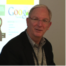

# Como la CIA hizo a Google

## Dentro de la red secreta detrás de la vigilancia global, una guerra sin fin, y Skynet - parte I

*INSURGE INTELLIGENCE, un nuevo proyecto de periodismo de investigación financiado por el público, pone al descubierto la historia exclusiva acerca de cómo la comunidad de inteligencia de los Estados Unidos financió, promovió e incubó a Google como parte de una campaña para dominar el mundo a través del control de la información.  Financiada desde su nacimiento por la NSA y la CIA, Google fue simplemente la primera entre una plétora de empresas incipientes del sector privado cooptadas por la inteligencia de los EE.UU.  para mantener su "superioridad en la información".*

*Los orígenes de esta ingeniosa estrategia se remontan a un grupo secreto patrocinado por el Pentágono, que durante las dos últimas décadas ha funcionado como un puente entre el gobierno de los EE.UU. y las élites de los sectores de negocios,  industriales, financieros, corporativos y de medios de comunicación. El grupo ha permitido que algunos de los más poderosos intereses especiales corporativos estadounidenses pudieran eludir sistemáticamente una democrática rendición de cuentas y el estado de derecho para influir en las políticas gubernamentales, así como en la opinión pública en los Estados Unidos y alrededor del mundo. Los resultados han sido catastróficos: la vigilancia global de la NSA, un estado permanente de guerra global, y una nueva iniciativa para transformar a los militares de los EE.UU. en Skynet.*

**Esta exclusiva está siendo lanzada libremente por su interés público, y fue posible mediante el crowdfunding. Quisiera dar las gracias a la maravillosa comunidad de patrocinantes por su apoyo, los cuales me han brindado la oportunidad de trabajar en profundidad en esta investigación. Por favor, apoye al periodismo independiente y de investigación del patrimonio mundial.**

Siguiendo los pasos de los ataques a *Charlie Hebdo* en París, los gobiernos occidentales se han movido rápidamente para legitimizar la expansión del poder de la vigilancia global y los controles sobre Internet, todo en nombre de la lucha contra el terrorismo.

Los políticos estadounidenses y europeos han llamado a proteger el espionaje del tipo NSA, y a potenciar la capacidad de intrusión sobre la privacidad en Internet mediante la prescripción de la criptografía. Una idea es establecer una sociedad con las compañías de telecomunicaciones para poder eliminar unilateralmente el contenido considerado como un "combustible para el odio y la violencia" en situaciones consideradas como "apropiadas".  Se han establecido acaloradas discusiones en los niveles gubernamentales y parlamentarios para explorar medidas enérgicas en contra de la confidencialidad abogado-cliente.

Cómo algo de esto hubiera sido efectivo para prevenir el ataque a *Charlie Hebdo* sigue siendo un misterio, sobretodo teniendo en cuenta que ya sabemos que los terroristas estaban bajo el radar de la inteligencia francesa desde hace una década.

Hay algo nuevo en esta historia. El atroz 11-S fue el primero de muchos ataques terroristas seguido cada uno por la dramática extensión del poder draconiano del estado a expensas de las libertades civiles, respaldado con la proyección de fuerzas militares en regiones identificadas como conflictivas por albergar terroristas.  Sin embargo, hay pocos indicios de que este fórmula tratada y probada haya hecho algo para reducir el peligro. En todo caso, parece estar encerrada en un ciclo de profundización de la violencia sin fin evidente a la vista.

Mientras nuestros gobiernos presionan para incrementar sus poderes, INSURGE INTELLIGENCE ahora puede revelar la magnitud inmensa del involucramiento de la comunidad de inteligencia de Estados Unidos en el desarrollo de las plataformas web que conocemos hoy en día, con el objetivo preciso de utilizar la tecnología como un mecanismo para luchar en la "guerra de la información" global — una guerra para legitimar el poder de unos pocos sobre el resto de nosotros.  El eje de esta historia es la corporación que de muchas maneras define el siglo XXI con su discreta omnipresencia: Google.

Google se muestra a sí mismo como una empresa de tecnología amistosa, buena onda, amigable con el usuario que creció en importancia a través de una combinación de talento, suerte y genuina innovación. Esto es verdad. Pero sólo es un fragmento de la historia. En realidad, Google es una cortina de humo detrás de la cual acecha el complejo industrial y militar de los EE.UU. 

La historia interna del ascenso de Google, revelada aquí por primera vez, abre la caja de Pandora, iluminando inesperadamente la existencia de una red parásita que impulsa la evolución de los aparatos de seguridad nacional de los EE.UU., y que se beneficia obscenamente de su operación.

### La red oculta

Durante las dos últimas décadas, las estrategias de inteligencia y de relaciones exteriores de EE.UU. han resultado en una "guerra de terror" global consistente de invasiones militares prolongadas en el mundo musulmán y de una exhaustiva vigilancia sobre las poblaciones civiles. Estas estrategias han sido originadas, cuando no dictadas, por una red secreta interna y que excede al Pentágono.

Establecida bajo la administración Clinton, consolidada con Bush, y firmemente afianzada con Obama, esta red bipartidaria de la mayoría de los ideólogos neoconservadores ha sellado su dominio dentro del Departamento de Defensa de los EE.UU (DoD) en los albores del 2015, a través de la operación de una oscura entidad corporativa externa al Pentágono, pero mantenida por él.

En 1999, la CIA creó su propia empresa de inversiones de capital de riesgo, In-Q-Tel, para financiar a las prometedoras empresas jóvenes que pudieran crear tecnologías útiles para las agencias de inteligencia. Pero la inspiración para In-Q-Tel viene de antes, cuando el Pentágono constituyó su propio grupo en el sector privado.

Conocida como "Foro Highlands", esta red privada ha operado como un puente entre el Pentágono y las poderosas élites estadounidenses no militares desde mediados de la década del '90.  A pesar de los cambios en las administraciones civiles, las redes alrededor del Foro Highlands se han vuelto cada vez más exitosas en el dominio de la política de defensa de los EE.UU.

A los gigantes contratistas de defensa como Booz Allen Hamilton y Science Applications International Corporation se los denomina algunas veces "comunidad de inteligencia en las sombras" debido al intercambio de sus empleados con el gobierno, y a su capacidad de influir simultáneamente y beneficiarse de la política de defensa. Pero aunque estos contratistas compiten entre sí por el poder y el dinero, colaboran en los momentos importantes. El Foro Highlands durante 20 años ha proporcionado un espacio extraoficial para que algunos de los más prominentes miembros de la comunidad de inteligencia en las sombras pudieran reunirse con altos funcionarios del gobierno de Estados Unidos, junto a líderes de otras industrias relevantes.

La primera vez que supe de la existencia de esta red fue en noviembre del 2014, cuando reporté para *VICE's Motherboard* que el secretario de defensa de EE.UU. Chuck Hagel recién había anunciado que la "Iniciativa de Innovación en Defensa" se trataba realmente de construir Skynet - o algo como eso, esencialmente para dominar una era emergente de conflictos armados robóticos automatizados.

Esta historia está basada en un "libro blanco" poco conocido del Pentágono publicado dos meses antes por la Universidad Nacional de Defensa (NDU) en Washington DC, una institución líder de gestión militar estadounidense que, entre otras cosas, lleva a cabo investigaciones para desarrollar políticas de defensa de EE.UU. en los más altos niveles. El libro blanco clarifica el pensamiento detrás de la nueva iniciativa, y los desarrollos tecnológicos y científicos revolucionarios que esperaban capitalizar. 

### El Foro Highlands

El coautor del libro blanco de la NDU es Linton Wells, un veterano oficial de defensa estadounidense de 51 años de edad que sirvió durante la administración Bush como oficial en jefe de información del Pentágono, suṕervisando a la Agencia Nacional de Seguridad de los EE.UU (NSA) y a otras agencias de espionaje. Aún posee autorización activa en asuntos de seguridad top-secret, y según un reporte de la revista Government Executive en el 2006 presidió el "Foro Highlands" fundado por el Pentágono en 1994.

 
 
La revista *New Scientific* (de acceso web mediante pago) ha comparado al Foro Highlands con reuniones de élite tales como "Davos, Ditchley y Aspen", describiéndola como "mucho menos conocida, pero... sin duda tan influyente como las reuniones de negocios". Las reuniones periódicas del Foro juntan a "personas innovadoras para considerar las interacciones entre la política y la tecnología. Sus mayores éxitos han sido en el desarrollo de la guerra de alta tecnología basada en la red".

Dado el papel de Wells en ese foro, tal vez no fue sorprendente que su libro blanco para la transformación de la defensa fuera capaz de tener un profundo impacto sobre la actual política del Pentágono. Pero si ese fuera el caso, ¿por qué nadie lo notó?

A pesar de estar patrocinado por el Pentágono, no se podía encontrar ninguna página oficial en el sitio web del DoD sobre el Foro. Fuentes de inteligencia y militares de EE.UU. activas y retiradas nunca habían oído hablar de él, y tampoco los periodistas de seguridad nacional. Me sentí frustrado.

### La empresa de riesgo de capital intelectual del Pentágono

En el prólogo de su libro de 2007, *Una multitud de uno: el futuro de la identidad individual*, John Clippinger, un científico del MIT del Grupo de Dinámicas Humanas del Laboratorio de Medios, describió su participación en una reunión del "Foro Highlands", una "reunión sólo para invitados financiada por el Departamento de Defensa y presidida por el asistente para la integración de redes e información". Este era un cargo de alto rango del DoD que supervisaba operaciones y políticas para las más poderosas agencias de espionaje del Pentágono incluyendo la NSA y la Agencia de Inteligencia de Defensa (DIA), entre otras. A partir de 2003, la posición fue una transición hacia lo que ahora es el subsecretario de defensa para inteligencia. El Foro Highlands, escribió Clippinger, fue fundado por un capitán retirado de la Marina de EE.UU. llamdo Dick O'Neill. Los delegados incluyen oficiales militares de alto rango de EE.UU. pertenecientes a numerosas agencias y divisiones - "capitanes, contraalmirantes, generales, coroneles, mayores y comandantes" así como "miembros líderes del DoD."

Lo que al principio parecía ser el principal sitio web del Foro describe a Highlands como "una red informal interdisciplinaria patrocinada por el Gobierno Federal", enfocada en la "información, la ciencia y la tecnología". La explicación es escasa, más allá del simple logo del "Departamento de Defensa".

Pero Highlands tiene también otro sitio web que se describe a sí mismo como una "empresa de riesgo de capital intelectual" con "extensa experiencia asistiendo a corporaciones, organizaciones y líderes del gobierno". La empresa provee un "amplio rango de servicios, incluyendo: planeamiento estratégico, creación de escenarios y juegos para la expansión de mercados globales", así como "trabajo con clientes para construir estrategias para la ejecución". El Grupo Highlands Inc., dice el sitio web, organiza un completo rango de foros sobre el tema.

Por ejemplo, además del Foro Highlands, desde el 11-S el Grupo organiza el "Foro Island", un evento internacional mantenido en asociación con el Ministro de Defensa de Singapur, el cual O'Neill supervisa como "líder consultor". El sitio web del Ministerio de Defensa de Singapur describe al Foro Island como "modelado después del Foro Highlands organizado por el Departamento de Defensa de los EE.UU." Los documentos revelados por el informante Edward Snowden confirman que Singapur jugó un papel clave al ṕermitir que los EE.UU. y Australia interceptaran cables submarinos para espiar a potencias asiáticas como Indonesia y Malasia..

El sitio web del Grupo Highlands también revela que Highlands es un socio de uno de los mayores contratistas de defensa de los EE.UU. Highlands está "apoyado por una red de compañías e investigadores independientes", que incluyen a "nuestros socios del Foro Highlands por los últimos diez años en SAIC; y la amplia red de participantes en el Foro Highlands".

SAIC es la sigla de la empresa de defensa de los EE.UU, Science Applications International Corporation (Corporación Internacional de Aplicaciones de la Ciencia), que cambió su nombre a Leidos en el 2013, que opera a SAIC como una subsidiaria. SAIC/Leidos está entre los diez contratistas de defensa más grandes, y trabaja estrechamente con la comunidad de inteligencia de los EE.UU., especialmente la NSA. Según el periodista de investigación Tim Shorrock, el primero en revelar la amplia extensión de la privatización de la inteligencia en EE.UU. con su trascendental libro *Spies for Hire*, SAIC tiene una "relación simbiótica con la NSA: la agencia es el mayor cliente individual de la compañía y SAIC es el mayor contratista de la NSA".

El nombre completo del capitán "Dick" O'Neill, el presidente fundador de Foro Highlands, es Richard Patrick O'Neill, quien después de su trabajo en la Marina se unió al DoD. Desempeñó su último cargo como asistente para la estrategia y la política en la Oficina del Secretario Adjunto de Defensa para el Comando, Control, Comunicaciones e Inteligencia, antes de la fundación de Highlands. 

### El Club de Yoda

Pero Clippinger también se refiere a otro individuo misterioso venerado por los concurrentes al Foro:

>*"Se sentó en la parte de atrás de la sala, sin ninguna expresión detrás de sus gruesos anteojos, de montura negra. Nunca le escuché pronunciar una palabra... Andrew (Andy) Marshall es un ícono dentro del DoD. Algunos lo llaman Yoda, por su mítico estado de inescrutabilidad... Él se ha desempeñado en varias administraciones y ha tenido una amplia consideración por sobre la política partidista. Fue un partidario del Foro Highlands y un asistente regular desde su comienzo".*
	
Desde 1973 Marshall encabezaba una de las más poderosas agencias del Pentágono, la Oficina de Evaluación de Red (ONA), el think tank interno del secretario de defensa de los EE.UU. que conduce la investigación altamente clasificada sobre el planeamiento futuro de la política de defensa  a través de la comunidad de inteligencia y militar de los EE.UU. La ONA ha desempeñado un rol clave en las principales iniciativas estratégicas del Pentágono, incluyendo la Estrategia Marítima, la Iniciativa para la Defensa Estratégica, la Iniciativa de Estrategias Competitivas y la Revolución en Asuntos Militares.

En una extraña semblanza en 2002 en *Wired*, el reportero Douglas McGray describió a Andrew Marshall, actualmente de 93 años de edad, como "el más esquivo del DoD" pero "uno de los más influyentes" funcionarios. McGray añadió que "el vicepresidente Dick Cheney, el secretario de defensa Donald Rumsfeld, y el subsecretario Paul Wolfowitz" -  ampliamente considerados los halcones del movimiento neoconservador en la política norteamericana - fueron algunas de los "estrellas protegidas" de Marshall.

Hablando en un sencillo seminario en la Universidad de Harvard después del 11-S, el presidente fundador del Foro Highlands Richard O'Neill dijo que Marshall fue mucho más que un "asistente regular" al Foro. "Andy Marshall es nuestro co-presidente, por lo que indirectamente todo lo que hacemos se remonta al sistema de Andy", le dijo a la audiencia. "Directamente, las personas que asisten a las reuniones del Foro pueden pasar sus informes a Andy sobre una variedad de tópicos y sintetizar cosas". También dijo que el Foro tiene un tercer co-presidente: el director de la Agencia de Proyectos e Investigación en Defensa Avanzada (DARPA), que al mismo tiempo era un elegido de Rumsfeld, Anthony J. Theter. Antes de unirse a DARPA, Tether era vicepresidente del Sector de Tecnología Avanzada de SAIC.

La influencia del Foro Highlands sobre la política de defensa de EE.UU. ha operado de este modo a través de tres canales principales: el patrocinio de la oficina del Secretario de Defensa (alrededor de la mitad de la década pasada fue transferida específicamente a la oficina del Subsecretario de Defensa para Inteligencia, que está a cargo de las principales agencias de vigilancia), conectada directamente con la ONA de Andrew Marshall; esta última vinculada con DARPA.

De acuerdo a Clippinger en *Una multitud de uno*, "lo que sucede en reuniones informales tales como en el Foro Highlands, tiene un enorme impacto con el tiempo, a través de curiosas e inesperadas vías de influencia, no sólo dentro del DoD sino también en todo el mundo". El escribió que las ideas del Foro han "pasado de ser herejías a ser convencionales. Ideas que eran anatemas en 1999 han sido adoptadas como políticas sólo tres años más tarde".

Aunque el Foro no produce "recomendaciones consensuadas", su impacto es más profundo que el de un tradicional comité asesor del gobierno. "Las ideas que surgen de las reuniones están disponibles para su uso por parte de los tomadores de decisiones así como para la gente de los thinks tanks," de acuerdo a O'Neill:

> *Vamos a incluir personas de Booz, SAIC, RAND, u otras de nuestras reuniones... Damos la bienvenida a ese tipo de cooperación, porque, verdaderamente, ellos son importantes. Están allí a largo plazo y son capaces de influir en las políticas gubernamentales con trabajo muy académico... Nosotros producimos ideas e interacción y redes para que estas personas las puedan tomar y usar cuando lo necesiten.*

Mis repetidas requisitorias a O'Neill para saber de su trabajo en Foro Highlands fueron ignoradas. El Departamento de Defensa tampoco respondió a mis múltiples pedidos de información ni hizo comentarios acerca del Foro.

### La guerra de la información

El Foro Highlands ha servido como un "puente para el tráfico de influencias" en dos sentidos: en un sentido, para la influencia de la red oculta de contratistas privados en la formulación de operaciones de información a través de la inteligencia militar de los EE.UU., y en el otro, para la influencia del Pentágono sobre el sector privado. No hay evidencia más clara de esto que el papel verdaderamente instrumental del Foro en la incubación de la idea de la vigilancia global como mecanismo para dominar la información a escala mundial.

En 1989, Richard O'Neill, entonces un criptógrafo de la Marina estadounidense, escribió un paper para el Colegio de Guerra Naval de EE.UU., *Hacia una metodología para el manejo de las percepciones*. En su libro, *Future Wars*, el Coronel John Alexander, entonces un oficial superior del Comando de Seguridad e Inteligencia de la Marina de los EE.UU. (INSCOM), mencionó que el paper de O'Neill delineó por primera vez una estrategia para el "manejo de las percepciones" como parte de la guerra de información (IW). Las estrategias propuestas por O'Neill identificaron tres categorías de objetivos para la IW: adversarios, para que se sientan vulnerables; socios potenciales, "para que perciben la causa (de la guerra) como justa"; y, finalmente, la población civil y los líderes políticos para que "perciban el costo como un mérito al esfuerzo". Una informe secreto basado en el trabajo de O'Neill "llegó a la cúpula" del DoD. "Reconocieron que O'Neill tenía razón y le dijeron que lo archivara".

Excepto que el DoD no lo archivó. Alrededor de 1994, el Grupo Highlands fue fundado por O'Neill como un proyecto oficial del Pentágono por el nombramiento del entonces secretario de defensa de Bill Clinton, William Perry - quien se unió a la junta directiva de SAIC después de retirarse del gobierno en 2003.

En las propias palabras de O'Neill, el grupo funcionaría como un "laboratorio de ideas" del Pentágono. Según *Government Executive*, expertos en tecnología de la información (IT) y militares asistieron a la primera reunión del Foro "para considerar el impacto de la IT y la globalización en los EE.UU. y en la guerra. ¿Cómo podrían cambiar al mundo Internet y otras tecnologías emergentes?". La reunión ayudó a sembrar la idea de la "guerra centrada en las redes" en la mente de los "pensadores militares más influyentes de la nación".

### Excluyendo al público

Los registros oficiales del Pentágono confirman que el objetivo primario fue apoyar a la políticas del DoD en la especialidad de O'Neill: la guerra de la información. Según el Reporte Anual del Pentágono de 1997 para el Presidente y el Congreso bajo una sección titulada "Operaciones de información" (IO), la Oficina de la Secretaría de Defensa (OSD) ha autorizado la "creación del Grupo Highlands en el contexto del DoD, la industria y los expertos académicos en IO" para coordinar las IO a través de las agencias federales de inteligencia militar.

Los años siguientes el reporte anual del DoD reiteraba el enfoque del Foro en las operaciones de información: "Para examinar los temas de IO, el DoD patrocina el Foro Highlands, el cual trabaja junto al gobierno, la industria y los profesionales académicos de diferentes campos."

Vale resaltar que en 1998, el "Grupo" Highlands se convirtió en "Foro". Según O'Neill, esto se hizo para evitar que las reuniones del Foro Highlands quedaran sujetas a "restricciones burocráticas". A lo que él estaba haciendo alusión era la Ley Federal de Comité Consultivo (FACA), que regula la forma en que el gobierno estadounidense puede solicitar formalmente el asesoramiento de intereses especiales.

Conocida como la ley de "gobierno abierto", FACA requiere que los oficiales de gobierno de EE.UU. no puedan manejarse a puertas cerradas ni mantener consultas secretas con personas externas al gobierno para desarrollar políticas. Todas estas consultas deberían tener lugar por medio de los comités de asesoramiento federales que permiten el control público. FACA requiere que las reuniones sean públicas, anunciadas por intermedio del Registro Federal, que los grupos de asesores estén registrados en la Administración de Servicios Generales, además de otros requerimientos pensados para mantener la rendición de cuentas ante el interés público. 

Pero *Government Executive* reportó que "O'Neill y otros creían" que tales cuestiones reglamentarias "podrían entorpecer el libre flujo de ideas y las discusiones sin tapujos que buscaban". Los abogados del Pentágono advirtieron que la palabra "Grupo" podría acarrear ciertas obligaciones y sugirieron dejar todo en manos privadas: "Entonces O'Neill cambió el nombre a Foro Highlands y lo trasladó al sector privado para manejarlo como consultor del Pentágono". El Foro Highlands del Pentágono entonces funciona bajo el manto de la "empresa de riesgo de capital intelectual" de O'Neill, "Highlands Group Inc.".

En 1995, un año después que William Perry designara a O'Neill a la cabeza del Foro Highlands, SAIC - la organización "socia" del Foro - inauguró un nuevo Centro para la Política y Estrategia de la Información bajo la dirección de "Jeffrey Cooper, un miembro del Grupo Highlands que asesoraba a oficiales superiores del Departamento de Defensa en cuestiones referidas a la guerra de la información". El Centro tuvo precisamente el mismo objetivo que el Foro, funcionar como "un centro de consulta para reunir a las mejores y más brillantes mentes en guerra de la información con el patrocinio de una serie de seminarios, ponencias y simposios que exploren las implicancias de la guerra de la información en profundidad". El objetivo era "permitir que los dirigentes y autoridades gubernamentales, industriales y académicas pudieran abordar las cuestiones claves alrededor de la guerra de la información para asegurar que Estados Unidos conserve su ventaja sobre todos sus enemigos potenciales".

A pesar de las regulaciones de la FACA, los comités asesores federales están muy fuertemente influenciados, cuando no manejados, por el poder corporativo. Así que al eludir la FACA, el Pentágono omitió incluso sus restricciones menores, al excluir permanentemente toda posibilidad de participación del público.

La afirmación de O'Neill de que no existen informes o recomendaciones es falsa. Por reconocimiento propio, las consultas secretas del Pentágono con la industria que han tenido lugar a través del Foro Highlands desde 1994 han sido acompañadas por las presentaciones regulares de papers políticos y académicos, grabaciones y notas de reuniones y otras formas de documentación que están bajo llave y son sólo accesibles para los delegados del Foro. Esto viola el espíritu, si no la letra, de la FACA — en una forma donde claramente se pretende eludir la responsabilidad democrática y el estado de derecho.

El Foro Highlands no necesita producir recomendaciones consensuadas. Su propósito es proveerle al Pentágono un mecanismo oculto en las redes sociales para consensuar relaciones duraderas con el poder corporativo, e identificar nuevos talentos, que pueden usarse para ajustar las estrategias en la guerra de la información en un absoluto secreto.

El número total de participantes en el Foro Highlands del DoD supera los mil, aunque las sesiones consisten en gran parte de reuniones al estilo de pequeños talleres cerrados de 25 a 30 personas como máximo, que reúnen a expertos y funcionarios dependiendo del tema. Los delegados han incluído a personal de alto rango de SAIC y Booz Allen Hamilton, RAND Corp., Cisco, Human Genome Sciences, eBay, PayPal, IBM, Google, Microsoft, AT&T, la BBC, Disney, General Electric, Enron, entre muchos más; miembros del Congreso y el Senado demócratas y republicanos; altos ejecutivos de la industria de la energía de EE.UU. como Daniel Yergin de IHS Cambridge Energy Research Associates; y personal clave involucrado en ambos lados de las campañas presidenciales.

Otros participantes son profesionales de alto nivel de los medios de comunicación: David Ignatius, editor asociado del Washington Post y al tiempo editor ejecutivo del International Herald Tribune; Thomas Friedman, columnista del New York Times desde hace mucho tiempo; Arnaud de Borchgrave, editor en el Washington Times y en United Press International; Steven Levy, un ex editor de Newsweek, escritor senior para Wired y ahora editor en jefe de tecnología en Medios; Lawrence Wright, redactor en el New Yorker; Noah Shachtmann, editor ejecutivo en el Daily Beast; Rebecca McKinnon, cofundadora de Global Voices Online; Nik Gowing de la BBC; y John Markoff del New York Times.

Debido al patrocinio actual del subsecretario de defensa para inteligencia del OSD, el Foro tiene acceso interno a los jefes de las principales agencias de reconocimiento y vigilancia de los EE.UU., así como a los directores y sus asistentes en las agencias de investigación del DoD, desde DARPA hasta ONA. Esto también significa que el Foro está profundamente conectado con los equipos de tareas de investigación política del Pentágono. 

### Google: sembrado por el Pentágono

En 1994 - el mismo año en que el Foro Highlands fue fundado bajo la tutela de la oficina del secretario de defensa, la ONA, y DARPA - dos jóvenes estudiantes de doctorado de la Universidad de Stanford, Sergey Brin y Larry Page, obtuvieron un logro con su primera aplicación de ranking de páginas web e indexado automatizado. Esta aplicación permanece como un componente central de lo que con el tiempo se convirtió en el servicio de búsqueda de Google. Brin y Page han realizado su trabajo con el financiamiento de la Iniciativa de Bibliotecas Digitales (DLI), un programa de múltiples agencias de la Fundación Nacional de Ciencias (NSF), la NASA y DARPA.

Pero esto es sólo una parte de la historia.

Durante el desarrollo del motor de búsqueda, Sergey Brin reportaba regular y directamente a dos personas que no pertenecían en absoluto a la facultad de Stanford: la Dra. Bhavani Thuraisingham y el Dr. Rick Steinheiser. Ambos eran representantes de sensibles programas de investigación de la comunidad de inteligencia de los EE.UU. sobre seguridad de la información y data mining.

Thuraisingham es actualmente el profesor distinguido Louis A. Beecherl y el director ejecutivo del Instituto de Investigaciones sobre Ciberseguridad de la Universidad de Texas, Dallas, y una experta cotizada en data mining, administración de datos y en temas de seguridad de la información. Pero en los '90, ella trabajaba para MITRE Corp., un contratista líder de defensa de EE.UU. donde administraba la iniciativa de sistemas de datos digitales masivos, un proyecto patrocinado por la NSA, la CIA y el Director de la Central de Inteligencia, para promover investigaciones innovadoras en tecnología de la información.

"Hemos financiado a la Universidad de Stanford a través del experto en informática Jeffrey Ullman, quien tenía varios estudiantes graduados promisorios trabajando en muchas áreas excitantes," me dijo la prof. Thuraisingham. "Uno de ellos era Sergey Brin, el fundador de Google. El programa MDDS de la comunidad de inteligencia en esencia le proporcionó un capital inicial de inversión a Brin, que fue complementada por muchas otras fuentes, incluyendo el sector privado".

Esta forma de financiamiento ciertamente no es inusual, y que Sergey Brin fuera autorizado para recibirla siendo un estudiante graduado parece haber sido casual.  El Pentágono había terminado sus investigaciones sobre la ciencia de la computación en ese tiempo. Pero esto ilustra cuán profundamente estaba arraigada la cultura de Silicon Valley en los valores de la comunidad de inteligencia de los EE.UU.

En un extraordinario documento hospedado en el sitio web de la Universidad de Texas, Thuraisingham relata que desde 1993 a 1999, "la Comunidad de Inteligencia (IC) comenzó un programa denominado Sistemas de Datos Digitales Masivos (MDDS) que administré  para la Comunidad de Inteligencia cuando estaba en MITRE Corporation". El programa financió 15 esfuerzos de investigación de varias universidades, incluyendo Stanford. Su meta era desarrollar "tecnologías de administración de datos para manejar desde varios terabytes a petabytes de datos," incluso para "procesamiento de consultas, manejo de transacciones, manejo de metadatos, administración de almacenamiento e integración de datos".

En ese momento, Thuraisingham era científica en jefe para el manejo de información y datos de MITRE, donde lideraba los esfuerzos del equipo de investigación y desarrollo para la NSA, la CIA. el Laboratorio de Investigación de la Fuerza Aérea, así como también el Comando de Sistemas de Guerra Espacial y Naval de la Marina de los EE.UU.(SPAWAR) y el Comando Electrónico y de Comunicaciones (CECOM). Ella impartía cursos para funcionarios de gobierno de los EE.UU. y contratistas de defensa sobre datamining en contraterrorismo. 

En su artículo de la Universidad de Texas, ella adjuntó la copia de una reseña sobre el programa MDDS de la comunidad de inteligencia de los EE.UU. que había sido presentada en el "Simposio Anual de la Comunidad de Inteligencia" en 1995. La reseña revela que los patrocinantes principales del programa MDDS fueron tres agencias: la NSA, la Oficina de Investigación y Desarrollo de la CIA y el Grupo de Gestión de la Comunidad (CMS) de inteligencia que opera bajo órdenes del Director de la Central de Inteligencia. Los administradores del programa, que aportaron 3 o 4 millones de dólares de financiamiento por año durante 3 o 4 años, fueron identificados como Hal Curran (NSA), Robert Kluttz (CMS), Dra. Claudia Pierce (NSA), Dr. Rick Steinheiser (ORD, la oficina de investigación y desarrollo de la CIA) y la Dra. Thuraisingham en persona.

Thuraisingham vuelve a reiterar en su artículo que este programa conjunto entre la CIA y la NSA financió parcialmente a Sergey Brin para desarrollar el núcleo central de Google, a través de una subvención a Stanford manejada por el supervisor de Brin, el profesor Jeffrey D.Ullman:

> *De hecho, el fundador de Google el Sr. Sergey Brin fue parcialmente financiado por este programa mientras era un estudiante de doctorado en Stanford. Junto con su tutor Prof. Jeffrey Ullman y mi colega en MITRE Dr. Chris Clifton (jefe científico en TI de MITRE), desarrolló el sistema Quey Flocks que arrojaba soluciones para la extracción de enormes cantidades de datos almacenadas en las bases de datos. Recuerdo visitar Stanford con el Dr. Rick Stenheiser de la comunidad de inteligencia y el Sr. Brin solía irrumpir en patines, dar su presentación y retirarse velozmente. De hecho la última vez que nos reunimos en septiembre de 1998, el Sr. Brin nos demostró su motor de búsqueda que se convertiría en Google poco después.*

Brin y Page constituyeron oficialmente a Google como una empresa en septiembre de 1998, el mismo mes que reportaron por última vez a Thuraisingham y Steinheiser. "Query flocks" también forma parte del sistema de búsqueda patentado de Google, "PageRank", que Brin desarrolló en Stanford bajo el programa de la CIA, la NSA y MDDS, así como también con financiamiento de NSF, IBM e Hitachi. Ese año, el Dr. Chris Clifton de MITRE, que trabajó bajo las órdenes de Thuraisingham para desarrollar el sistema "Query flocks", escribió un paper en coautoría con el supervisor de Brin, el Prof.Ullman, y el de la CIA Rick Steinheiser. Titulado *Descubriendo información en textos*, el paper fue presentado en una conferencia académica.

"El financiamiento de MDDS que patrocinó a Brin fue significativo en cuanto a los fondos iniciales, pero probablemente fue superado por otras fuentes de financiación", dijo Thuraisingham. "La duración del financiamiento a Brin fue de alrededor de dos años aproximadamente. En ese período, junto a mis colegas del MDDS visitábamos Stanford para ver a Brin y monitorear su progreso cada tres meses aproximadamente. No éramos exactamente sus supervisores, pero queríamos comprobar su progreso, señalar los potenciales problemas y sugerir ideas. En aquellas sesiones informativas, Brin nos presentó su investigación sobre query flocks, y también nos demostró las versiones preliminares del motor de búsqueda de Google".

Hasta aquí, Brin reportó a Thuraisinghaim y a Steinheiser regularmente acerca de su trabajo desarrollando Google. El programa MDDS es mencionado actualmente en varios papers con la coautoría de Brin y Page mientras asistían a Stanford. En su paper publicado en 1998 en el Boletín del Comité Técnico Social de Computación sobre Ingeniería de Datos de la IEEE, describen la automatización de los métodos de extracción de información a partir de la web por medio de la "extracción por patrones de relación iterativos duales", el desarrollo de un "ranking global de páginas web denominado PageRank", y el uso de PageRank para "desarrollar un nuevo motor de búsqueda llamado Google". En una nota al pie de página en la apertura, Sergey Brin confirma que él estaba "parcialmente patrocinado por el Programa de Sistemas Digitales Masivos de Datos del Equipo Administración de la Comunidad", a través de una subvención de la NSF - confirmando que el programa de la CIA, la NSA y el MDDS aportó sus financiamiento a través de la NSF.

Esta subvención , cuyo informe del proyecto menciona a Brin entre los estudiantes beneficiarios (sin mencionar al MDDS), era diferente a la subvención a Larry Page que incluyó financiamiento de DARPA y la NASA.  El reporte del proyecto. autorizado por el supervisor de Brin, Prof.Ullman, continúa diciendo bajo la sección "Indicaciones de éxito" que "hay algunas nuevas historias de nuevas empresas basadas en la investigación apoyada por la NSF". Bajo "Impacto del proyecto", el reporte señala: "Finalmente, el proyecto google también se ha vuelto comercial con Google.com". 

La explicación de Thuraisingham por lo tanto demuestra que el programa de la CIA, la NSA y MDDS no sólo financió a Brin a través de su trabajo con Larry Page desarrollando Google, sino también que los representantes de alto nivel de la inteligencia de los EE.UU. incluyeron a un oficial de la CIA que supervisó la evolución de Google en su fase de pre-lanzamiento, durante todo el camino hasta que la empresa estuvo lista para ser oficialmente fundada. Google, entonces, fue activada con una "significativa" cantidad de capital inicial y supervisada desde el Pentágono: a saber, la CIA, la NSA y DARPA.

El DoD no hizo comentarios al respecto.

Cuando le pregunté al Prof. Ullman para confirmar si Brin fue parcialmente financiado o no por el programa MDDS de la comunidad de inteligencia, y si Ullman era consciente de que Brin era supervisado regularmente por Rick Steinheiser de la CIA mientra desarrollaba el motor de búsqueda Google, Ullman respondió de forma evasiva: "¿Puedo saber a quién representa usted y por qué está interesado en estas cuestiones?¿Quiénes son sus "fuentes"? También negó que Brin haya desempeñado un rol importante en el desarrollo del sistema de "query flocks", aunque queda claro a partir de los papers de Brin que se inspiró en este trabajo para desarrollar junto a Page el sistema PageRank.

Cuando le pregunté a Ullman si el estaba negando el rol de la comunidad de inteligencia de los EE.UU. apoyando a Brin durante el desarrollo de Google, respondió: "No me voy a dignar a responder esta tontería con una negación. Si no me explica cuál es su teoría, y qué es lo que está tratando de hacer, no voy a ayudarlo en lo más mínimo".

La reseña del MDDS publicada online por la Universidad de Texas confirma que la razón de ser del proyecto de la CIA y la NSA era "proveer un capital inicial para desarrollar tecnologías de administración de datos de alto riesgo y altos dividendos", incluyendo técnicas para "consultas, navegación y filtrado, procesamiento de transacciones, métodos de acceso e indexación, gestión de metadatos y modelado de datos, e integración de bases de datos heterogéneas, así como el desarrollo de arquitecturas apropiadas". La visión de máxima del programa era "procurar el acceso constante y la fusión de cantidades enormes de datos, información y conocimientos en un medio ambiente heterogéneo en tiempo real" para ser usado por el Pentágono, la comunidad de inteligencia y potencialmente el gobierno.

Estas revelaciones corroboran la declaración de Robert Steele, ex oficial de alto rango de la CIA y subdirector civil fundador de la Actividad de Inteligencia del Cuerpo de Marines, a quien entrevisté para el periódico *The Guardian* el año pasado en referencia a la inteligencia open source. Citando fuentas de la CIA, Steele dijo que en 2006 Steinheiser, un viejo colega suyo, fue el enlace de la CIA en Google que proporcionó los primeros fondos para la firma de IT pionera.  Al mismo tiempo, el fundador de *Wired* John Batelle logró obtener esta negación oficial de un portavoz de Google en respuesta a las afirmaciones de Steele:

> *"Las declaraciones relacionadas a Google son completamente falsas".*

En esta ocasión, a pesar de múltiples pedidos y conversaciones, un vocero de Google rechazó hacer declaraciones.

ACTUALIZACIÓN: a las 5:41PM GMT, el Director de comunicación corporativa de Google se puso en contacto conmigo y me pidió que incluyera la siguiente declaración:

> *"Sergey Brin no formaba parte del Programa Query Flocks en Stanford, y ninguno de sus proyectos fueron financiados por los organismos de inteligencia de EE.UU".*

Mi contestación es la siguiente:

Mi respuesta a esta declaración es la siguiente: el propio Brin en su paper reconoce el financiamiento de la iniciativa MDDS (Sistemas de Datos Digitales Masivos) del CMS (Equipo de Administración de la Comunidad) que fue suministrada a través de lla NSF. MDDS fue un programa de la comunidad de inteligencia generado por la CIA y la NSA.  También me consta , como se observa en una parte, que la Prof. Thurainsingham de la Universidad de Texas administraba el programa MDDS en representación de la comunidad de inteligencia de EE.UU., y que ella y Rick Steinheiser de la CIA se reunieron con Brin cada tres meses aproximadamente durante dos años para supervisar el progreso del desarrollo de Google y PageRank. Si Brin trabajó en query flocks no se sabe con exactitud.

En este contexto, usted se podría preguntar lo siguiente:

1) ¿Google niega que el trabajo de Brin fue parcialmente financiado por el MDDS por medio de una subvención de la NSF?
	
2) ¿Google niega que Brin reportaba regularmente a Thurainsingham y Steinheiser desde alrededor de 1996 hasta septiembre de 1998, el año en que les fue presentado a ellos el motor de búsqueda Google?

### Conocimiento total de la información

El 3 de noviembre de 1993 se publicó la apertura del plazo de recepción de papers para el MDDS por medio de una lista de correos electrónicos del oficial de alto rango de la inteligencia de EE.UU. David Charvonia, director de la oficina de coordinación de investigación y desarrollo del CMS de la comunidad de inteligencia. La reacción de Tatu Ylonen (famoso inventor del ampliamente usado protocolo de protección de datos de shell segura (SSH)) fue decirles  a sus colegas en la lista de correos electrónicos: "¿Cripto relevancia? Te hace pensar si debes proteger tus datos". El mensaje también confirma que el contratista de defensa y socio del Foro Highlands, SAIC, manejó el proceso de presentaciones a MDDS con reseñas que fueron enviadas a Jackie Booth de la Oficina de Investigación y Desarrollo de la CIA por intermedio de una dirección de correo electrónico de SAIC.

En 1997, revela Thuraisingham, poco antes que Google fuera lanzada como empresa y mientras ella aún supervisaba el desarrollo de este motor de búsqueda en Stanford,  enfocó sus pensamientos en las aplicaciones de seguridad nacional del programa MDDS. En los agradecimientos de su libro *Web Data Mining y aplicaciones en inteligencia de negocios y contraterrorismo* del año 2003, Thuraisingham escribió que ella y el "DR.Rick Steinheiser de la CIA, comenzaron a discutir con la Agencia de Proyectos de Investigación Avanzada en Defensa acerca de las aplicaciones del data mining en contraterrorismo", una idea que se originó directamente desde el programa MDDS que financió parcialmente a Google. "Estas discusiones con el tiempo se convirtieron en el actual programa de DARPA, EELD (Detección de Enlaces y Extracción de Evidencias)"

Entonces el mismo oficial superior de la CIA y contratista de la CIA y la NSA involucrado en el suministro del capital inicial para Google estaba considerando simultáneamente el rol del data mining para propósitos contraterroristas, y estaba desarrollando ideas para herramientas de hecho expuestas por DARPA.

Hoy, como lo demuestra su reciente página de opinión en *The New York Times*, Thuraisingham continúa siendo una defensora acérrima del data mining con propósitos contraterroristas, pero también insiste que estos métodos deben ser desarrollados por el gobierno en cooperación con los abogados de libertades civiles y defensores privados para asegurar que estos procedimientos robustos se apliquen para impedir potenciales abusos. Ella señala, críticamente, que con la cantidad de información que está siendo recolectada, existe un alto riesgo de falsos positivos.

En 1993, cuando el programa MDDS fue lanzado y administrado por MITRE Corp. en representación de la comunidad de inteligencia de EE.UU., la experta en informática de la Universidad de Virginia, Dra. Anita K. Jones - miembro del consejo de administración de MITRE -  obtuvo el puesto de director de DARPA y jefe de investigación e ingeniería a través del Pentágono. Ella ha estado en la junta de MITRE desde 1988. Entre 1987 y 1993,  Jonas simultáneamente sirvió en la junta directiva de SAIC. Como nuevo jefe de DARPA desde 1993 a 1997, ella también codirigió el Foro Highlands del Pentágono durante el período de desarrollo y prelanzamiento de Google en Stanford a cargo del MDSS.

Así, cuando Thuraisingham y Steinheiser hablaban en DARPA sobre las aplicaciones del contraterrorismo de la investigación del MDDS, Jones era director de DARPA y Co-Presidente del Foro Highlands. Ese mismo año, Jones dejó DARPA para volver a su puesto en la Universidad de Virgina. Al año siguiente, se incorporó a la Junta de la Fundación Nacional de Ciencia (NSF) de EE.UU., que por supuesto había financiado también a Brin y Page y también volvió a la Junta Directiva de SAIC. Cuando dejó el DoD, el senador Chuck Robb le brindó a Jones el siguiente tributo: "Trajo la tecnología y las comunidades militares operativas unidas para diseñar planes detallados para mantener el dominio de Estados Unidos en el campo de batalla en el próximo siglo".

En la junta de la Fundación Nacional de Ciencia desde 1992 a 1998 (incluyendo un período como jefe desde 1996) estaba Richard N. Zare. Este fue el período en que la NSF patrocinó a Sergey Brin y Larry Page en asociación con DARPA. En junio de 1994, el Prof. Zare, un químico de Stanford, participó con el Prof. Jeffrey Ullman (quien supervisó la investigación de Sergey Brin), en un panel patrocinado por Stanford y el Consejo de Investigación Nacional se discutió la necesidad de científicos que muestren cómo sus trabajos están "atados a las necesidades nacionales". El panel presentó juntos a científicos y legisladores, incluso "informantes de Washington".

El programa EELD de DARPA, inspirado por el trabajo de Thuraisingham y Steinheiser bajo la mirada de Jones, fue rápidamente adaptado e integrado con un conjunto de herramientas para dirigir una vigilancia completa bajo la administración Bush.

Según el oficial Ted Senator de DARPA, quien lideró el programa EELD para la efímera Oficina de Conocimiento de la Información, EELD estaba entre un rango de "tecnología promisoria" estando preparada para integrarse "dentro del prototipo del sistema TIA". TIA, sigla en inglés de Conocimiento Total de la Información, era el principal programa global de data mining y espionaje electrónico implementado por la administración Bush después del 11-SS. TIA ha sido armado por el conspirador del affair Irán-Contra Almirante John Poindexter, quien fue designado en 2002 por Bush para encabezar la bueva Oficina de Conocimiento de la Información de DARPA.

El Centro de Investigación Palo Alto de Xerox (PARC) fue otro contratista entre 26 empresas (incluída también SAIC) que recibió contratos por millones de dólares de DARPA (las cantidades específicas es información clasificada) al mando de Poindexter, para seguir adelante con el programa de vigilancia desde 2002. La investigación incluyó "análisis de perfiles basados en el comportamiento", "seguimiento, identificación y detección automatizada" de actividades terroristas, entre otros proyectos de análisis de datos. En ese momento, el director de PARC y jefe científico era John Seely Brown. Tanto Brown como Poindexter participaban en el Foro Highlands del Pentágono - Brown de forma regular hasta hace poco.

TIA fue dado de baja en 2003 supuestamente debido a la oposición pública después que el programa fuera expuesto en los medios de comunicación, pero al año siguiente Poindexter participó en la sesión del Grupo Highlands en Singapur, junto a oficiales de seguridad y defensa de todo el mundo. Mientras tanto, Ted Senator continuó manejando el programa EELD entre otros proyectos de análisis y data mining en DARPA hasta 2006, cuando se marchó para convertirse en vicepresidente de SAIC. Actualmente, es un socio técnico de SAIC/Leidos.

### Google, DARPA y el rastro del dinero

Mucho antes de la aparición de Sergey Brin y Larry Page, el departamento de ciencias de la computación de Stanford mantuvo una estrecha relación de trabajo con la inteligencia militar de EE.UU. Una carta fechada el 5 de noviembre de 1984 de la oficina del famoso experto en inteligencia artificial (IA), Prof. Edward Feigenbaum, dirigida a Rick Steinheiser, le da las últimas instrucciones al Proyecto de Programación Heurística de Stanford, dirigiéndose a Steinheiser como miembro del "Comité Directivo de IA". Una lista de asistentes a una conferencia de contratistas en esa época, patrocinada por la Oficina de Investigación Naval (ONR) del Pentágono, incluye a Steinheiser como delegado bajo la designación "OPNAV Op-115" - que se refiere al programa sobre preparación operacional de la oficina del jefe de operaciones navales, que desempeñó un papel clave en el progreso de sistemas digitales para los militares.

A partir de los '70's, el Prof. Feigenbaum y sus colegas pusieron en marcha el Proyecto de Programación Heurística de Stanford bajo contrato con DARPA, continuando hasta los '90s. Feigenbaum sólo ha recibido algo más de 7 millones de dólares en este período por su trabajo con DARPA, junto con otros fondos de la NSF, la NASA y ONR.

El supervisor de Brin en Stanford, Prof. Jeffrey Ullman, era parte en 1996 de un proyecto de financiación conjunta del Programa de Integración Inteligente de la Información de DARPA. Ese año, Ullman codirigió las reuniones patrocinadas por DARPA sobre intercambio de datos entre sistemas múltiples. 

En septiembre de 1998, el mismo mes que Sergey Brin reportaba a a los representantes de Inteligencia de EE.UU. Steinheiser y Thuraisingham, los empresarios en tecnología Andreas Bechtolsheim y David Cheriton invirtieron cien mil dólares cada uno en Google. Ambos inversores estaban conectados con DARPA.

Cuando era un estudiante de doctorado en ingeniería eléctrica en Stanford en los '80s, el proyecto pionero de una estación de trabajo SUN de Bechtolsheim había sido financiado por DARPA y el departamento de ciencias de la computación de Stanford - esta investigación fue la base para que Bechtolsheim creara Sun Microsystems, que fundó junto a William Joy.

En cuanto al co inversor de Bechtolsheim en Google. David Cheriton, es un antiguo profesor de ciencias de la computación de Stanford que tuvo una relación aún mas estrecha con DARPA.. Su biografía en la Universidad de Alberta, que lo premió en noviembre de 2014 con un doctorado honorario en ciencias, dice que "la investigación (de Cheriton) ha recibido el apoyo de la Agencia de Proyectos de Investigación Avanzada en Defensa de los EE.UU (DARPA) por más de 20 años".
 
Mientras tanto, Bechtolsheim se marchó de Sun Microsystems en 1995, fundando Granite Systems con su compañero de inversión en Google Cheriton como socio. Ellos vendieron Granite a Cisco Systems en 1996, reteniendo una parte significativa, y convirtiéndose en altos ejecutivos de Cisco.

Un correo electrónico extraído de Enron Corpus (una base de datos de 600.000 mensajes obtenidos por la Comisión Regulatoria Federal de Energía y liberados luego al público) de Richard O'Neill, invitando a ejecutivos de Enron a participar en el Foro Highlands, muestra que los ejecutivos de Cisco y Granite están íntimamente conectados al Pentágono. El mensaje revela que en mayo de 2000, el socio de Bechtolsheim  y co-fundador de Sun Microsystems, William Joy - que era entonces jefe científico y oficial ejecutivo de la empresa - ha asistido al Foro para discutir sobre nanotecnología y computación molecular.

En 1999, Joy también co-dirigió el comité asesor de la presidencia sobre tecnología de la información, supervisando un reporte que reconocía que DARPA tenía:

> *... revisadas sus prioridades en los 90's de manera que todo el financiamiento a la tecnología de la información era juzgada en términos de sus beneficios para el combatiente.*

Durante los '90s, el financiamiento de DARPA a Stanford, incluyendo Google, estaba dirigido explícitamente a desarrollar tecnologías que pudieran mejorar las operaciones de inteligencia militar del Pentágono en los teatros de guerra.

El reporte de Joy recomendó mayor financiamientp del gobierno federal a través del Pentágono, la NASA y otras agencias del sector IT. Greg Papadopoulos, otro de los colegas de Bechtolsheim , también asistió a la reunión del Foro Highlands del Pentágono como director de tecnología de Sun Microsystems en septiembre de 2000. 

En noviembre, el Foro Highlands del Pentágono hospedó a Sue Bostrom, quien era vicepresidenta para Internet de Cisco, sentada en el directorio de la compañía junto a a los co-inversores en Google Bechtolsheim y Cheriton. El Foro también hosṕedó a Lawrence Zuriff, entonces un socio administrador de Granite, que Bechtolsheim y Cheriton habían vendido a Cisco. Zuriff había sido anteriormente un contratista de SAIC desde 1993 a 1994, trabajando con el Pentágono en cuestiones de seguridad nacional, específicamente para la Oficina de Evaluación de la Red Marshall. En 1994, tanto SAIC como ONA estaban involucrados, de hecho , en la creación del Foro Highlands del Pentágono. Entre los resultados del trabajo de Zuriff en SAIC se destaca un documento titulado *Comprendiendo la Guerra de la Información*, que se repartió en una mesa redonda de la marina de EE.UU.sobre la Revolución en los Asuntos Militares patrocinada por SAIC.

Después de la constitución de Google como empresa, recibió 25 millones de dólares de financiación en acciones en 1999 lideradas por Sequoia y Kleiner Perkins Caufield & Byers. Según Homeland Security Today, "Varias jóvenes empresas financiadas por Sequoia han firmado contratos con el Departamento de Defensa, especialmente después del 11-S cuando Mark Kvamme de Sequioa se reunió con el secretario de defensa Donald Rumsfeld para discutir la aplicación de tecnologías emergentes para conductas de guerra y recolección para inteligencia". Similarmente, Kleiner Perkins ha desarrollado una "cercana relación" con In-Q-Tel, la firma de capital de riesgo de la CIA que financia empresas jóvenes "para fomentar tecnologías "prioritarias" de valor" para la comunidad de inteligencia.

John Doerr, quien manejó la inversión de Kleiner Perkins en Google y obtuvo un lugar en la junta directiva, era el principal inversor inicial en Sun Microsystems de Becholshtein cuando se fundó. Junto a su esposa Anne son los principales financistas detrás del Centro Universitario Rice para Liderazgo en Ingeniería (RCEL), que en 2009 recibió 16 millones de dólares de DARPA por su programa de I+D de computación ubicua plataforma-consciente-compilación-medioambiente (PACE). Doerr también tuvo una relación cercana con la administración Obama, cuando aconsejó poco después de tomar el poder 
al Pentágono aumentar el financiamiento a la industria tecnológica. En 2013, en la conferencia Fortune Brainstorm TECH, Doerr aplaudió "como DARPA del DoD financió GPS, CAD, la mayoría de los departamentos de ciencias de la computación, y de hecho, Internet."

En otras palabras, desde sus inicios Google fue incubada, nutrida y financiada por intereses que estaban directamente asociados o cercanamente alineados con la comunidad de inteligencia militar de EE.UU.: muchos de ellos estaban integrados en el Foro Highlands del Pentágono.

### Google captura al Pentágono  

En 2003 Google comenzó a personalizar su motor de búsqueda bajo un contrato espacial con la CIA para su Oficina de Administración Intelink, "supervisando intranets sensibles, secretas y ultrasecretas pero no clasificadas para la CIA y otras agencias de IC." según Homeland Security Today. Ese año, el financiamiento de la CIA estaba siendo silenciosamente canalizado a través de la Fundación Nacional de Ciencias hacia proyectos que pudieran ayudar a crear "nuevas capacidades para combatir al terrorismo a través de tecnología de avanzada".

Al año siguiente, Google compró la empresa Keyhole, que había sido financiada originalmente por In-Q-Tel. Por medio de, Google comenzó a desarrollar el software de mapeo satelital avanzado detrás de Google Earth. La ex directora de DARPA y codirectora del Foro HIghlands Anita Jones estaba en el consejo de In-Q-Tel en ese momento, y permanece allí el día de hoy.

Luego en noviembre de 2005, In-Q-Tel publicó un aviso para vender 2.2 millones de acciones de Google. Las relaciones de Google con la inteligencia de EE.UU. salieron a la luz cuando un contratista de TI dijo en una conferencia de acceso restringido en Washington DC para profesionales de inteligencia sin atribuirlo a nadie que al menos una agencia de inteligencia de EE.UU. estaba trabajando para "acrecentar la capacidad de monitoreo de datos (de usuarios) de Google" como parte de un esfuerzo para obtener datos de "interés para la inteligencia de seguridad nacional".

Una fotografía en Flickr fechada en marzo de 2007 revela que el director de investigaciones de Google y el experto en IA Peter Norvig asistió a una reunión del Foro Highlands del Pentágono ese año en Carmel, California.  La íntima conexión de Norvig con el Foro por ese año también está corroborada por su rol en la aprobación de invitados en la lista de presentaciones del Foro 2007.

La fotografía más abajo muestra a Norvig conversando con Lewis Sheperd, quien en ese tiempo era el oficial mayor de inteligencia, responsable de la investigación, aprobación y diseño de "todos los sistemas de hardware/software y las adquisiciones para la Iniciativa de TI en Inteligencia de Defensa Global", incluso "tecnologías de big data". Sheperd trabaja actualmente en Microsoft. Norvig era un científico investigador en informática de la Universidad de Stanford en 1991 antes de unirse a Sun Microsystems de Bechtolsheim como científico senior hasta 1994, pasando a encabezar la división de ciencias de la computación de la NASA.

Norvig se muestra en el perfil de Google Plus de O'Neill como uno de sus contactos cercanos. El alcance del resto de las contactos de O'Neill en Google Plus ilustra que está directamente conectado no solamente con un amplio rango de ejecutivos de Google, sino también con los nombres más importantes de la comunidad de tecnología de EE.UU.

Estas conexiones incluyen a Michele Weslander Quaid, una ex contratista de la CIA y anterior oficial senior de inteligencia del Pentágono quien es actualmente directora de tecnología de Google donde está desarrollando programas que "se ajusten mejor a las necesidades de las agencias gubernamentales"; Elizabeth Churchill, director de experiencia de usuario de Google; James Kuffner, un experto en robótica humanoide que encabeza la división de robótica de Google y que introdujo el término "robótica en la nube"; Mark Drapeau, director de compromiso para el cambio para los negocios de Microsoft con el sector público; Lili Cheng, administrador general del Laboratorio de Experiencias Sociales Futuras de Microsoft (FUSE); Jon Udell, "evangelista" de Microsoft; Cory Ondrejka, vicepresidente de ingeniería de Facebook; para nombrar solo unos pocos.

En 2010, Google firmó un contrato de adjudicación directa por varios miles de millones de dólares con la agencia hermana de la NSA, la Agencia Nacional de Inteligencia Geospacial (NGA). El contrato era para usar Google Earth para los servicios de visualización de la NGA. Google ha desarrollado el software detrás de Google Earth al comprar Keyhole de la empresa de riesgo de la CIA, In-Q-Tel.

Luego un año después, en 2011, otro contacto de O'Neill en Google Plus, Michele Quaid - quien ha serviso en posiciones ejecutivas en la NGA, en la Oficina de Reconocimiento Nacional y en la oficina del director de Inteligencia Nacional - abandonó su rol en el gobierno para convertirse en una "evangelista de la innovación" y la persona señalada para buscar contratos con el gobierno. La última función de Quaid antes de partir hacia Google fue como representante principal del Director de Inteligencia Nacional ante la Fuerza Especial de Inteligencia, Vigilancia y Reconocimiento, y como asesor principal del subsecretario de defensa para el director de inteligencia del Conjunto y Coalición de Apoyo al Combatiente (J&CWS). Ambos roles involucran operaciones de información principalmente. Antes de irse a Google, en otras palabras, Quaid trabajó estrechamente con la Oficina de la Subsecretaría de Defensa para la Inteligencia, que está subordinada al Foro Highlands del Pentágono. Quaid ha asistido personalmente al Foro, aunque no pude confirmar con precisión cuando y con qué frecuencia.

En marzo de 2012, la entonces directora de DARPA Regina Duran - quien por sus competencias también co-dirigía el Foro Highlands del Pentágono - siguió a su Colega Quaid a Google para liderar al nuevo Grupo de Tecnología Avanzada y Proyectos de la compañía. Durante su desempeño en el Pentágono, Duran encabezó las iniciativas de ciberseguridad estratégica y redes sociales entre otras. Ella era responsable de concentrar "una porción creciente" del trabajo de DARPA "en la investigación de capacidades ofensivas para abordar necesidades militares específicas", asegurando 500 millones de dólares del gobierno para financiar ciber investigaciones de DARPA desde 2012 hasta 2017.

Por noviembre de 2014, el jefe de IA de Google y experto en robótica James Kuffner fue un delegado junto con O'Neill al Foro Highlands 2014 en Singapur, para explorar "Avances en robótica e inteligencia artificial: implicaciones para la sociedad, la seguridad y el conflicto". El evento incluyó 26 delegados de Austria, Israel, Japón, Singapur, Suecia, Gran Bretaña y EE.UU., tanto de la industria como del gobierno. La asociación de Kuffner con el Pentágono. sin embargo. comenzó mucho antes. En 1997, Kuffner fue un investigador durante su doctorado en Stanford de un proyecto financiado por el Pentágono sobre robots móviles autónomos en red, patrocinados por DARPA y la marina de EE.UU.

### Rumsfeld y la vigilancia persistente

Resumiendo, muchos de los ejecutivos más importantes de Google están asociados con el Foro Highlands del Pentágono, el cual a través del período de crecimiento de Google por más de una década ha funcionado repetidamente como una fuerza convocante para establecer conexiones. La incubación de Google por parte de la comunidad de inteligencia de EE.UU. desde sus comienzos ocurrió a través de una combinación de patrocinio directo y de redes informales de influencia financiera, firmemente alineadas con los intereses del Pentágono

El propio Foro Highlands ha utilizado la construcción de relaciones informales de tales redes privadas para reunir a los sectores de industria y defensa, permitiendo la fusión de intereses corporativos y militares para expandir el aparato de vigilancia encubierto en el nombre de la seguridad nacional. El poder ejercido por la red oculta representada en el Foro, sin embargo, puede estimarse más claramente desde su impacto durante la administración Bush, cuando desempeñó un rol directo redactando literalmente las estrategias y doctrinas detrás de los intentos de EE.UU. para conseguir "superioridad en la información".

En diciembre de 2001, O'Neill confirmó que las discusiones estratégicas del Foro Highlands se estaban alimentando directamente de la revisión estratégica de Andrew Marshall de todo el DoD ordenado por el Presidente Bush y Donald Rumsfeld para actualizar las fuerzas armadas, incluyendo la Revisión Cuatrienal de Defensa - y que algunos de las primeras reuniones del Foro "resultaron en la redacción de un grupo de políticas, estrategias y doctrinas del DoD para los servicios en la guerra de la información". El proceso de "redactar" las políticas de la guerra de la información del Pentágono "fue hecho en conjunto con las personas que entendieron de otra manera al entorno - no solamente los ciudadanos estadounidenses, sino también los extranjeros, y las personas que estaban desarrollando TI corporativa".

Las doctrinas de la guerra de la información del Pentágono después del 11-S fueron escritas, entonces, no sólo por funcionarios de seguridad nacional de EE.UU. y en el extranjero: también intervinieron poderosas entidades corporativas en los sectores de tecnologíia y defensa.

En abril de ese año, el general James McCarthy completó su revisión para reestructurar el sector de defensa ordenada por Rumsfeld. Su reporte resaltaba repetidamente la vigilancia global como fundamental para la transformación del DoD. En cuanto a Marshall, en su informe posterior a Rumsfeld desarrolló un plan para determinar el futuro del Pentágono en la "era de la información".

O'Ńeill también afirmó que el desarrollar la doctrina de la guerra de la información, el Foro ha mantenido extensas discusiones acerca de vigilancia electrónica y "que constituyen un acto de guerra en un entorno de información". Los papers basados en la política de defensa de los EE.UU. escritos en los primeros años de la década del '90 por los consultores de RAND John Arquila y David Ronfeldt, ambos miembros antiguos del Foro Highlands, fueron producidos "como resultado de aquellas reuniones", al explorar los dilemas de la política acerca de cuánto faltaba para cumplir el objetivo de la "superioridad en la información". Una de las cosas que impactaron al público estadounidense fue que no estábamos robando electrónicamente las cuentas de Milosevic cuando de hecho hubiéramos podido hacerlo", comentó O'Neill 

Aunque el proceso de I+D alrededor de la estrategia de transformación del Pentágono es confidencial, se pueden encontrar indicios de las discusiones del DoD en ese período en una monografía de investigación del año 2005 de la Escuela de Estudios Militares Avanzados de la Armada de EE.UU. en la revista *Military Review*, autorizada por un activo oficial de inteligencia de la Armada.

"La idea de la Vigilancia Persistente como un potencial de transformación ha circulado dentro de la Comunidad de Inteligencia (IC) nacional y el Departamento de Defensa (DoD) durante los últimos tres años", decía el paper, en referencia al estudio de reestructuración encargado por Rumsfeld.

El paper de la Marina hizo una revisión de una variedad de documentos miiltares oficiales de alto nivel, incluyendo uno de la Oficina del Presidente del Estado Mayor Conjunto, que muestra que la "Vigilancia Persistente" era un tema fundamental de la visión centrada en la información para la política de defensa a través del Pentágono.

Ahora sabemos que sólo dos meses antes del discurso de O'Neill en Harvard 2001, bajo el programa TIA, el presidente Bush autorizó secretamente la vigilancia doméstica de los estadounidenses sin orden judicial,  en lo que parecía haber sido una modificación ilegal del proyecto de data mining ThinThread - como fue expuesto posteriormente por los informantes William Binney y Thomas Drake.

### El nudo del comienzo de la vigilancia

A partir de aquí, SAIC, el socio del Foro Highlands, jugó un rol clave en el despliege de la NSA desde el principio. Poco después del 11-S, Brian Sharkey, director de tecnología del sector ELS3 del SAIC (enfocado en los sistemas de TI para sistemas de emergencias), formó equipo con John Poindexter para proponer el programa de vigilancia TIA. Sharkey de SAIC había sido previamente subdirector de la Oficina de Sistemas de Información de DARPA durante la década del '90.

Mientras tanto, por el mismo tiempo, el vicepresidente de SAIC para el desarrollo corporativo, Samuel Visner, se convirtió en el jefe de los programas de inteligencia de señales de la NSA. SAIC fue una de las corporaciones que recibió un contrato por 280 millones de dólares para desarrollar uno de los sistemas de espionaje secretos de la NSA. En 2003, Visner retornó a SAIC para convertirse en el director de planeamiento y desarrollo de negocios del grupo de inteligencia de la empresa.  

Ese año, la NSA consolidó su programa TIA de vigilancia electrónica sin orden judicial, para "monitorear a los individuos" y comprender "cómo encajan dentro de los modelos" a través de los perfiles de riesgo de los ciudadanos estadounidenses y de los extranjeros. TIA estaba haciendo esto integrando bases de datos de finanzas, de viajes, médicas, educativas y otros registros dentro de una "gran base de datos virtual centralizada".

Esto sucedió también en el año en que la administración Bush elaboró su famoso hoja de ruta de las Operaciones de Información (IO) . Al describir a Internet como un "sistema de armas vulnerable",  la hoja de ruta de las IO de Rumsfeld propuso que la estrategia del Pentágono "debería estar basada en la premisa de que el DoD 'combatirá a la red' como si fuera un sistema de armas enemigo". EE.UU. debería buscar el "máximo control" del "espectro completo de los sistemas de comunicaciones emergentes, sensores y sistemas de armas", según propone el documento.

Al año siguiente, John Poindexter, que había propuesto y ejecuta el programa de vigilancia de TIA por medio de su puesto en DARPA, estaba en Singapur participando en el Foro Island de Highlands 2004. Otros delegados incluyeron entonces al presidente adjunto del Foro Highlands y CIO del Pentágono Linton Wells, el presidente del famoso contratista de la guerra de la información del Pentágono, John Rendon; Karl Lowe, director del Comando de Fuerzas Conjuntas (JFCOM) de la División Mixta de Guerra Avanzada; el general de división de la fuerza aérea Stephen Dalton, el administrador de capacidades para la superioridad de la información en el Ministerio de Defensa del Reino Unido; Tte Gral. Johan Kihl, el Jefe del Estado Mayor Comandante Supremo del Cuartel General del Ejército Sueco, entre otros.

Como en el 2006, SAIC ha sido premiado con un contrato de la NSA multimillonario en dólares para desarrollar un gran proyecto de data mining llamado ExecuteLocus, a pesar del colosal fracaso de 1000 millones de dólares del contrato anterior conocido como "Trailblazer". Los componentes principales de TIA fueron "tranquilamente continuados" con "diferentes alias", según Política Exterior de Shane Harris, pero han sido ocultados "detrás del velo de un presupuesto de inteligencia confidencial". El nuevo programa de vigilancia había sido para entonces desplazado de la oŕbita de DARPA y puesto bajo jurisdicción de la NSA.

Este fue también el año de otro Foro Island en Singapur, conducido por Richard O'Neill en nombre del Pentágono, que incluyó a funcionarios de alto rango de la industria y de defensa desde EE.UU, Reino Unido, India e Israel. Los participantes también incluyeron tecnólogos experimentados de Microsoft e IBM así como Gilman Louie, socio de la firma de inversiones en tecnología Alsop Louie Partners.

Gilman Louie es un ex CEO de In-Q-Tel - la firma de la NSA que invierte especialmente en empresas jóvenes que desarrollan tecnologías de data minig. In-Q-Tel fue fundada en 1999 por la Dirección de Ciencia y Tecnología de la CIA, en virtud de la cual operaba la Oficina de Investigación y Desarrollo (ORD), que era parte del programa financiado de Google MDSS. La idea fue reemplazar esencialmente las funciones anteriormente desempeñadas por ORD, al movilizar al sector privado para desarrollar soluciones de tecnología de información para la comunidad entera de inteligencia.

Louie lideró In-Q-Tel desde 1999 hasta enero de 2006 - incluso cuando Google compró Keyhole, el software de mapeo satelital financiado por In-Q-Tel. Entre sus colegas en la junta de In-Q-Tel en este período estaban la ex directora de DARPA y copresidenta del Foro Highlands Anita Jones (aún en el cargo), así como el miembro fundador William Perry: el hombre señalado por O'Neill para formar el Foro Highlands por primera vez. Uniéndose a Perry como miembro fundador de In-Q-Tel estaba John Seely Brown, por entonces jefe científico de Xerox Corp. y director de su Centro de Investigación Palo Alto (PARC) desde 1990 hasta 2002, que también es un antiguo miembro del Foro Highlands desde su nacimiento.

Además de la CIA, In-Q-Tel también ha sido respaldado por el FBI, NGA y la Agencia de Inteligencia de Defensa, entre otras agencias. Más del 60% de las inversiones de In-Q-Tel supervisadas por Louie eran
"en empresas especializadas en recolección automática, filtrado y comprensión de océanos de información", según News21 de la Escuela Medill de Periodismo, que observa también que el propio Louie había reconocido que no estaba claro si la privacidad y las libertades civiles estarán protegidas" del uso gubernamental de estas tecnologías "por razones de seguridad nacional".

La transcripción del seminario de Richard O'Neill a finales de 2001 en Harvard muestra que el Foro Highlands del Pentágono tuvo como invitado a Gilman Louie mucho antes que el Foro Island, de hecho, poco después del 11-S, donde exploró "qué está sucediendo con In-Q-Tel". Esta sesión del Foro enfocada a "cómo sacar ventaja de la velocidad del mercado comercial que no está presente dentro de la ciencia y de la comunidad tecnológica de Washington" y para comprender "las implicaciones para el DoD en términos de la revisión estratégica, el QDR, la acción Hill, y los accionistas". Los participantes del encuentro incluyeron "militares de alto rango", mandos de combate, "varios oficiales de alto rango de la Marina", algunas "personas de la industria de defensa" y varios congresistas estadounidenses incluyendo el diputado republicano William Mac Thornberry y el senador demócrata Joseph Lieberman.

Tanto Thornberry como Lieberman son devotos defensores de la vigilancia de la NSA, y han actuado en consecuencia para conseguir apoyos para la legislación pro guerra y pro vigilancia. Los comentarios de O'Neill indican que el papel del Foro no era solamente permitir que los contratistas corporativos escriban las políticas del Pentágono, sino conseguir apoyo político para las políticas gubernamentales adoptadas a través de la marca informal del Foro de las redes en las sombras.

Repetidamente, O'Neill le relató a su audiencia en Harvard que su trabajo como presidente del Foro era encontrar casos de estudio de empresas reales a través del sector privado, como eBay y Human Genome Science, para plantear la base de la "superioridad en la información" estadounidense - "como dominar" al mercado de la información - e influenciarlo para "que el presidente y el secretario de defensa puedan hacer lo que deseen con respecto a la transformación del DoD y la revisión estratégica".

En 2007, un año después de la reunión del Foro Island que incluyó a Gilman Louie, Facebook recibió su segundo ronda de $12.7 millones financiados por Accel Partners. Accel estaba encabezada por James Breyer. ex jefe de la Asociación Nacional de Capital de Riesgo (NVCA) donde Louie también trabajó en la junta mientras era CEO de In-Q-Tel. Tanto Louie como Breyer han trabajado juntos previamente en la junta de BBN Technologies - que ha contratado a la ex jefa de DARPA y consejera de In-Q-Tel Anita Jones.

La ronda 2008 de financiación de Facebook fue liderada por Greylock Venture Capital, que invirtió 27.5 millones de dólares. Los socios principales de la empresa incluyen a Howard Cox, otro ex jefe de NVCA que se sienta en la junta de In-Q-Tel. Además de Breyer y Zuckerberg, el otro miembro de la junta de Facebook es Peter Thiel, cofundador del contratista de defensa Palantir que provee toda clase de tecnologías de visualización y data mining para el gobierno, los militares y las agencias de inteligencia de EE.UU., incluyendo a la NSA y el FBI,  y que a su vez se alimentó de la viabilidad financiera de los miembros del Foro Highlands.

Los cofundadores de Palantir Thiel y Alex Karp se reunieron con John Poindexter en 2004, según Wired, el mismo año en que Poindexter visitó el Foro Island en Singapur. La reunión tuvo lugar en la casa de Richard Perle, otro acólito de Andrew Marshall. Poindexter ayudó a Palantir abriéndole puertas, y presentándole "una legión de abogados de los estratos más influyentes del gobierno". Thiel también se reunió con Gilman Louie de In-Q-Tel, para asegurarse el respaldo de la CIA en esta fase temprana.

Y así cerramos el círculo. Los programas de data mining como ExecuteLocus y sus proyectos relacionados, que fueron desarrollados durante este período, aparentemente sentaron las bases para los nuevos programas de la NSA eventualmente revelados por Snowden. En 2008, Facebook recibió su próxima ronda de financiamiento de Greylock Venture Capital; como lo confirman los documentos y el testimonio del denunciante la NSA efectivamente resucitó el proyecto TIA con foco en data mining en Internet por medio del monitoreo completo de los mensajes de correo electrónico, los mensajes de texto y la navegación web.

También sabemos ahora gracias a Snowden que el sistema de explotación "Inteligencia en Red Digital" XKeyscore de la NSA fue diseñado para permitirle a los analistas buscar no sólo en las bases de datos de Internet como los correos electrónicos, los chats online y el historial de navegación, sino también los servicios telefónicos, audios de teléfonos móviles, transacciones financieras y comunicaciones de transportes aéreos globales - esencialmente la red entera de telecomunicaciones globales. El socio del Foro Highlands, SAIC, desempeñó un rol clave, entre otros contratistas, en producir y administrar XKeyscore de la NSA, y estuvo recientemente implicado en el hacking de la NSA de la red privada Tor.

El Foro Highlands del Pentágono estuvo por lo tanto íntimamente involucrado en todo esto como una red convocante - pero también muy directamente. Al confirmar su rol de pivot en la expansión de los aparatos de vigilancia global liderados por EE.UU., el entonces copresidente del Foro, CIO del Pentágono Linton Wells, le contó a la revista FedTech en 2009 que él había supervisado la introdución de la NSA de "una impresionante arquitectura a largo plazo el verano pasado que suministrará seguridad cada vez más sofisticada hasta el 2015 o más". 

### La conexión Goldman Sachs

Cuando le pregunté a Wells acerca de la influencia del Foro en la vigilancia global de EE.UU., respondió que prefería no hacer comentarios al respecto y que ya no lideraba al grupo.

Aunque Wells ya no está en el gobierno - esto era de esperar - aún está conectado a Highlands. En septiembre de 2014, después de distribuir su influyente libro blanco acerca de la transformación del Pentágono, se unió al Instituto Monterrey para Estudios Internacionales (MIIS) Iniciativa Ciberseguridad (CySec) como un distinguido y experimentado investigador.

Desgraciadamente, esto no fue suficiente para mantenerlo ocupado en su retiro. El cambio de Wells enfatiza la idea del Pentágono de que la guerra de la información no se relaciona solamente con la vigilancia, sino también con la explotación de la vigilancia para influir tanto en el gobierno como en la opinión pública.

La iniciativa MIIS CySec está actualmente asociada con el Foro Highlands del Pentágono a través del memorándum de entendimiento (MoU) firmado con la directora del MIIS Dra. Amy Sans, que es miembro del Consejo Asesor de Seguridad Internacional de la Secretaría de Estado. El sitio web del MIIS CySec declara que el MoU firmado por Richard O'Neill:

>*"allana el camino para la futuras sesiones conjuntas MIIS CySec-Grupo Highlands que explorarán el impacto de la tecnología sobre la seguridad, la paz y el compromiso de la información. Durante alrededor de 20 añosel Grupo Highlands se ha comprometido con el sector privado y los líderes gubernamentales, incluyendo al Director Nacional de Inteligencia, DARPA, la oficina del secretario de defensa, la oficina del secretario de seguridad nacional y el ministro de defensa de Singapur, en conversaciones productivas para enmarcar las áreas de política y de tecnología."*

¿Quién es el benefactor financiero de la nueva iniciativa de asociación entre Highlands del Pentágono y MIIS CySec? Según el sitio web de MIIS CySec, la iniciativa fue lanzada "a través de una generosa donación de capital inicial de George Lee". George C. Lee es un socio principal de Goldman Sachs, donde es el CIO de la división de inversiones bancarias, y jefe del grupo de Medios, Telecomunicaciones y Tecnología Global (TMT).

Pero hay algo más. En 2011, fue Lee quien construyó la valuación de 50 mil millones de dólares de Facebook, y previamente había hecho tratos para otros gigantes conectados a Highlands tales como Google, eBay y Microsoft. El entonces jefe de Lee, Stephen Friedman, un ex CEO y director de Goldman Sachs, y posteriormente socio principal en la mesa directiva de la firma, fue también un miembro fundador de la junta directiva de In-Q-Tel junto al jefe supremo William Perry y al miembro del Foro Seely Brown. 

En 2001, Bush incorporó a Stephen Friedman al Consejo Asesor de Inteligencia del Presidente, quien lo dirigió desde 2005 hasta 2009. Friedman había trabajado previamente junto a Paul Wolfowitz y otros durante 1995-1996 en la comisión presidencial de investigación de competencias en inteligencia de EE.UU, y en 1996 enel Panel Jeremiah con Martin Faga, el vicepresidente senior y administrador general del Centro Corporativo para Sistemas de Inteligencia Integrados de MITRE - donde Thuraisingham, que administró el programa de la CIA-NSA-MDDS que inspiró el data mining contraterrorista DARPA, fue   también un ingeniero principal.

En las notas al pie de un capítulo para el libro, *Ciberespacio y Seguridad Nacional* (Georgetown University Press), el ejecutivo de SAIC/Leidos Jeff Cooper revela que otro socio principal de Goldman Sachs, Philip J. Venables - que como director de riesgos de la información lideró los programas de la empresa sobre seguridad de la información - desarrolló una presentación en el Foro Highlands 2008 llamada *Sesión de fortalecimiento de la disuasión*. El capítulo de Cooper recurrió a la presentación en Highlands "tras pedirle autorización". En 2010, Venables participó con su entonces jefe Friedman en una reunión en el Instituto Aspen sobre la economía mundial. Durante los últimos años, Venables también participó de varias comisiones evaluadoras de premios de ciberseguridad de la NSA.
 
En síntesis, la firma de inversión responsable de crear las fortunas de miles de millones de dólares de las sensaciones de la tecnología del siglo XXI, desde Google a Facebook, está íntimamente relacionada con la comunidad de inteligencia militar de EE.UU.; con Venables, Lee y Friedman ya sea directamente conectados al Foro Highlands del Pentágono, o a los miembros principales del Foro.

### Combatiendo al terror con terror

La confluencia de estos poderosos intereses financieros y militares alrededor del Foro Highlands, por medio del patrocinio de George Lee al nuevo socio del Foro, la iniciativa MIIS CySec, en relevante por si misma.

La directora de MIIS CySec, la Dra. Itamara Lochard, ha estado inmersa en Highlands. Ella regularmente "presenta investigaciones actuales sobre grupos no gubernamentales, gobernanza, tecnología y conflictos a la oficina del secretario de defensa de EE.UU Foro Highlands",  de acuerdo a au biografía en la Universidad Tutfs. También "habitualmente asesora a los mandos de combate estadounidenses" y se especializa en estudiar el uso de la tecnología de la información de los "grupos subestatales violentos y no violentos".

La Dra. Lochard mantiene una base de datos completa de 1700 organizaciones no gubernamentales incluyendo "insurgentes, paramilitares, terroristas, complejas organizaciones criminales, bandas organizadas,  ciber actores sociales, actores sociales no violentos estratégicos", para analizar sus "patrones de organización, áreas de cooperación, estrategias y tácticas". Preste atención, aquí, a la mención de "actores sociales no violentos estratégicos" - los cuales quizás abarca a las ONG y otros grupos  u organizaciones comprometidas en la actividad o campaña política, a juzgar por el foco de otros programas de investigación del DoD.

Desde el 2008. Lochard ha sido una profesora adjunta de la Universidad de Operaciones Especiales Conjuntas de los EE.UU. donde dictaba un curso avanzado top secret en "Guerra irregular" que ella diseñó para los oficiales superiores de las fuerzas especiales de EE.UU. Previamente había dictado cursos en "Guerra interna" para "oficiales político-militares" de alto rango de varios regímenes del Golfo.

Sus puntos de vista revelan por lo tanto mucho acerca de lo que el Foro Highlands ha estado asesorando en todos estos años. En 2004, Lochard fue coautora de un estudio para el Instituto de Estudios de Seguridad Nacional de la Fuerza Aérea de los EE.UU. sobre las estrategias estadounidenses más allá de las "organizaciones no gubernamentales armadas". El estudio por un lado sostenía que los grupos armados no gubernamentales deberían ser reconocidos con urgencia como la "prioridad de seguridad número uno", y por el otro que la proliferación de grupos armados "brinda oportunidades estratégicas que pueden ser explotadas para ayudar a alcanzar las metas políticas. Existen y existirán casos donde EE.UU. encuentre que colaborar con grupos armados sea beneficioso para sus intereses estratégicos". Pero se deben desarrollar "herramientas sofisticadas" para diferenciar los grupos y comprender sus dinámicas, para determinar cuáles deberían ser neutralizados y cuáles explotados en beneficio de EE.UU. "Los perfiles de los grupos armados pueden asimismo ser empleados para identificar las formas en las cuales EE.UU. pueda ayudar a algunos de ellos y cuyo éxito será beneficioso para los objetivos políticos de EE.UU. en el extranjero".

En 2008 Wikileaks publicó una filtración de un manual de campo de las Operaciones Especiales de la Armada de EE.UU. de acceso restringido, que demostraba que la clase de ideas defendidas por la experta de Highlands Lochard han sido explícitamente adoptadas por las fuerzas especiales de EE.UU.

El trabajo de Lochard demuestra que el Foro Highlands está situado en la intersección de la estrategia avanzada del Pentágono sobre vigilancia, operaciones encubiertas y guerra irregular: ya sea movilizando la vigilancia global para desarrollar información detallada sobre grupos violentos y no violentos percibidos como potencialmente amenazantes para los intereses de EE.UU., u ofreciendo oportunidades de explotarla, alimentándose directamente de sus operaciones encubiertas.

Esto último es la razón por la cual la CIA, la NSA y el Pentágono engendraron Google: para poder ejecutar sus guerras sucias secretas con una eficiencia nunca antes vista.
